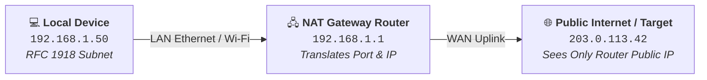
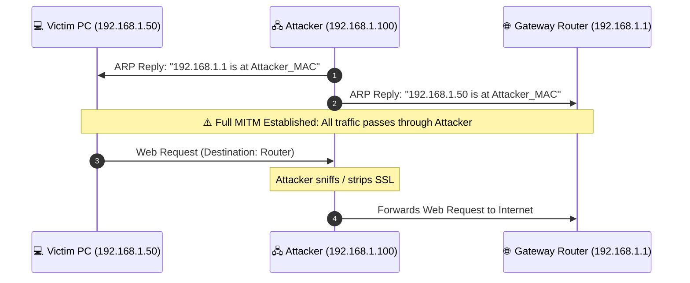
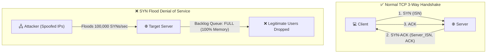

# 🛡️ CYBERSECURITY & OPSEC FIELD NOTES
### *Low-Level Systems Architecture, Network Forensics & Adversarial Threat Modeling*

  <b>A structured, deep technical documentation repository for security researchers, systems developers, and learners.</b> 
  <i>Published and maintained by <a href="https://github.com/DaddyZyn"><b>DaddyZyn (DRAXO.dev)</b></a></i>

---

## 💡 Request a Topic or Suggest Concepts

Have a concept you want explained or documented in deep technical detail?
* 👉 **[Open a Topic Request on GitHub Issues](https://github.com/DaddyZyn/Cyber-security-notes/issues/new?template=topic_request.yml)**
* Or submit a pull request following our **[Contributing Guide](./CONTRIBUTING.md)**.

---

## 📑 Core Documentation Modules

| # | Topic Directory | Focus Areas | Quick Link |
| :---: | :--- | :--- | :---: |
| **01** | **[`01-networking-fundamentals`](./topics/01-networking-fundamentals/)** | Public vs. Private IPs, RFC 1918, NAT Translation, IPv4 vs. IPv6 Dual-Stack Leaks, Subnets (`/24`, `/16`), Gateways, DNS UDP 53 & DoH/DoT | [📖 Read Module](./topics/01-networking-fundamentals/README.md) |
| **02** | **[`02-hardware-identifiers`](./topics/02-hardware-identifiers/)** | Layer 2 vs. Layer 3 Boundaries, Why MACs never leave routers, Captive Portals, Client-side WinAPI Telemetry (`GetAdaptersAddresses`), MAC Spoofing | [📖 Read Module](./topics/02-hardware-identifiers/README.md) |
| **03** | **[`03-ip-tracking-and-geolocation`](./topics/03-ip-tracking-and-geolocation/)** | How IPs are pulled (P2P, WebRTC STUN), The GeoIP Centroid Myth, **Wi-Fi BSSID Triangulation (WiGLE/Skyhook 5-10m)**, ISP DHCP Subpoenas, Data Breaches | [📖 Read Module](./topics/03-ip-tracking-and-geolocation/README.md) |
| **04** | **[`04-vpn-mechanics-and-opsec`](./topics/04-vpn-mechanics-and-opsec/)** | TUN/TAP Adapters, Kernel Routing, The Trust Shift Rule, VPN Leak Vectors, **Commercial Traps (Proton/Nord KYC & Legal Logs) vs. Mullvad (16-Digit Zero-Data & Police Raid)** | [📖 Read Module](./topics/04-vpn-mechanics-and-opsec/README.md) |
| **05** | **[`05-phone-numbers-osint-and-larp-defense`](./topics/05-phone-numbers-osint-and-larp-defense/)** | Fake Doxxer & Larper Bluffs, Telecom SS7/HLR Reality vs. Public OSINT, Truecaller/Eyecon Sync Scrapes, **SIM Swapping Defense, Carrier Port-Out PINs, Non-SMS 2FA** | [📖 Read Module](./topics/05-phone-numbers-osint-and-larp-defense/README.md) |
| **06** | **[`06-wireshark-stun-p2p-sniffing-and-app-hardening`](./topics/06-wireshark-stun-p2p-sniffing-and-app-hardening/)** | P2P Media Streams vs. Server Relays, **Wireshark Filters (`stun.type == 0x0001`, `0x0101`, `XOR-MAPPED-ADDRESS`)**, Hardening Settings for **WhatsApp, Telegram, Signal, Discord, Steam SDR** | [📖 Read Module](./topics/06-wireshark-stun-p2p-sniffing-and-app-hardening/README.md) |
| **07** | **[`07-legacy-exploits-ip-harvesting-and-lan-attacks`](./topics/07-legacy-exploits-ip-harvesting-and-lan-attacks/)** | **Forced SMB / UNC Path NTLMv2 Leaks (Port 445)**, **LLMNR & NetBIOS Name Poisoning (Responder)**, BitTorrent DHT IP Scraping, Email Header/Pixel Leaks, Legacy IRC DCC | [📖 Read Module](./topics/07-legacy-exploits-ip-harvesting-and-lan-attacks/README.md) |
| **08** | **[`08-arp-poisoning-mitm-and-packet-interception`](./topics/08-arp-poisoning-mitm-and-packet-interception/)** | **ARP Cache Poisoning Mechanics**, Gratuitous ARP Spoofing (`arpspoof`), **SSL/TLS Stripping (sslstrip)**, Wireshark Alerts (`arp.duplicate-address-frame`), Static ARP & DAI | [📖 Read Module](./topics/08-arp-poisoning-mitm-and-packet-interception/README.md) |
| **09** | **[`09-tcp-handshake-exploits-rst-injection-and-scanning`](./topics/09-tcp-handshake-exploits-rst-injection-and-scanning/)** | **TCP 3-Way Handshake (ISN/SEQ/ACK)**, **SYN Flood DoS Attacks & SYN Cookies**, **TCP RST Injection / Connection Killing**, Nmap Scans (`-sT`, `-sS`, `-sF`, `-sX`), Port Scan Filters | [📖 Read Module](./topics/09-tcp-handshake-exploits-rst-injection-and-scanning/README.md) |

---

## 🔍 Visual Architecture Overviews

### 🌐 01. Networking & NAT Translation Flow
How private subnets (`192.168.x.x`) communicate across the public internet via Network Address Translation:

---

### ⚡ 08. ARP Cache Poisoning & Man-in-the-Middle Flow
How an attacker sends unauthenticated Gratuitous ARP replies to force all LAN traffic through their network interface:

---

### 🎯 09. TCP 3-Way Handshake vs. SYN Flood DoS
How legitimate TCP connections establish state vs. how SYN Floods exhaust server kernel backlog memory:

---

## 🔒 App & Network Hardening Summary Matrix

| Protocol / Vector | Vulnerable Default? | Required Hardening Setting | Resulting Protection |
| :--- | :---: | :--- | :--- |
| **WhatsApp Calls** | ⚠️ Yes (P2P on 1-on-1) | Settings ➔ Privacy ➔ Advanced ➔ **Protect IP Address in Calls** | 🛡️ Relayed via Meta Servers |
| **Telegram Calls** | ⚠️ Yes (P2P enabled) | Settings ➔ Privacy ➔ Calls ➔ **Peer-to-Peer: NOBODY** | 🛡️ Relayed via Telegram Servers |
| **Signal Calls** | ⚠️ Yes (Direct P2P) | Settings ➔ Privacy ➔ Advanced ➔ **Always Relay Calls** | 🛡️ Relayed via Signal Servers |
| **Outbound SMB (445)** | ⚠️ Yes (Windows auto-connects) | Block Port 445 Outbound on Firewall; Restrict Outbound NTLM in GPO | 🛡️ Prevents Forced Hash Leaks |
| **Local LLMNR / NetBIOS** | ⚠️ Yes (Multicast broadcast) | GPO: Turn off Multicast Name Resolution; Disable NetBIOS in WINS | 🛡️ Immune to Responder Poisoning |
| **Local ARP Spoofing** | ⚠️ Yes (Stateless unauthenticated ARP) | Dynamic ARP Inspection (DAI) on switch / Static ARP / VPN Tunnel | 🛡️ Immune to MITM Sniffing |
| **TCP SYN Flooding** | ⚠️ Yes (Backlog exhaustion) | Enable Kernel **SYN Cookies** (`tcp_syncookies = 1`) | 🛡️ Stateless Handshake Protection |
| **Torrent Swarms** | ⚠️ Yes (Public DHT announce) | qBittorrent ➔ Options ➔ Advanced ➔ **Bind to VPN Network Interface** | 🛡️ Zero Fallback Leaks |

---

## 🤝 Contributing

Contributions, corrections, and new module submissions are welcome. Please check **[`CONTRIBUTING.md`](./CONTRIBUTING.md)** for details on structure and formatting.

---

## ⚖️ License & Credits

* **Author & Maintainer**: [DaddyZyn (DRAXO.dev)](https://github.com/DaddyZyn)
* **Purpose**: Educational, defensive security research, and systems engineering documentation.
* **Repository**: [https://github.com/DaddyZyn/Cyber-security-notes](https://github.com/DaddyZyn/Cyber-security-notes)
