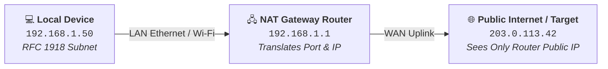
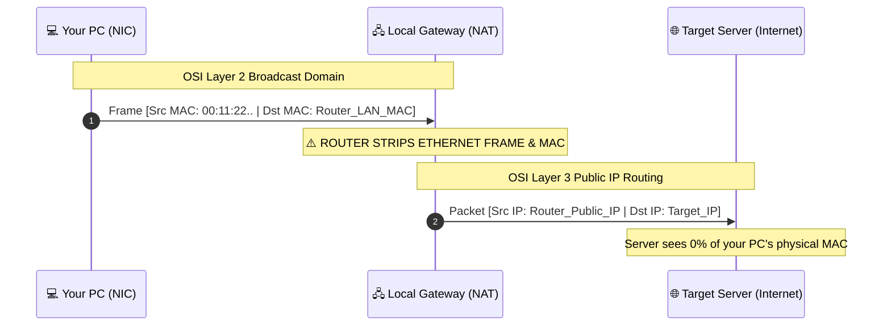
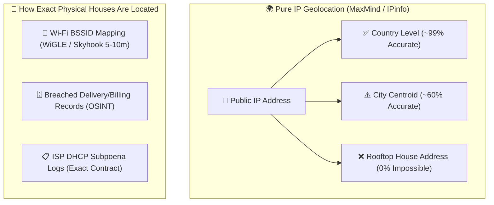
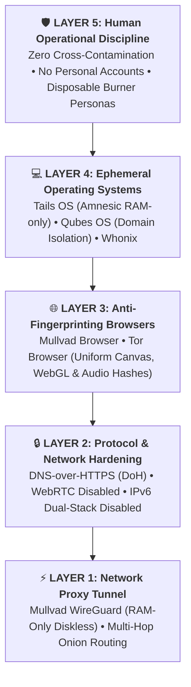
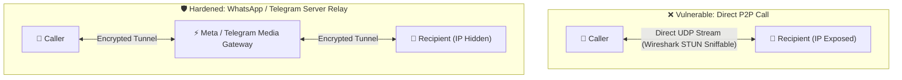

# 🛡️ CYBERSECURITY & OPSEC FIELD NOTES
### *Low-Level Systems Architecture, Network Forensics & Adversarial Threat Modeling*

  <b>A structured, deep technical documentation repository for security researchers, systems developers, and learners.</b> 
  <i>Published and maintained by <a href="https://github.com/DaddyZyn"><b>DaddyZyn (DRAXO.dev)</b></a></i>

---

## 💡 Request a Topic or Suggest Concepts

Have a concept you want explained or documented in deep technical detail?
* 👉 **[Open a Topic Request on GitHub Issues](https://github.com/DaddyZyn/Cyber-security-notes/issues/new?template=topic_request.yml)**
* Or submit a pull request following our **[Contributing Guide](./CONTRIBUTING.md)**.

---

## 📑 Core Documentation Modules

| # | Topic Directory | Focus Areas | Quick Link |
| :---: | :--- | :--- | :---: |
| **01** | **[`01-networking-fundamentals`](./topics/01-networking-fundamentals/)** | Public vs. Private IPs, RFC 1918, NAT Translation, IPv4 vs. IPv6 Dual-Stack Leaks, Subnets (`/24`, `/16`), Gateways, DNS UDP 53 & DoH/DoT | [📖 Read Module](./topics/01-networking-fundamentals/README.md) |
| **02** | **[`02-hardware-identifiers`](./topics/02-hardware-identifiers/)** | Layer 2 vs. Layer 3 Boundaries, Why MACs never leave routers, Captive Portals, Client-side WinAPI Telemetry (`GetAdaptersAddresses`), MAC Spoofing | [📖 Read Module](./topics/02-hardware-identifiers/README.md) |
| **03** | **[`03-ip-tracking-and-geolocation`](./topics/03-ip-tracking-and-geolocation/)** | How IPs are pulled (P2P, WebRTC STUN), The GeoIP Centroid Myth, **Wi-Fi BSSID Triangulation (WiGLE/Skyhook 5-10m)**, ISP DHCP Subpoenas, Data Breaches | [📖 Read Module](./topics/03-ip-tracking-and-geolocation/README.md) |
| **04** | **[`04-vpn-mechanics-and-opsec`](./topics/04-vpn-mechanics-and-opsec/)** | TUN/TAP Adapters, Kernel Routing, The Trust Shift Rule, VPN Leak Vectors, **Commercial Traps (Proton/Nord KYC & Legal Logs) vs. Mullvad (16-Digit Zero-Data & Police Raid)** | [📖 Read Module](./topics/04-vpn-mechanics-and-opsec/README.md) |
| **05** | **[`05-phone-numbers-osint-and-larp-defense`](./topics/05-phone-numbers-osint-and-larp-defense/)** | Fake Doxxer & Larper Bluffs, Telecom SS7/HLR Reality vs. Public OSINT, Truecaller/Eyecon Sync Scrapes, **SIM Swapping Defense, Carrier Port-Out PINs, Non-SMS 2FA** | [📖 Read Module](./topics/05-phone-numbers-osint-and-larp-defense/README.md) |
| **06** | **[`06-wireshark-stun-p2p-sniffing-and-app-hardening`](./topics/06-wireshark-stun-p2p-sniffing-and-app-hardening/)** | P2P Media Streams vs. Server Relays, **Wireshark Filters (`stun.type == 0x0001`, `0x0101`, `XOR-MAPPED-ADDRESS`)**, Hardening Settings for **WhatsApp, Telegram, Signal, Discord, Steam SDR** | [📖 Read Module](./topics/06-wireshark-stun-p2p-sniffing-and-app-hardening/README.md) |

---

## 🔍 Visual Architecture Overviews

### 🌐 01. Networking & NAT Translation Flow
How private subnets (`192.168.x.x`) communicate across the public internet via Network Address Translation:

---

### 💻 02. Layer 2 vs. Layer 3 Frame Stripping
Why your physical network card MAC address **never leaves your local router**:

---

### 🛰️ 03. Geolocation Reality vs. Rooftop Doxxing
Why IP addresses only resolve to ISP regional aggregation nodes, while physical rooftop locations are found via Wi-Fi BSSID trilateration and data breaches:

---

### 🔒 04. The 5-Layer OPSEC Defense Stack
An unbroken chain of operational security:

---

### 🦈 05 & 06. P2P Sniffing vs. Server Relayed Calls
How direct media streams leak public IPs in Wireshark STUN captures vs. hardened server-relayed calls:

---

## 🔒 App Hardening Quick-Settings Matrix

| Application | Vulnerable Default? | Required Privacy Setting | Resulting Protection |
| :--- | :---: | :--- | :--- |
| **WhatsApp** | ⚠️ Yes (P2P on 1-on-1) | Settings ➔ Privacy ➔ Advanced ➔ **Protect IP Address in Calls** | 🛡️ Relayed via Meta Servers |
| **Telegram** | ⚠️ Yes (P2P enabled) | Settings ➔ Privacy ➔ Calls ➔ **Peer-to-Peer: NOBODY** | 🛡️ Relayed via Telegram Servers |
| **Signal** | ⚠️ Yes (Direct P2P) | Settings ➔ Privacy ➔ Advanced ➔ **Always Relay Calls** | 🛡️ Relayed via Signal Servers |
| **Discord** | 🛡️ Safe on Voice | Keep official client & avoid untrusted external links | 🛡️ Centralized Gateway Default |
| **Steam Games** | ⚠️ Depends on Game | Steam Settings ➔ In-Game ➔ **Steam Networking: Always Relay** | 🛡️ SDR Datagram Relay |

---

## 🤝 Contributing

Contributions, corrections, and new module submissions are welcome. Please check **[`CONTRIBUTING.md`](./CONTRIBUTING.md)** for details on structure and formatting.

---

## ⚖️ License & Credits

* **Author & Maintainer**: [DaddyZyn (DRAXO.dev)](https://github.com/DaddyZyn)
* **Purpose**: Educational, defensive security research, and systems engineering documentation.
* **Repository**: [https://github.com/DaddyZyn/Cyber-security-notes](https://github.com/DaddyZyn/Cyber-security-notes)
