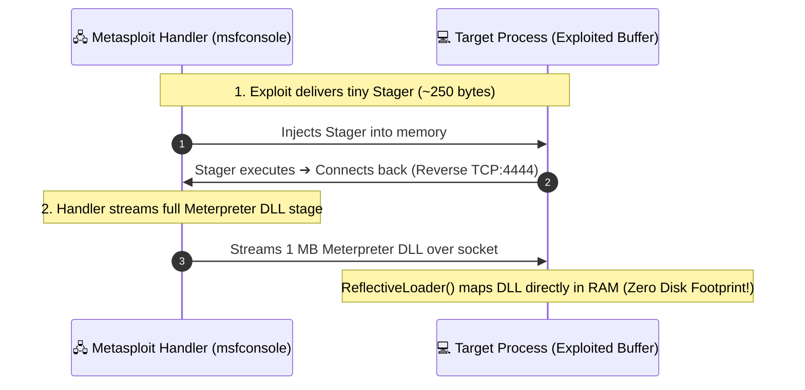
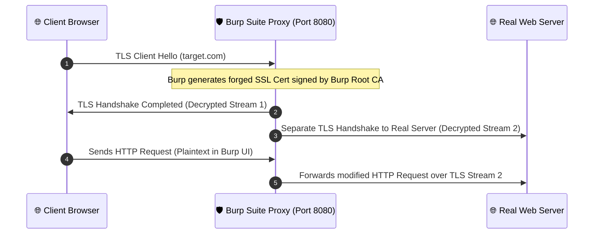

# 🛡️ CYBERSECURITY & OPSEC FIELD NOTES
### *Low-Level Systems Architecture, Network Forensics & Adversarial Threat Modeling*

  <b>A structured, deep technical documentation repository and open-source tool suite for security researchers, systems developers, and learners.</b> 
  <i>Published and maintained by <a href="https://github.com/DaddyZyn"><b>DaddyZyn (DRAXO.dev)</b></a></i>

---

## 💡 Request a Topic or Suggest Concepts

Have a concept you want explained or documented in deep technical detail?
* 👉 **[Open a Topic Request on GitHub Issues](https://github.com/DaddyZyn/Cyber-security-notes/issues/new?template=topic_request.yml)**
* Or submit a pull request following our **[Contributing Guide](./CONTRIBUTING.md)**.

---

## 🧰 Python Security Tool Suite

The repository includes a suite of standalone, zero-dependency Python tools in the **[`/tools`](./tools/)** directory:

| Tool | Focus Area | Quick Command | Description |
| :--- | :--- | :--- | :--- |
| **[`opsec_audit.py`](./tools/opsec_audit.py)** | Endpoint Security | `python tools/opsec_audit.py` | Audits outbound SMB port 445 leaks, IPv6 dual-stack bypass, and DNS bindings |
| **[`arp_watch.py`](./tools/arp_watch.py)** | MITM Detection | `python tools/arp_watch.py --watch` | Real-time sentinel monitoring local ARP cache for duplicate MAC collisions |
| **[`subnet_calc.py`](./tools/subnet_calc.py)** | Network Math | `python tools/subnet_calc.py 10.0.0.0/16` | Bitwise CIDR calculator: Netmask, Wildcard, Broadcast, Host ranges & Binary |
| **[`dns_entropy.py`](./tools/dns_entropy.py)** | Exfil Analysis | `python tools/dns_entropy.py <domain>` | Calculates Shannon Entropy to detect DNS tunneling (dnscat2/iodine) |

👉 **[View Full Tools Documentation & Options](./tools/README.md)**

---

## 📑 Core Documentation Modules

| # | Topic Directory | Focus Areas | Quick Link |
| :---: | :--- | :--- | :---: |
| **01** | **[`01-networking-fundamentals`](./topics/01-networking-fundamentals/)** | Public vs. Private IPs, RFC 1918, NAT Translation, IPv4 vs. IPv6 Dual-Stack Leaks, Subnets (`/24`, `/16`), Gateways, DNS UDP 53 & DoH/DoT | [📖 Read Module](./topics/01-networking-fundamentals/README.md) |
| **02** | **[`02-hardware-identifiers`](./topics/02-hardware-identifiers/)** | Layer 2 vs. Layer 3 Boundaries, Why MACs never leave routers, Captive Portals, Client-side WinAPI Telemetry (`GetAdaptersAddresses`), MAC Spoofing | [📖 Read Module](./topics/02-hardware-identifiers/README.md) |
| **03** | **[`03-ip-tracking-and-geolocation`](./topics/03-ip-tracking-and-geolocation/)** | How IPs are pulled (P2P, WebRTC STUN), The GeoIP Centroid Myth, **Wi-Fi BSSID Triangulation (WiGLE/Skyhook 5-10m)**, ISP DHCP Subpoenas, Data Breaches | [📖 Read Module](./topics/03-ip-tracking-and-geolocation/README.md) |
| **04** | **[`04-vpn-mechanics-and-opsec`](./topics/04-vpn-mechanics-and-opsec/)** | TUN/TAP Adapters, Kernel Routing, The Trust Shift Rule, VPN Leak Vectors, **Commercial Traps (Proton/Nord KYC & Legal Logs) vs. Mullvad (16-Digit Zero-Data & Police Raid)** | [📖 Read Module](./topics/04-vpn-mechanics-and-opsec/README.md) |
| **05** | **[`05-phone-numbers-osint-and-larp-defense`](./topics/05-phone-numbers-osint-and-larp-defense/)** | Fake Doxxer & Larper Bluffs, Telecom SS7/HLR Reality vs. Public OSINT, Truecaller/Eyecon Sync Scrapes, **SIM Swapping Defense, Carrier Port-Out PINs, Non-SMS 2FA** | [📖 Read Module](./topics/05-phone-numbers-osint-and-larp-defense/README.md) |
| **06** | **[`06-wireshark-stun-p2p-sniffing-and-app-hardening`](./topics/06-wireshark-stun-p2p-sniffing-and-app-hardening/)** | P2P Media Streams vs. Server Relays, **Wireshark Filters (`stun.type == 0x0001`, `0x0101`, `XOR-MAPPED-ADDRESS`)**, Hardening Settings for **WhatsApp, Telegram, Signal, Discord, Steam SDR** | [📖 Read Module](./topics/06-wireshark-stun-p2p-sniffing-and-app-hardening/README.md) |
| **07** | **[`07-legacy-exploits-ip-harvesting-and-lan-attacks`](./topics/07-legacy-exploits-ip-harvesting-and-lan-attacks/)** | **Forced SMB / UNC Path NTLMv2 Leaks (Port 445)**, **LLMNR & NetBIOS Name Poisoning (Responder)**, BitTorrent DHT IP Scraping, Email Header/Pixel Leaks, Legacy IRC DCC | [📖 Read Module](./topics/07-legacy-exploits-ip-harvesting-and-lan-attacks/README.md) |
| **08** | **[`08-arp-poisoning-mitm-and-packet-interception`](./topics/08-arp-poisoning-mitm-and-packet-interception/)** | **ARP Cache Poisoning Mechanics**, Gratuitous ARP Spoofing (`arpspoof`), **SSL/TLS Stripping (sslstrip)**, Wireshark Alerts (`arp.duplicate-address-frame`), Static ARP & DAI | [📖 Read Module](./topics/08-arp-poisoning-mitm-and-packet-interception/README.md) |
| **09** | **[`09-tcp-handshake-exploits-rst-injection-and-scanning`](./topics/09-tcp-handshake-exploits-rst-injection-and-scanning/)** | **TCP 3-Way Handshake (ISN/SEQ/ACK)**, **SYN Flood DoS Attacks & SYN Cookies**, **TCP RST Injection / Connection Killing**, Nmap Scans (`-sT`, `-sS`, `-sF`, `-sX`), Port Scan Filters | [📖 Read Module](./topics/09-tcp-handshake-exploits-rst-injection-and-scanning/README.md) |
| **10** | **[`10-dhcp-starvation-and-rogue-gateway-attacks`](./topics/10-dhcp-starvation-and-rogue-gateway-attacks/)** | **DHCP DORA (UDP 67/68)**, **DHCP Starvation via MAC Flooding (Yersinia)**, **Rogue DHCP Gateway Hijacking**, Wireshark Signatures, Switchport DHCP Snooping | [📖 Read Module](./topics/10-dhcp-starvation-and-rogue-gateway-attacks/README.md) |
| **11** | **[`11-wifi-80211-deauth-wpa2-handshakes-and-pmkid`](./topics/11-wifi-80211-deauth-wpa2-handshakes-and-pmkid/)** | **802.11 Deauth Attack Mechanics (`aireplay-ng -0`)**, **WPA2 4-Way EAPOL Handshakes**, **Client-less PMKID Extraction**, GPU Hashcat Cracking (`-m 22000`), **802.11w PMF & WPA3** | [📖 Read Module](./topics/11-wifi-80211-deauth-wpa2-handshakes-and-pmkid/README.md) |
| **12** | **[`12-dns-tunneling-covert-channels-and-exfiltration`](./topics/12-dns-tunneling-covert-channels-and-exfiltration/)** | **DNS Recursive Exfiltration**, Subdomain Label Chunking, **Bidirectional C2 via TXT Records (dnscat2 / iodine)**, Shannon Entropy Analysis, Wireshark Detection | [📖 Read Module](./topics/12-dns-tunneling-covert-channels-and-exfiltration/README.md) |
| **13** | **[`13-pentesting-tool-internals-and-mechanics`](./topics/13-pentesting-tool-internals-and-mechanics/)** | **Wireshark/Npcap Ring Buffers & BPF Bytecode**, **Nmap Raw Sockets (`SOCK_RAW`) & OS Fingerprinting**, **Metasploit Reflective DLL Injection & Meterpreter TLV**, **Burp Suite Dynamic Root CA Proxy**, **Hashcat CUDA Compute Shaders** | [📖 Read Module](./topics/13-pentesting-tool-internals-and-mechanics/README.md) |

---

## 🔍 Visual Architecture Overviews

### ⚙️ 13. Metasploit Staged Payload & Reflective DLL Injection
How Metasploit exploits inject tiny stagers to pull down 100% in-memory (fileless) Meterpreter stages without touching the physical disk:

---

### 🛡️ 13. Burp Suite Dynamic CA Interception Proxy
How Burp Suite intercepts and decrypts encrypted HTTPS traffic using dynamically signed certificates:

---

## 🔒 Complete Hardening & Defense Matrix

| Attack Vector | Layer | Vulnerable Default? | Required Hardening Countermeasure |
| :--- | :---: | :---: | :--- |
| **ARP Cache Poisoning** | Layer 2 | ⚠️ Yes | Dynamic ARP Inspection (DAI) / Static ARP / Encrypted VPN |
| **DHCP Starvation / Rogue Srv** | Layer 2/3 | ⚠️ Yes | Switchport **DHCP Snooping** + Port Security limits |
| **Wi-Fi 802.11 Deauth** | Layer 2 (802.11) | ⚠️ Yes (WPA2) | Enable **802.11w Protected Management Frames (PMF)** / WPA3 |
| **WPA2 Handshake Cracking** | Layer 2 (802.11) | ⚠️ Yes | Complex 20+ char random passphrase / Upgrade to WPA3-SAE |
| **DNS Tunneling / Exfiltration** | Layer 7 (UDP 53) | ⚠️ Yes | Internal DNS sinkholing, Query Length Limits, Subdomain Entropy rules |
| **Forced Outbound SMB** | Layer 7 (TCP 445) | ⚠️ Yes | Block Port 445 Outbound; Restrict Outbound NTLM via GPO |
| **LLMNR / NetBIOS Spoofing** | Layer 2/3 | ⚠️ Yes | Turn off Multicast Name Resolution in GPO; Disable NetBIOS in WINS |
| **TCP SYN Flooding** | Layer 4 | ⚠️ Yes | Enable Kernel **SYN Cookies** (`tcp_syncookies = 1`) |
| **WhatsApp / Telegram P2P** | Layer 7 (VoIP) | ⚠️ Yes | Enable **"Protect IP in Calls"** (WhatsApp) / Peer-to-Peer: **Nobody** (Telegram) |
| **Torrent Swarm IP Leaks** | Layer 7 (P2P) | ⚠️ Yes | Bind qBittorrent network interface strictly to VPN adapter |

---

## 🤝 Contributing

Contributions, corrections, and new module submissions are welcome. Please check **[`CONTRIBUTING.md`](./CONTRIBUTING.md)** for details on structure and formatting.

---

## ⚖️ License & Credits

* **Author & Maintainer**: [DaddyZyn (DRAXO.dev)](https://github.com/DaddyZyn)
* **Purpose**: Educational, defensive security research, and systems engineering documentation.
* **Repository**: [https://github.com/DaddyZyn/Cyber-security-notes](https://github.com/DaddyZyn/Cyber-security-notes)
