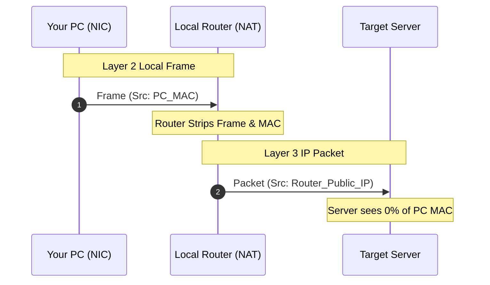

# 💻 Module 02: Hardware Identifiers — MAC Addresses & Local Footprints

Many beginners confuse MAC addresses with IP addresses and misunderstand where hardware identifiers travel. In this module, we break down the mechanics at Layer 2 vs Layer 3 and explain how device identifiers are tracked.

---

## 📑 Table of Contents
- [1. What is a MAC Address?](#1-what-is-a-mac-address)
- [2. Where Does a MAC Address Travel?](#2-where-does-a-mac-address-travel-the-layer-2-vs-layer-3-rule)
  - [2.1 The Hop-by-Hop Principle](#21-the-hop-by-hop-principle)
  - [2.2 Why Remote Servers Cannot See Your MAC](#22-why-remote-servers-cannot-see-your-mac)
- [3. How Hardware Identifiers ARE Tracked & Leaked](#3-how-hardware-identifiers-are-tracked--leaked)
  - [3.1 Local Wi-Fi Access Points & Captive Portals](#31-local-wi-fi-access-points--captive-portals)
  - [3.2 Client-Side Software & Telemetry (Layer 7 HWID)](#32-client-side-software--telemetry-layer-7-exfiltration)
  - [3.3 ARP Sniffing & MITM on Shared LANs](#33-arp-sniffing-on-shared-networks)
- [4. MAC Spoofing & Countermeasures](#4-mac-spoofing--countermeasures)
  - [4.1 OS Built-in MAC Randomization](#41-mac-randomization)
  - [4.2 Manual Spoofing (Linux & Windows)](#42-manual-spoofing)

---

## 1. What is a MAC Address?

A **Media Access Control (MAC)** address is a 48-bit (6-byte) physical identifier permanently assigned to a Network Interface Card (NIC) by the hardware manufacturer.

Format: `00:1A:2B:3C:4D:5E` (6 hexadecimal octets)

| Field | Length | Example Value | Purpose |
| :--- | :--- | :--- | :--- |
| **OUI (Organization Unique Identifier)** | First 3 Bytes (24 Bits) | `00:1A:2B` | Registered chip vendor (Intel, Realtek, Apple) |
| **NIC Serial Identifier** | Last 3 Bytes (24 Bits) | `3C:4D:5E` | Unique physical hardware serial number |

---

## 2. Where Does a MAC Address Travel? (The Layer 2 vs Layer 3 Rule)

### 2.1 The Hop-by-Hop Principle
* **MAC addresses operate exclusively at OSI Layer 2 (Data Link Layer).**
* **MAC addresses NEVER leave your local broadcast domain / local router.**

### 2.2 Layer 2 Frame Stripping Flow



> [!NOTE]
> **Conclusion**: Remote web servers, game servers, and website operators **cannot see your physical MAC address from an IP packet header**.

---

## 3. How Hardware Identifiers ARE Tracked & Leaked

If MAC addresses don't leave the local network in packet headers, how do adversaries and corporations use them to track you?

### 3.1 Local Wi-Fi Access Points & Captive Portals
* Public Wi-Fi (airports, hotels, cafes) logs your physical MAC address the instant you associate with the Access Point (AP).
* Even if you connect to a VPN immediately after authenticating, the network operator has already tied your device's physical hardware MAC, device hostname, and connection timestamps to your physical presence.

### 3.2 Client-Side Software & Telemetry (Layer 7 Exfiltration)
Websites running in standard web browsers cannot directly read your MAC address due to JavaScript sandbox restrictions. However:
* **Installed Applications (Steam, Discord, Game Anti-Cheats, EDRs, Malware)**: Run with native OS privileges.
* They call native APIs (e.g., Windows WinAPI `GetAdaptersAddresses()` or `GetAdaptersInfo()`) to read your real MAC address, disk serial numbers, BIOS UUID, and CPU IDs.
* They package these identifiers into encrypted HTTPS requests (Layer 7 payload) and send them to their servers, creating an unshakeable hardware profile (HWID).

### 3.3 ARP Sniffing on Shared Networks
On any unsegmented LAN (e.g., open Starbucks Wi-Fi or dorm networks):
* Any machine running Wireshark or `arp-scan` can discover every active host's MAC address and private IP.
* An attacker can execute **ARP Cache Poisoning (Man-in-the-Middle)** to redirect all your traffic through their machine before it reaches the router.

---

## 4. MAC Spoofing & Countermeasures

### 4.1 MAC Randomization
Modern mobile OSes (iOS, Android) and modern Windows/Linux desktop distributions feature built-in MAC randomization for Wi-Fi scanning and per-SSID connections.

### 4.2 Manual Spoofing
* **Linux**:
  ```bash
  sudo ip link set dev eth0 down
  sudo macchanger -r eth0
  sudo ip link set dev eth0 up
  ```
* **Windows**:
  * Device Manager -> Network Adapter -> Properties -> Advanced -> `Locally Administered Address` (or `Network Address`) -> Set to a custom 12-digit hex value.
  * Note: The second character must be `2`, `6`, `A`, or `E` to indicate a locally administered unicast address (e.g., `02:XX:XX:XX:XX:XX`).

---

<div align="center">
  <sub>Published and maintained by <a href="https://github.com/DaddyZyn"><b>DaddyZyn (DRAXO.dev)</b></a></sub>
</div>
