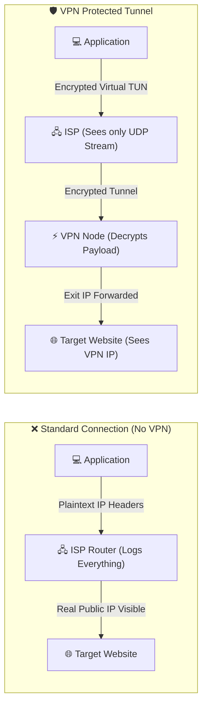
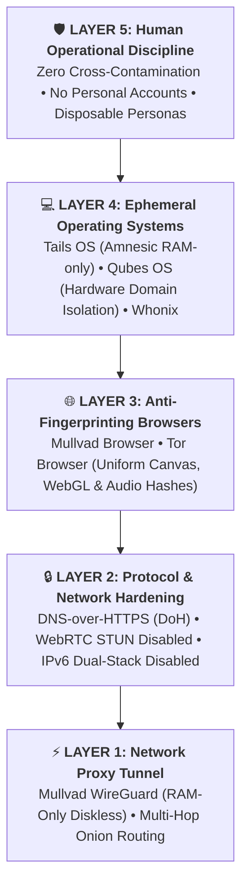

# 🔒 Module 04: VPN Mechanics, OPSEC Realities & Provider Analysis

A Virtual Private Network (VPN) is one of the most misunderstood privacy tools in cybersecurity. Commercial marketing has convinced millions of users that clicking "Connect" makes them an untouchable ghost on the internet. In this module, we break down how VPNs actually work, where they fail, and conduct a threat-model breakdown of providers like ProtonVPN vs. Mullvad.

---

## 📑 Table of Contents
- [1. How a VPN Operates Under the Hood](#1-how-a-vpn-operates-under-the-hood)
  - [1.1 Virtual TUN Adapters & Routing Tables](#11-the-virtual-adapter--routing-table)
  - [1.2 The Trust Shift Rule](#12-the-trust-shift-rule)
- [2. Common VPN Leak Vectors & Failure Modes](#2-common-vpn-leak-vectors--failure-modes)
- [3. Threat Modeling Providers: Commercial Traps vs. True OPSEC](#3-threat-modeling-providers-commercial-traps-vs-true-opsec)
  - [3.1 Provider Architectural Comparison Matrix](#31-provider-architectural-comparison-matrix)
  - [3.2 The Reality of Commercial VPNs & Proton](#32-the-reality-of-commercial-vpns--proton)
  - [3.3 Why Mullvad Sets the Benchmark for Privacy](#33-why-mullvad-sets-the-benchmark-for-privacy)
- [4. Advanced Tracking Beyond the VPN](#4-advanced-tracking-beyond-the-vpn-browser-fingerprinting)
  - [4.1 Browser Fingerprinting & Persistent State](#41-what-a-vpn-cannot-protect-you-from)
  - [4.2 The 5-Layer OPSEC Defense Stack](#42-the-5-layer-opsec-defense-stack)

---

## 1. How a VPN Operates Under the Hood

### 1.1 The Virtual Adapter & Routing Table
When a VPN client starts on your machine:
1. It creates a **virtual network interface (TUN/TAP adapter)**.
2. It modifies your operating system's **kernel routing table**, setting the default route (`0.0.0.0/0`) to point through the virtual adapter instead of your physical LAN gateway.
3. It establishes an encrypted tunnel (using protocols like **WireGuard** or **OpenVPN**) over UDP/TCP to a remote VPN server.

### 1.2 The Trust Shift Rule
> [!IMPORTANT]
> **A VPN does NOT encrypt your data across the entire internet.**
> * The tunnel exists **only between your device and the VPN server**.
> * From the VPN server to the target website, the traffic exits in whatever protocol you are using (HTTPS encrypts the payload, but the target server sees the VPN server's IP).
> * **Core Rule**: A VPN does not eliminate trust; **it shifts trust from your ISP to the VPN provider**.

---

## 2. Common VPN Leak Vectors & Failure Modes

| Leak Vector | Mechanism | Threat Outcome |
| :--- | :--- | :--- |
| **DNS Leak** | OS sends DNS requests to local ISP resolver outside the VPN tunnel. | ISP still sees all domains visited. |
| **IPv6 Leak** | VPN only tunnels IPv4; outbound IPv6 requests bypass tunnel directly to ISP. | Exposes real ISP-assigned global IPv6 address. |
| **WebRTC STUN Leak** | Browser executes STUN request punching through NAT. | Remote website reads your real public and private IPs. |
| **Kill Switch Failure** | VPN connection drops momentarily; OS fails back to physical network before renegotiating. | Unencrypted packets leak real IP during reconnect. |
| **Traffic Timing Correlation** | An adversary monitoring your ISP line and the target server correlates packet burst sizes and timestamps. | Confirms you are the sender despite encryption. |

---

## 3. Threat Modeling Providers: Commercial Traps vs. True OPSEC

### 3.1 Provider Architectural Comparison Matrix

| Threat Vector / Feature | ⚠️ Commercial / Proton | 🛡️ Mullvad VPN |
| :--- | :--- | :--- |
| **Account Identifier** | ❌ Email / Username / Password required | ✅ **Random 16-Digit Token (Zero KYC)** |
| **KYC / Personal Data** | ❌ Tied to recovery inboxes & payment cards | ✅ **Zero personal data collected or stored** |
| **Anonymous Payment** | ⚠️ Limited (Third-party KYC gateways) | ✅ **Cash in physical envelope / Monero (XMR)** |
| **Logging Architecture** | ❌ Subject to Swiss court logging orders | ✅ **Diskless RAM-only infrastructure** |
| **Real-World Audit** | ❌ Documented user IP logs surrendered | ✅ **Swedish Police raid yielded 0 logs** |
| **Port Forwarding** | ⚠️ Available (Increases device fingerprinting) | ✅ **Eliminated to prevent fingerprinting/abuse** |
| **OPSEC Rating** | 🟥 **35% Anonymity** | 🟩 **98% Anonymity** |

### 3.2 The Reality of Commercial VPNs & Proton
* **Account Linkage**: Providers like Proton, Nord, and Surfshark require an email address, username, and password upon registration. This immediately links your payment records, recovery accounts, and communication logs to a central identity.
* **Jurisdiction & Legal Compliance**:
  * While Switzerland (where Proton is based) has strict privacy laws, Swiss courts **can and do compel Swiss companies to log specific targets** under Swiss criminal code orders (as seen in the documented 2021 French activist case where Proton was legally forced to log IP and browser fingerprints of a target).
  * No commercial provider operating a business entity is above the court orders of its sovereign jurisdiction.
* **Heavy Marketing & Affiliate Schemes**: Most "top 10 VPN" review sites are owned by the VPN companies themselves or run on massive recurring affiliate payouts, skewing technical recommendations.

### 3.3 Why Mullvad Sets the Benchmark for Privacy
Mullvad is widely regarded by systems engineers and security researchers as the gold standard for network proxying due to its strict zero-knowledge architecture:

1. **No Account Information**:
   * Mullvad generates a **random 16-digit account number**.
   * It never asks for an email, phone number, name, or password.
2. **Anonymous Payment Methods**:
   * Accepts **cash mailed in a physical envelope** with only the account token written inside.
   * Accepts **Monero (XMR)** for untraceable on-chain settlement.
3. **RAM-Only Diskless Servers**:
   * Servers run on ephemeral operating system images in memory with no hard drive logging.
4. **Real-World Stress Test (2023 Police Raid)**:
   * In April 2023, the Swedish National Police visited Mullvad's Gothenburg offices with a search warrant to seize user data.
   * Because of Mullvad's system architecture, no user data or logs existed to seize, and the authorities left empty-handed.
5. **No Port Forwarding**:
   * Mullvad eliminated port forwarding to prevent users from being uniquely fingerprinted or abuse actors from compromising the network integrity.

---

## 4. Advanced Tracking Beyond the VPN: Browser Fingerprinting

Using Mullvad or any VPN **only conceals your IP address**. Advanced adversaries and tracking networks do not rely on IPs alone.

### 4.1 What a VPN CANNOT Protect You From:
* **Browser Fingerprinting**: Websites probe your browser engine using Canvas rendering, WebGL attributes, installed fonts, audio context hardware hashing, and screen geometry. This creates a hash unique to your exact device that persists across IP changes.
* **Persistent State & Cookies**: LocalStorage, IndexedDB, Session Cookies, and Service Workers keep you authenticated and tracked regardless of what VPN node you switch to.
* **Application-Level Telemetry**: Logging into personal accounts (Google, Discord, Steam, Twitter) while connected to a VPN immediately ties that VPN exit IP to your permanent identity.

### 4.2 The 5-Layer OPSEC Defense Stack

> [!TIP]
> **Golden Rule**: Anonymity is not a software program you download; it is an unbroken chain of operational discipline.

---

  Published and maintained by <a href="https://github.com/DaddyZyn"><b>DaddyZyn (DRAXO.dev)</b></a>

