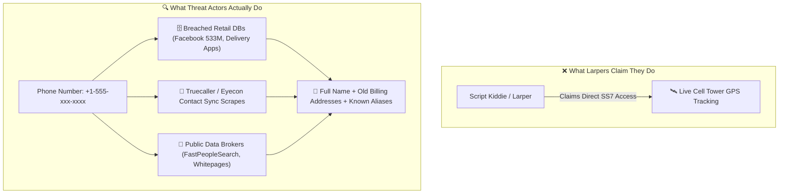
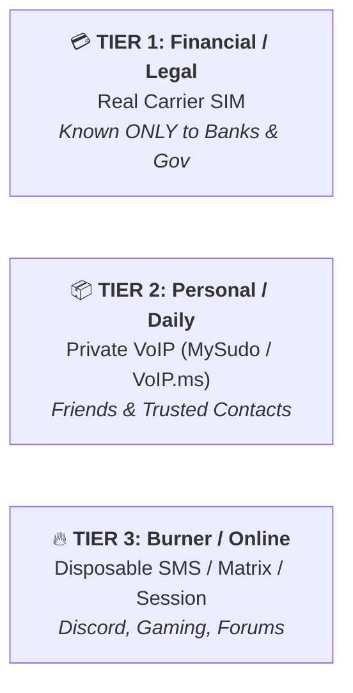

# 📱 Module 05: Phone Number OSINT, "Larping" Myths & Doxxing Defense

In online gaming and Discord communities, one of the most common intimidation tactics is script kiddies and "doxxers" claiming they have your phone number and can track your live GPS coordinates, hack your phone remotely, or pull your SSN. In this module, we separate fiction from technical reality, dissect the actual intelligence vectors tied to phone numbers, and implement an airtight defense playbook.

---

## 📑 Table of Contents
- [1. The "Larping" Myth vs. Technical Reality](#1-the-larping-myth-vs-technical-reality)
  - [1.1 The Common Bluffs](#11-the-common-bluffs)
  - [1.2 The SS7 / HLR Telecom Reality](#12-the-ss7--hlr-telecom-reality)
- [2. How Phone Number Intelligence ACTUALLY Works](#2-how-phone-number-intelligence-actually-works)
  - [2.1 Crowd-Sourced Phonebooks (Truecaller, Eyecon, Sync.ME)](#21-crowd-sourced-phonebooks-truecaller-eyecon-syncme)
  - [2.2 Data Broker Aggregators & Leaked DBs](#22-data-broker-aggregators--leaked-databases)
  - [2.3 Messaging App Contact Sync Exploits](#23-messaging-app-contact-sync-exploits)
  - [2.4 SIM Swapping (The Real Danger)](#24-sim-swapping-the-actual-critical-threat)
- [3. The Phone Number Defense Playbook](#3-the-phone-number-defense-playbook)
  - [3.1 Tiered Number Architecture (Burners vs. Banking)](#31-tiered-number-architecture)
  - [3.2 Carrier Port-Out PIN & SIM Lock](#32-carrier-port-out-pin--sim-lock)
  - [3.3 Delisting from Truecaller & Data Brokers](#33-delisting-from-truecaller--data-brokers)
  - [3.4 Eliminating SMS-Based 2FA](#34-eliminating-sms-based-2fa)

---

## 1. The "Larping" Myth vs. Technical Reality

### 1.1 The Common Bluffs
Adversaries on Discord, Telegram, or gaming lobbies frequently use social engineering templates to cause panic:

| The Attacker's Bluff | Technical Reality | Threat Severity |
| :--- | :--- | :--- |
| *"I'm pinging your cell tower to get your live GPS rooftop coordinates."* | **False.** Real-time triangulation requires direct Law Enforcement CALEA wiretaps or high-tier SS7 access. Random internet actors cannot ping cell towers. | 🟢 **Zero Threat (Bluff)** |
| *"I have your number so I have your full SSN and bank details."* | **False.** Phone numbers do not contain financial data; attackers simply search your number in leaked combo databases from past retail breaches. | 🟡 **Low-Med (Breach OSINT)** |
| *"I'm sending a remote payload to exploit your phone via SMS."* | **False.** Zero-click SMS exploits (e.g., Pegasus/NSO Group) cost millions and are reserved for nation-state espionage, not Discord arguments. | 🟢 **Zero Threat (Bluff)** |

### 1.2 The SS7 / HLR Telecom Reality

* **SS7 (Signaling System No. 7)**: The international telecom protocol used for routing SMS and roaming.
* While rogue telecom insiders or state agencies can query Home Location Registers (HLR) for serving MSC/Cell IDs, **random internet script kiddies do not possess direct SS7 gateway access**.
* **What they are actually doing**: They paste your phone number into automated Telegram OSINT bots or free public record search engines.

---

## 2. How Phone Number Intelligence ACTUALLY Works

### 2.1 Crowd-Sourced Phonebooks (Truecaller, Eyecon, Sync.ME)
When an unsuspecting user installs apps like Truecaller or Eyecon, they grant the app permission to upload their **entire address book** to the company's servers.
* Even if you never installed Truecaller yourself, if a friend, relative, or coworker saved your number in their phone as *"John Doe Work"* or *"Dave Discord"*, your name and number were indexed in Truecaller's global database.

### 2.2 Data Broker Aggregators & Leaked Databases
1. **Breach Correlation**: Massive historical data breaches (e.g., Facebook 533M leak, delivery services, marketing databases) contain millions of plaintext phone numbers paired with full names, emails, and dates of birth.
2. **Reverse Lookups**: Public search sites (FastPeopleSearch, That'sThem, TruePeopleSearch) index public voter registries, property records, and utility installations by phone number.

### 2.3 Messaging App Contact Sync Exploits
* Attackers generate large batches of phone numbers and programmatically upload them into Telegram, WhatsApp, or Signal address books.
* If your privacy settings allow discovery by phone number, the app automatically reveals your profile picture, bio, username, and online status.

### 2.4 SIM Swapping: The Actual Critical Threat
The only high-consequence direct attack utilizing a phone number is **SIM Swapping**:
1. The attacker calls your cellular carrier (T-Mobile, AT&T, Verizon, Vodafone) pretending to be you.
2. They trick or bribe the customer service representative into transferring your phone number to a new SIM card in the attacker's possession.
3. Once active, the attacker intercepts your SMS 2FA codes and resets passwords for your email, crypto exchanges, and social accounts.

---

## 3. The Phone Number Defense Playbook

### 3.1 Tiered Number Architecture
Never use your primary cellular carrier number for online platforms or strangers:
* **Tier 1 (Real SIM)**: Used strictly for banking, government identification, and primary utilities. Never shared publicly or on social apps.
* **Tier 2 (Private VoIP / Secondary SIM)**: Services like MySudo, Google Voice, or VoIP.ms for deliveries, e-commerce, and acquaintances.
* **Tier 3 (Disposable / Non-VoIP Burners)**: For online accounts, Discord, and public registrations.

### 3.2 Carrier Port-Out PIN & SIM Lock
Prevent SIM swaps by locking your carrier account:
1. **Port-Out Protection / Freeze**: Contact your cellular provider and enable account port-out protection (requires a dedicated verbal password/PIN before any number transfer).
2. **SIM Card PIN**: Enable the SIM PIN on your physical device (Settings -> Cellular -> SIM PIN) so the card cannot be used if physically stolen.

### 3.3 Delisting from Truecaller & Data Brokers
* **Truecaller Unlist**: Visit `truecaller.com/unlisting` and submit your phone number for permanent removal from their searchable index.
* **Data Broker Opt-Outs**: Submit automated or manual opt-out requests to data aggregators (FastPeopleSearch, Whitepages, LexisNexis).

### 3.4 Eliminating SMS-Based 2FA
> [!CAUTION]
> **SMS is NOT a secure 2FA protocol.** SMS packets are unencrypted, vulnerable to SIM swaps, and susceptible to SS7 redirection.

* Replace all SMS verification with **Time-Based One-Time Passwords (TOTP)** using apps like **Aegis Authenticator** (Android), **Ente Auth**, or hardware security keys (**YubiKey**).

---

  Published and maintained by <a href="https://github.com/DaddyZyn"><b>DaddyZyn (DRAXO.dev)</b></a>

