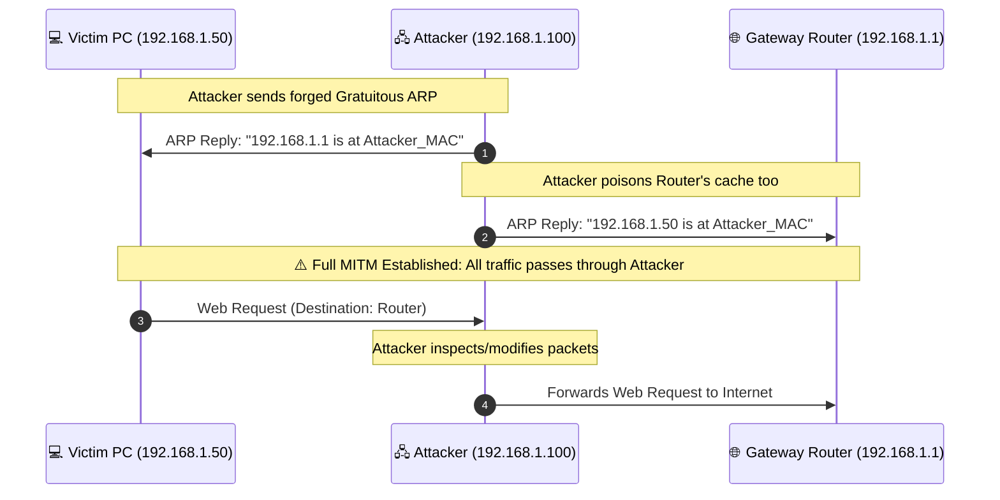
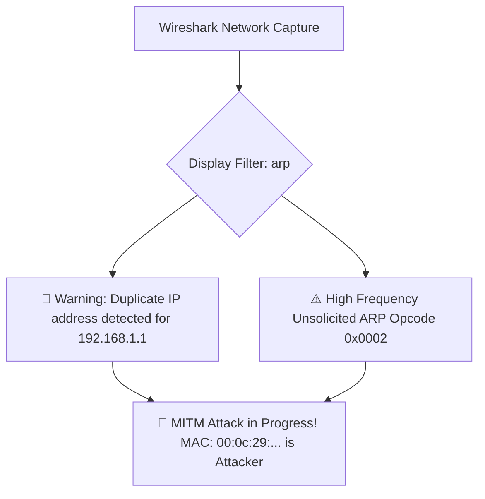

# ⚡ Module 08: ARP Cache Poisoning, MITM & Packet Interception

On any local network (home Wi-Fi, school campus, coffee shop, or corporate LAN), devices communicate across Layer 2 using the **Address Resolution Protocol (ARP)**. Because ARP was designed in 1982 with **zero authentication**, any device on the local network can deceive other devices into routing all their traffic through an attacker's machine. In this module, we dissect ARP cache poisoning, Man-in-the-Middle (MITM) mechanics, SSL stripping, and packet forensics in Wireshark.

---

## 📑 Table of Contents
- [1. The Fundamental Flaw in ARP](#1-the-fundamental-flaw-in-arp)
  - [1.1 How Normal ARP Resolution Works](#11-how-normal-arp-resolution-works)
  - [1.2 The Stateless Gratuitous ARP Exploit](#12-the-stateless-gratuitous-arp-exploit)
- [2. Man-in-the-Middle (MITM) Attack Execution](#2-man-in-the-middle-mitm-attack-execution)
  - [2.1 The Two-Way Poisoning Flow](#21-the-two-way-poisoning-flow)
  - [2.2 IP Forwarding & Packet Sniffing](#22-ip-forwarding--packet-sniffing)
  - [2.3 SSL/TLS Stripping (Downgrade Attacks)](#23-ssltls-stripping-downgrade-attacks)
- [3. Detecting ARP Attacks in Wireshark](#3-detecting-arp-attacks-in-wireshark)
  - [3.1 Wireshark Display Filters & Alerts](#31-wireshark-display-filters--alerts)
  - [3.2 Inspecting Duplicate IP / MAC Collisions](#32-inspecting-duplicate-ip--mac-collisions)
- [4. Hardening & Defenses](#4-hardening--defenses)
  - [4.1 Static ARP Table Entries](#41-static-arp-table-entries)
  - [4.2 Dynamic ARP Inspection (DAI) & 802.1X](#42-dynamic-arp-inspection-dai--8021x)
  - [4.3 Encrypted Tunnels (VPN & HTTPS with HSTS)](#43-encrypted-tunnels-vpn--https-with-hsts)

---

## 1. The Fundamental Flaw in ARP

### 1.1 How Normal ARP Resolution Works
When your computer wants to send a packet to your router (`192.168.1.1`):
1. It broadcasts an **ARP Request** to the entire LAN (`FF:FF:FF:FF:FF:FF`): *"Who has 192.168.1.1? Tell 192.168.1.50"*.
2. The router replies with an **ARP Reply**: *"192.168.1.1 is at MAC AA:BB:CC:DD:EE:FF"*.
3. Your PC stores this in its **ARP cache** (`arp -a`).

### 1.2 The Stateless Gratuitous ARP Exploit
ARP is completely **stateless and unauthenticated**:
* Operating systems will update their internal ARP table **even if they never asked for an ARP reply**.
* An attacker can send unsolicited (Gratuitous) ARP replies at any time claiming to own any IP address on the subnet.

---

## 2. Man-in-the-Middle (MITM) Attack Execution

### 2.1 The Two-Way Poisoning Flow



### 2.2 IP Forwarding & Packet Sniffing
To prevent the victim's internet from crashing (which would alert them), the attacker enables kernel IP packet forwarding:
```bash
# Linux Kernel IP Forwarding
echo 1 > /proc/sys/net/ipv4/ip_forward

# Running arpspoof (Two-way poisoning)
sudo arpspoof -i eth0 -t 192.168.1.50 192.168.1.1
sudo arpspoof -i eth0 -t 192.168.1.1 192.168.1.50
```

### 2.3 SSL/TLS Stripping (Downgrade Attacks)
While HTTPS encrypts payload data, an attacker in a MITM position can execute an **SSLStrip** attack:
1. When the victim enters `example.com`, the initial HTTP request is intercepted by the attacker.
2. The attacker establishes an HTTPS connection to the real website on the victim's behalf.
3. The attacker proxies the response back to the victim over **unencrypted HTTP**, rewriting all `https://` links to `http://`.
4. All passwords, session cookies, and credentials sent by the victim travel in plaintext to the attacker.

> [!NOTE]
> **HSTS (HTTP Strict Transport Security)**: Modern websites use HSTS headers and preloaded browser lists to force browsers to refuse unencrypted HTTP connections, defeating basic SSLStrip.

---

## 3. Detecting ARP Attacks in Wireshark

When an active ARP spoofing attack occurs on your network, Wireshark immediately flags anomalies.



### 3.1 Wireshark Display Filters & Alerts

| Wireshark Filter | What It Detects | Threat Level |
| :--- | :--- | :--- |
| `arp.duplicate-address-frame` | Detects multiple MAC addresses claiming the same IP | 🔴 **CRITICAL (Active MITM)** |
| `arp.opcode == 2` | Filters all ARP Reply packets | 🟡 **Look for flooding** |
| `arp.opcode == 1` | Filters ARP Requests | 🟢 Normal resolution |
| `arp.isgratuitous == 1` | Detects unsolicited Gratuitous ARP announcements | 🟠 **Suspicious when repeated** |

### 3.2 Inspecting the Collision in Packet Details
Inside Wireshark, you will see a warning generated by the Expert Info engine:
```
Expert Info (Warning/Sequence): Duplicate IP address detected for 192.168.1.1 (AA:BB:CC:DD:EE:FF) - also in use by 00:0C:29:11:22:33
```
* `AA:BB:CC:DD:EE:FF`: The real gateway router.
* `00:0C:29:11:22:33`: The attacker's network card.

---

## 4. Hardening & Defenses

### 4.1 Static ARP Table Entries
You can lock your gateway's MAC address in your OS so rogue ARP replies are ignored:
* **Windows**:
  ```cmd
  netsh interface ipv4 add neighbors "Wi-Fi" 192.168.1.1 AA-BB-CC-DD-EE-FF
  ```
* **Linux**:
  ```bash
  sudo arp -s 192.168.1.1 AA:BB:CC:DD:EE:FF
  ```

### 4.2 Dynamic ARP Inspection (DAI) & Switch Security
In enterprise networks, managed switches enforce **DAI (Dynamic ARP Inspection)**:
* The switch intercepts all ARP packets on untrusted ports.
* It verifies the MAC-to-IP binding against the **DHCP Snooping database**.
* Any spoofed ARP packet is dropped instantly at the physical switch port.

### 4.3 Encrypted VPN Tunnels
> [!TIP]
> **The Ultimate Defense on Public Wi-Fi**: Even if an attacker successfully poisons your ARP cache on a coffee shop network, running an encrypted VPN (**WireGuard / OpenVPN**) encapsulates all Layer 3 packets inside an authenticated cryptographic envelope (`ChaCha20-Poly1305` or `AES-256-GCM`).
> * The attacker only sees unintelligible encrypted UDP ciphertext and cannot decrypt or modify your web traffic.

---

<div align="center">
  <sub>Published and maintained by <a href="https://github.com/DaddyZyn"><b>DaddyZyn (DRAXO.dev)</b></a></sub>
</div>
