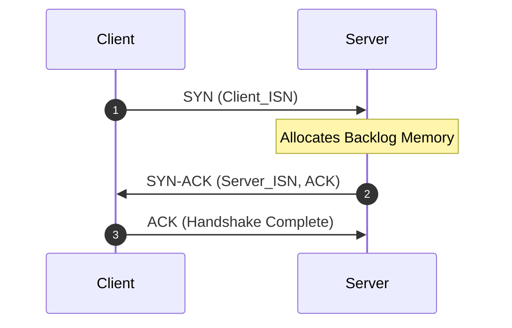
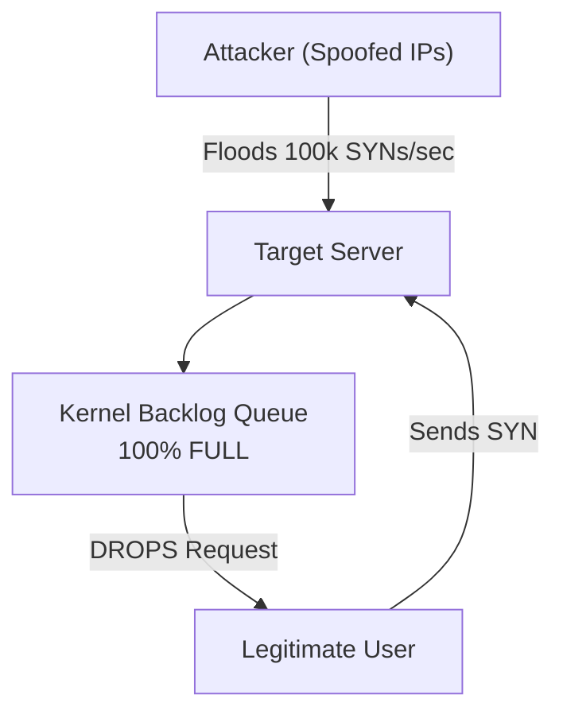
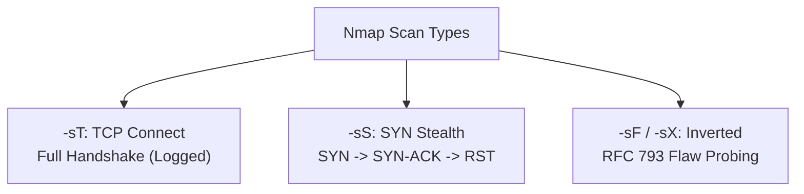

# 🎯 Module 09: TCP Handshake Exploits, RST Injection & Port Scanning Mechanics

The Transmission Control Protocol (TCP) is the foundational transport layer protocol for reliable internet communication. However, the stateful nature of TCP connection establishment and termination opens several low-level attack vectors. In this module, we dissect TCP 3-way handshake mechanics, SYN flooding, TCP Reset (RST) connection hijacking, and how port scanning engines like Nmap probe network defenses.

---

## 📑 Table of Contents
- [1. The TCP 3-Way Handshake & Sequence Number Mechanics](#1-the-tcp-3-way-handshake--sequence-number-mechanics)
  - [1.1 Handshake Sequence Flow](#11-handshake-sequence-flow)
  - [1.2 Sequence (SEQ) and Acknowledgment (ACK) Numbers](#12-sequence-seq-and-acknowledgment-ack-numbers)
- [2. SYN Flood Denial of Service (DoS) & SYN Cookies](#2-syn-flood-denial-of-service-dos--syn-cookies)
  - [2.1 The TCP Backlog Queue Exhaustion](#21-the-tcp-backlog-queue-exhaustion)
  - [2.2 The SYN Cookie Defense Solution](#22-the-syn-cookie-defense-solution)
- [3. TCP Reset (RST) Injection & Connection Killing](#3-tcp-reset-rst-injection--connection-killing)
  - [3.1 How Blind & On-Path RST Injection Works](#31-how-blind--on-path-rst-injection-works)
  - [3.2 Wireshark Packet Forensics for Forged RSTs](#32-wireshark-packet-forensics-for-forged-rsts)
- [4. Port Scanning Mechanics: How Nmap Probes Networks](#4-port-scanning-mechanics-how-nmap-probes-networks)
  - [4.1 TCP Connect Scan (`-sT`)](#41-tcp-connect-scan--st)
  - [4.2 SYN Half-Open Stealth Scan (`-sS`)](#42-syn-half-open-stealth-scan--ss)
  - [4.3 Inverted / RFC 793 Scans (FIN, XMAS, NULL)](#43-inverted--rfc-793-scans-fin-xmas-null)
- [5. Wireshark Detection Matrix for Network Scanning](#5-wireshark-detection-matrix-for-network-scanning)

---

## 1. The TCP 3-Way Handshake & Sequence Number Mechanics

### 1.1 Handshake Sequence Flow
Before any web data or application traffic travels across TCP, a connection must be established:



### 1.2 Sequence (SEQ) and Acknowledgment (ACK) Numbers
* **ISN (Initial Sequence Number)**: A pseudo-random 32-bit integer chosen by each endpoint.
* **SEQ Numbers**: Track the byte offset of transmitted data to guarantee in-order delivery and detect packet drops.
* **ACK Numbers**: Inform the sender of the *next expected byte* ($ACK = SEQ_{received} + \text{bytes} + 1$).

---

## 2. SYN Flood Denial of Service (DoS) & SYN Cookies

### 2.1 The TCP Backlog Queue Exhaustion
When a server receives a `SYN` packet, it enters the **SYN_RECEIVED** state and allocates a data structure in its kernel memory called the **TCP Backlog Queue (half-open connection table)**.



* The attacker never sends the final `ACK`.
* The server waits for the timeout (typically 30–120 seconds).
* When thousands of spoofed `SYN` packets arrive per second, the backlog table overflows, causing the server to **drop all incoming legitimate connections**.

### 2.2 The SYN Cookie Defense Solution
**SYN Cookies** eliminate the need for the server to allocate any memory during the initial `SYN` phase:
1. When a `SYN` arrives, the server computes an Initial Sequence Number ($ISN$) using a cryptographic hash:
   $$ISN_{cookie} = \text{HMAC}(SrcIP, DstIP, SrcPort, DstPort, \text{SecretKey}, \text{Timestamp})$$
2. The server sends `SYN-ACK` with this computed $ISN$ and **immediately discards all state**. Zero kernel memory is stored.
3. If a legitimate client replies with `ACK`, the client sends $ACK_{num} = ISN_{cookie} + 1$.
4. The server reconstructs the hash from the incoming packet headers. If the math checks out, it creates the connection on the spot.

---

## 3. TCP Reset (RST) Injection & Connection Killing

The `RST` (Reset) flag in TCP is designed to immediately abort an invalid connection. However, it can be abused by adversaries or state censorship firewalls (e.g., the Great Firewall of China) to sever active downloads, game connections, or VPN sessions.

```mermaid
sequenceDiagram
    autonumber
    participant Client as Client
    participant Attacker as On-Path Sniffer
    participant Server as Server

    Client<->Server: Active Connection
    Note over Attacker: Sniffs SEQ & ACK numbers
    Attacker->>Client: Injected RST Packet
    Note over Client: Connection Terminated!
    Attacker->>Server: Injected RST Packet
    Note over Server: Connection Terminated!
```

### 3.1 How Blind & On-Path RST Injection Works
* **On-Path Injection**: An attacker on the same network or ISP sniffs the current Sequence Number and injects a packet with `Flags: RST` spoofed from the server's IP. The client accepts it and closes the socket instantly.
* **Blind Injection**: Even without eavesdropping, an off-path attacker can guess the Sequence Number if the TCP window size is large (RFC 4987 / RFC 5961 hardening mitigates this by requiring exact ACK validation).

### 3.2 Wireshark Packet Forensics for Forged RSTs
```
tcp.flags.reset == 1
```
* **Red Flags**: If you see a `RST` packet with a different **IP TTL (Time to Live)** or distinct IP identification field compared to the established stream, it confirms the packet was injected by a third party.

---

## 4. Port Scanning Mechanics: How Nmap Probes Networks

Port scanning is the fundamental reconnaissance method used to discover open services on a target machine.



### 4.1 TCP Connect Scan (`-sT`)
* Executes the full 3-way handshake (`SYN` -> `SYN-ACK` -> `ACK`) using the OS `connect()` socket API.
* **Result**: Highly reliable, but application firewalls and web servers immediately log the connected IP address.

### 4.2 SYN Half-Open Stealth Scan (`-sS`)
* The industry standard default scan in Nmap.
1. Sends a raw `SYN` packet to target port.
2. If port is **OPEN**: Target replies with `SYN-ACK`. Nmap sends an immediate `RST` to tear down the connection before the OS application layer completes the handshake.
3. If port is **CLOSED**: Target replies with `RST`.
4. If port is **FILTERED**: No response or ICMP Unreachable.
* **Advantage**: Leaves minimal traces in application-level logs because no connection is ever fully established.

### 4.3 Inverted / RFC 793 Scans (FIN, XMAS, NULL)
According to RFC 793:
* If an incoming packet has unexpected flags (e.g. `FIN` only, or `XMAS` with `FIN + PSH + URG`, or `NULL` with 0 flags) sent to a **CLOSED port**, the host MUST reply with `RST`.
* If sent to an **OPEN port**, the packet MUST be silently dropped.
* **Usage**: Probes systems behind legacy stateless packet filters.

---

## 5. Wireshark Detection Matrix for Network Scanning

| Attack / Scan Type | Primary Wireshark Filter | Characteristic Signature |
| :--- | :--- | :--- |
| **SYN Flood DoS** | `tcp.flags.syn == 1 and tcp.flags.ack == 0` | Massive burst of incoming SYNs with zero matching ACKs |
| **Nmap SYN Scan (`-sS`)** | `tcp.flags.syn == 1 and tcp.flags.ack == 0` followed immediately by `tcp.flags.reset == 1` | Rapid sequence of SYN packets to ascending ports |
| **TCP RST Injection** | `tcp.flags.reset == 1 and tcp.seq > 0` | Abrupt RST packet during active high-throughput stream |
| **XMAS Tree Scan** | `tcp.flags == 0x029` (FIN + PSH + URG) | Packets containing invalid combinations of TCP control flags |
| **NULL Scan** | `tcp.flags == 0` | Packets with zero flags enabled |

---

<div align="center">
  <sub>Published and maintained by <a href="https://github.com/DaddyZyn"><b>DaddyZyn (DRAXO.dev)</b></a></sub>
</div>
