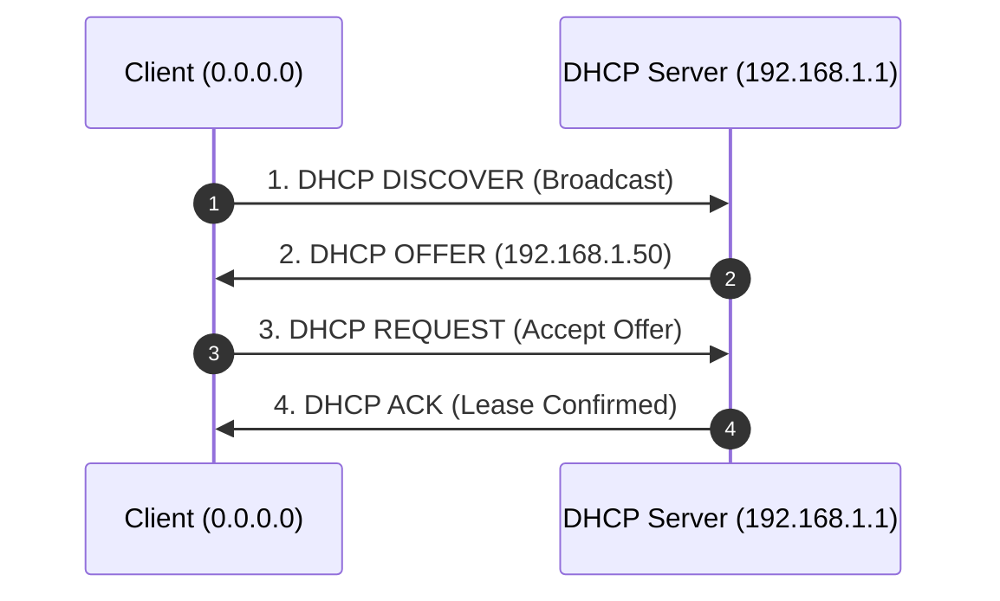
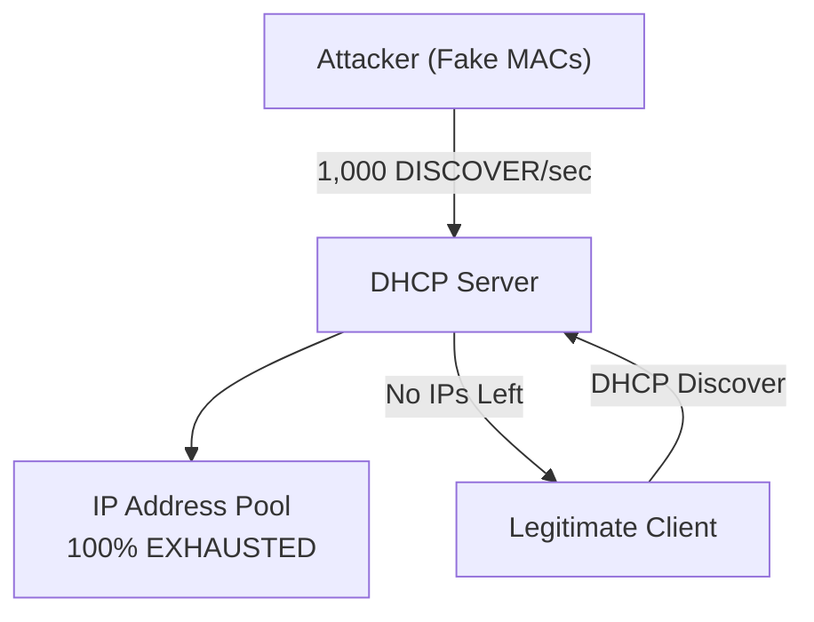
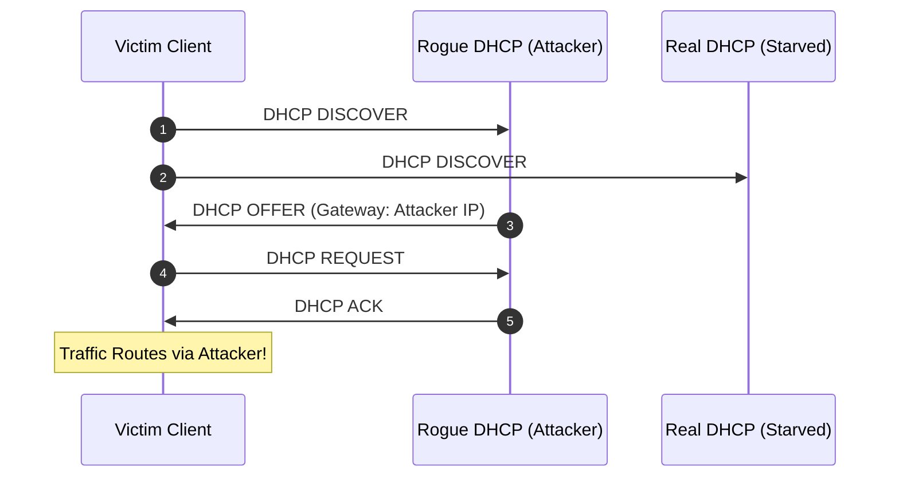
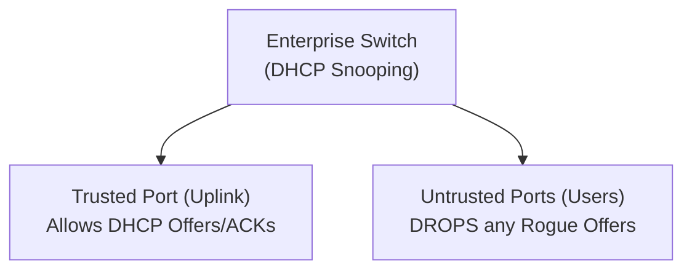

# 🖧 Module 10: DHCP Starvation & Rogue Gateway Hijacking

Dynamic Host Configuration Protocol (DHCP) is the automated protocol responsible for assigning IP addresses, default gateways, subnet masks, and DNS servers to devices joining a network. However, standard DHCP has **zero authentication**, allowing local network attackers to exhaust available IP pools and deploy rogue DHCP servers to hijack default gateways. In this module, we break down the DHCP DORA process, starvation attack mechanics, and enterprise DHCP snooping defenses.

---

## 📑 Table of Contents
- [1. The DHCP DORA Process Mechanics](#1-the-dhcp-dora-process-mechanics)
  - [1.1 The 4-Way DORA Handshake (UDP 67/68)](#11-the-4-way-dora-handshake-udp-6768)
  - [1.2 Key DHCP Options Assigned to Clients](#12-key-dhcp-options-assigned-to-clients)
- [2. The DHCP Starvation Attack](#2-the-dhcp-starvation-attack)
  - [2.1 MAC Address Flooding & Lease Pool Depletion](#21-mac-address-flooding--lease-pool-depletion)
  - [2.2 Attack Tooling (Yersinia / Scapy)](#22-attack-tooling-yersinia--scapy)
- [3. Rogue DHCP Server & Gateway Hijacking](#3-rogue-dhcp-server--gateway-hijacking)
  - [3.1 Becoming the Default Gateway & DNS](#31-becoming-the-default-gateway--dns)
  - [3.2 The Seamless MITM Advantage](#32-the-seamless-mitm-advantage)
- [4. Detecting DHCP Attacks in Wireshark](#4-detecting-dhcp-attacks-in-wireshark)
  - [4.1 Wireshark Display Filters](#41-wireshark-display-filters)
  - [4.2 Packet Header Signatures](#42-packet-header-signatures)
- [5. Switch Hardening & Enterprise Defenses](#5-switch-hardening--enterprise-defenses)
  - [5.1 DHCP Snooping](#51-dhcp-snooping)
  - [5.2 Switchport Port Security](#52-switchport-port-security)

---

## 1. The DHCP DORA Process Mechanics

### 1.1 The 4-Way DORA Handshake (UDP 67/68)
When a device connects to an Ethernet port or Wi-Fi network, it obtains its network configuration via four broadcast/unicast messages:



### 1.2 Key DHCP Options Assigned to Clients
Inside the DHCP Offer / ACK payload, the server injects critical routing parameters:
* **Option 1**: Subnet Mask (e.g., `255.255.255.0`)
* **Option 3**: **Router / Default Gateway IP** (e.g., `192.168.1.1`)
* **Option 6**: **Domain Name Servers (DNS)** (e.g., `1.1.1.1`, `8.8.8.8`)
* **Option 51**: IP Address Lease Time (e.g., 86400 seconds)

---

## 2. The DHCP Starvation Attack

### 2.1 MAC Address Flooding & Lease Pool Depletion
Standard DHCP servers assign IP addresses based on the **Client Hardware Address (`chaddr`)** inside the DHCP packet:
* An attacker floods the network with thousands of `DHCP DISCOVER` requests per second, generating a **new randomized MAC address** for every single packet.
* The legitimate DHCP server allocates an IP address from its pool for each fake MAC.
* Within seconds, the entire subnet IP pool (e.g., `192.168.1.2` through `192.168.1.254`) is completely exhausted.



### 2.2 Attack Tooling (Yersinia / Scapy)
Adversaries execute starvation using tools like `yersinia` or custom Scapy scripts:
```bash
# Executing DHCP Starvation in Yersinia
sudo yersinia dhcp -attack 1 -interface eth0
```

---

## 3. Rogue DHCP Server & Gateway Hijacking

Once the legitimate DHCP server is starved (or simply outraced by an attacker with lower network latency), the attacker deploys a **Rogue DHCP Server**.



### 3.1 Becoming the Default Gateway & DNS
In the rogue DHCP ACK, the attacker sets:
* **Option 3 (Router)**: `192.168.1.100` (Attacker's IP)
* **Option 6 (DNS)**: `192.168.1.100` (Attacker's Rogue DNS Server)

### 3.2 The Seamless MITM Advantage
Unlike ARP cache poisoning (which causes high packet noise and can trigger switch alerts), a Rogue DHCP attack is **clean and native**:
* The victim's operating system legitimately believes the attacker is the actual default gateway.
* The victim forwards all WAN traffic, DNS lookups, and unencrypted credentials directly to the attacker without any ARP spoofing alerts.

---

## 4. Detecting DHCP Attacks in Wireshark

### 4.1 Wireshark Display Filters

| Wireshark Filter | What It Captures | Threat Detection |
| :--- | :--- | :--- |
| `dhcp or bootp` | All DHCP traffic | Overall protocol activity |
| `dhcp.option.dhcp == 1` | DHCP Discover packets | Look for high-frequency flooding with random MACs |
| `dhcp.option.dhcp == 2` | DHCP Offer packets | Look for **two different IP sources** sending Offers |
| `dhcp.option.router != 192.168.1.1` | Rogue Gateway Offer | Identifies non-standard default gateways being assigned |
| `udp.port == 67 or udp.port == 68` | Raw BOOTP/DHCP ports | Captures all UDP 67/68 frames |

### 4.2 Packet Header Signatures
To confirm a Rogue DHCP server in Wireshark:
1. Filter by `dhcp.option.dhcp == 2` (Offers).
2. Look at the `Source IP` and Ethernet `Source MAC`.
3. If you see offers originating from an IP other than your official router (e.g. `192.168.1.100`), an active Rogue DHCP server is present.

---

## 5. Switch Hardening & Enterprise Defenses

Consumer home routers lack layer-2 switch defense features, but enterprise networks deploy two critical switchport controls:



### 5.1 DHCP Snooping
* **Trusted Ports**: Connected directly to the legitimate DHCP server or upstream switch trunk. DHCP Offers and ACKs are allowed.
* **Untrusted Ports**: Connected to standard user workstations. If any device on an untrusted port sends a DHCP `OFFER` or `ACK`, the switch **drops the packet immediately and shuts down the port**.

```cisco
! Cisco Switch DHCP Snooping Configuration
ip dhcp snooping
ip dhcp snooping vlan 1,10,20
interface GigabitEthernet0/1
 ip dhcp snooping trust
```

### 5.2 Switchport Port Security
To prevent DHCP Starvation attacks from flooding fake MAC addresses:
* Limit the maximum number of MAC addresses allowed on an edge access port to 1 or 2.
* If a client floods randomized MAC addresses, the switch puts the port into `err-disable` state instantly.

```cisco
! Cisco Port Security Limit
interface GigabitEthernet0/2
 switchport mode access
 switchport port-security
 switchport port-security maximum 2
 switchport port-security violation shutdown
```

---

<div align="center">
  <sub>Published and maintained by <a href="https://github.com/DaddyZyn"><b>DaddyZyn (DRAXO.dev)</b></a></sub>
</div>
