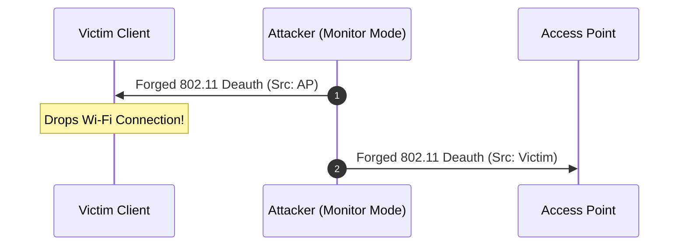
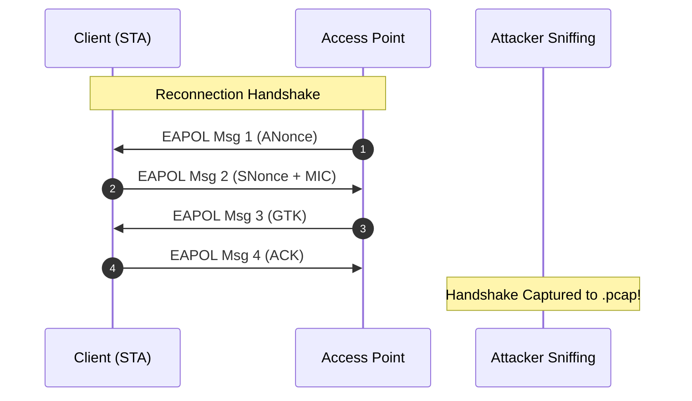
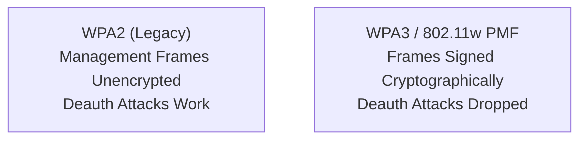

# 📡 Module 11: Wi-Fi 802.11 Deauth, WPA2 Handshakes & PMKID Attacks

Wireless networks transmit radio frames across open air, making them susceptible to unauthenticated frame injection, handshake sniffing, and rogue access point deployment. In this module, we dissect the IEEE 802.11 protocol structure, explain why unencrypted 802.11 management frames enable instant Deauthentication attacks, examine WPA2 4-way handshake and PMKID captures, and configure WPA3 / 802.11w Protected Management Frames (PMF) defenses.

---

## 📑 Table of Contents
- [1. IEEE 802.11 Frame Architecture](#1-ieee-80211-frame-architecture)
  - [1.1 Management, Control, and Data Frames](#11-management-control-and-data-frames)
  - [1.2 The Unencrypted Management Frame Vulnerability](#12-the-unencrypted-management-frame-vulnerability)
- [2. The 802.11 Deauthentication Exploit](#2-the-80211-deauthentication-exploit)
  - [2.1 Forging Deauth Subtypes (0x000C)](#21-forging-deauth-subtypes-0x000c)
  - [2.2 Execution via Aircrack-ng](#22-execution-via-aircrack-ng)
- [3. Capturing & Cracking WPA2 4-Way Handshakes](#3-capturing--cracking-wpa2-4-way-handshakes)
  - [3.1 The 4-Way EAPOL Handshake Mechanics](#31-the-4-way-eapol-handshake-mechanics)
  - [3.2 Offline Hashcat Cracking (`-m 22000`)](#32-offline-hashcat-cracking--m-22000)
- [4. The Client-less PMKID Attack](#4-the-client-less-pmkid-attack)
  - [4.1 How PMKID Works Without Any Connected Users](#41-how-pmkid-works-without-any-connected-users)
  - [4.2 Capturing the RSN PMKID](#42-capturing-the-rsn-pmkid)
- [5. Evil Twin Access Points & Wireshark Forensics](#5-evil-twin-access-points--wireshark-forensics)
- [6. Defenses: 802.11w PMF & WPA3](#6-defenses-80211w-pmf--wpa3)

---

## 1. IEEE 802.11 Frame Architecture

### 1.1 Management, Control, and Data Frames
Wi-Fi traffic is categorized into three distinct 802.11 frame types:

| Frame Type | Subtypes | Encryption in WPA2 | Purpose |
| :--- | :--- | :---: | :--- |
| **Management** | Beacon, Probe Request/Response, **Deauthentication**, Disassociation | ❌ **UNENCRYPTED** | Network discovery, joining, and disconnection |
| **Control** | RTS (Request to Send), CTS (Clear to Send), ACK | ❌ **UNENCRYPTED** | Radio channel contention and clearance |
| **Data** | Standard IP Payload Packets | ✅ **ENCRYPTED (AES-CCMP)** | User internet and application traffic |

### 1.2 The Unencrypted Management Frame Vulnerability
In standard WPA and WPA2 networks:
* Even though your **Data frames** are encrypted with AES-CCMP, your **Management frames are sent in complete plaintext with zero cryptographic signature**.
* Any Wi-Fi card placed in **Monitor Mode** can forge a management frame claiming to originate from the Access Point's MAC address (BSSID).

---

## 2. The 802.11 Deauthentication Exploit

### 2.1 Forging Deauth Subtypes (0x000C)
When an Access Point wants to disconnect a client (or vice versa), it sends a **Deauthentication frame** (Type 0, Subtype 12).
* Because the frame is unauthenticated, an attacker simply spoofs the AP's BSSID and broadcasts a Deauth packet to the victim's client MAC.
* The victim's wireless card receives the frame, assumes the router disconnected it, and **instantly drops the Wi-Fi connection**.



### 2.2 Execution via Aircrack-ng
```bash
# 1. Enable Monitor Mode on wireless interface
sudo airmon-ng start wlan0

# 2. Transmit forged deauth frames
sudo aireplay-ng -0 5 -a AA:BB:CC:DD:EE:FF -c 00:11:22:33:44:55 wlan0mon
```

---

## 3. Capturing & Cracking WPA2 4-Way Handshakes

The attacker does not deauth the user merely to cause annoyance; they deauth them to **force a reconnection and capture the 4-Way EAPOL Handshake**.

### 3.1 The 4-Way EAPOL Handshake Mechanics



* **ANonce & SNonce**: Random 32-byte nonces generated by the router and client.
* **MIC (Message Integrity Code)**: A cryptographic checksum created using the **PTK (Pairwise Transient Key)** derived from the Wi-Fi Pre-Shared Password.

### 3.2 Offline Hashcat Cracking (`-m 22000`)
The attacker extracts the handshake into the modern Hashcat format (`.hc22000`) using `hcxpcapngtool`:
```bash
# Convert capture to Hashcat format
hcxpcapngtool -o hash.22000 handshake.pcap

# Crack Wi-Fi password offline at billions of guesses/sec on GPU
hashcat -m 22000 hash.22000 /usr/share/wordlists/rockyou.txt
```
> **Security Reality**: The cracking happens 100% offline on the attacker's GPU without sending a single packet to the router. If your Wi-Fi password is in a wordlist, it is cracked in seconds.

---

## 4. The Client-less PMKID Attack

In 2018, security researcher *atom* discovered that many modern routers support the **PMKID (Pairwise Master Key Identifier)** caching feature in their RSN (Robust Security Network) information elements.

### 4.1 How PMKID Works Without Any Connected Users
* Traditional handshake attacks **require an active client** to be connected to the network to deauth them.
* **The PMKID Attack requires ZERO connected clients**:
  1. The attacker sends a single standard association request to the AP.
  2. The router responds with EAPOL Message 1 containing the **PMKID** inside its RSN tag:
     $$PMKID = \text{HMAC-SHA1-128}(PMK, \text{"PMK Name"} \parallel MAC_{AP} \parallel MAC_{Client})$$
  3. The attacker captures this single frame directly from the router and cracks the Wi-Fi password offline.

```mermaid
flowchart TD
    Attacker["Attacker (Zero Clients Needed)"] -->|1. Sends 802.11 Assoc Req| Router["Wi-Fi Router"]
    Router -->|2. EAPOL Msg 1 (PMKID Tag)| Attacker
    Attacker --> GPU["Offline GPU Cracking<br/>(Hashcat -m 22000)"]
```

---

## 5. Evil Twin Access Points & Wireshark Forensics

Adversaries combine Deauth attacks with **Evil Twin Access Points** (e.g., using a WiFi Pineapple):
1. The attacker broadcasts a duplicate Wi-Fi network with the exact same SSID as the target coffee shop or home.
2. They continuously deauth users from the real network.
3. Frustrated devices roam and connect to the attacker's stronger Evil Twin signal.
4. The Evil Twin presents a fake captive portal asking for the Wi-Fi password, router admin login, or Google credentials.

### Wireshark Wi-Fi Forensics Filters

| Wireshark Filter | What It Detects | Threat Signature |
| :--- | :--- | :--- |
| `wlan.fc.type_subtype == 0x000c` | 802.11 Deauthentication frames | Continuous flood indicates active Wi-Fi jamming/deauth attack |
| `wlan.fc.type_subtype == 0x000a` | 802.11 Disassociation frames | Secondary method used to disconnect clients |
| `eapol` | EAPOL 4-way handshake packets | Captures authentication exchange |

---

## 6. Defenses: 802.11w PMF & WPA3



### 6.1 Enabling 802.11w Protected Management Frames (PMF)
* **802.11w PMF** adds cryptographic BIP (Broadcast Integrity Protocol) and CCMP signatures to all deauth and disassoc frames.
* If an attacker injects a spoofed deauth frame, the receiving device checks the cryptographic signature, realizes it is unsigned/fake, and **completely ignores it**.

### 6.2 Upgrading to WPA3-SAE
* **WPA3 replaces the 4-way PSK handshake with Simultaneous Authentication of Equals (SAE)** based on Dragonfly key exchange.
* **Result**: Offline dictionary cracking is mathematically impossible; PMKID attacks are dead; Protected Management Frames are strictly mandatory.

---

<div align="center">
  <sub>Published and maintained by <a href="https://github.com/DaddyZyn"><b>DaddyZyn (DRAXO.dev)</b></a></sub>
</div>
