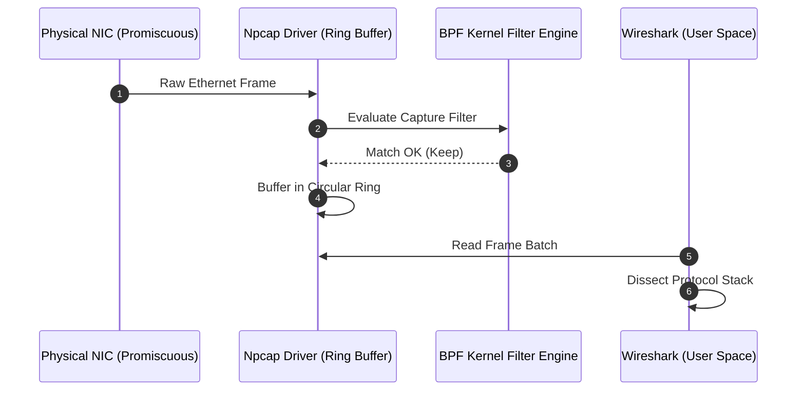
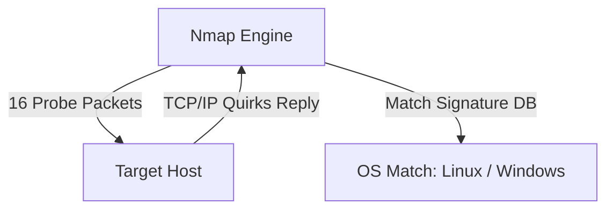
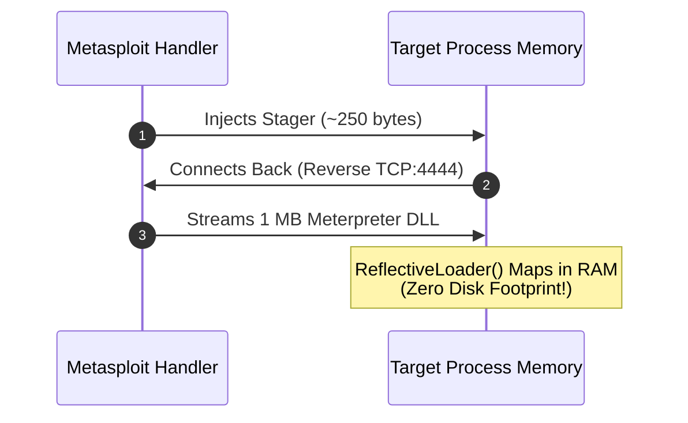
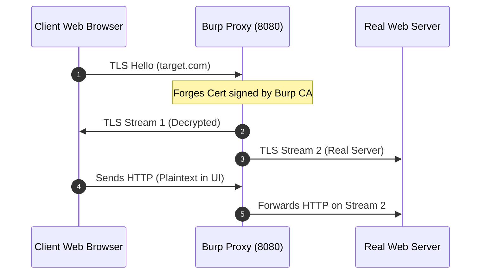
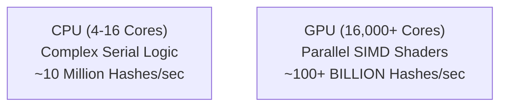

# 🛠️ Module 13: Penetration Testing Tool Internals & Architecture

Most tutorials teach users which commands to type (`nmap -sS`, `msfconsole`, `wireshark`), but fail to explain what is happening under the hood at the operating system, kernel, and network interface level. In this module, we dissect the internal architecture and low-level mechanics of the core security tools: **Wireshark/Npcap**, **Nmap**, **Metasploit Framework**, **Burp Suite**, and **Hashcat**.

---

## 📑 Table of Contents
- [1. Wireshark & Npcap: Packet Capture Internals](#1-wireshark--npcap-packet-capture-internals)
  - [1.1 Promiscuous Mode & Hardware Filtering](#11-promiscuous-mode--hardware-filtering)
  - [1.2 The Npcap / libpcap Kernel Driver Ring Buffer](#12-the-npcap--libpcap-kernel-driver-ring-buffer)
  - [1.3 Berkeley Packet Filters (BPF) Bytecode](#13-berkeley-packet-filters-bpf-bytecode)
  - [1.4 Protocol Dissector Tree Architecture](#14-protocol-dissector-tree-architecture)
- [2. Nmap: Network Scanner Engine Mechanics](#2-nmap-network-scanner-engine-mechanics)
  - [2.1 Raw Socket Fabrication (`SOCK_RAW`)](#21-raw-socket-fabrication-sock_raw)
  - [2.2 OS TCP/IP Stack Fingerprinting (`-O`)](#22-os-tcpip-stack-fingerprinting--o)
  - [2.3 Service Version Probing (`-sV`)](#23-service-version-probing--sv)
  - [2.4 Nmap Scripting Engine (NSE) Lua Coroutines](#24-nmap-scripting-engine-nse-lua-coroutines)
- [3. Metasploit Framework: Exploit & Payload Architecture](#3-metasploit-framework-exploit--payload-architecture)
  - [3.1 Stager vs. Stage Payload Execution Chain](#31-stager-vs-stage-payload-execution-chain)
  - [3.2 Reflective DLL Injection (Fileless In-Memory Execution)](#32-reflective-dll-injection-fileless-in-memory-execution)
  - [3.3 Meterpreter TLV Protocol](#33-meterpreter-tlv-protocol)
- [4. Burp Suite: TLS Interception Proxy Mechanics](#4-burp-suite-tls-interception-proxy-mechanics)
  - [4.1 Dynamic CA Certificate Generation](#41-dynamic-ca-certificate-generation)
  - [4.2 TLS Termination & Upstream Re-Encryption](#42-tls-termination--upstream-re-encryption)
- [5. Hashcat: GPU Parallelized Cryptanalysis](#5-hashcat-gpu-parallelized-cryptanalysis)
  - [5.1 OpenCL / CUDA Compute Shader Pipelines](#51-opencl--cuda-compute-shader-pipelines)
  - [5.2 Rule-Based Mutation Engines](#52-rule-based-mutation-engines)

---

## 1. Wireshark & Npcap: Packet Capture Internals

### 1.1 Promiscuous Mode & Hardware Filtering
By default, a Network Interface Card (NIC) inspects the destination MAC address of incoming Ethernet frames in hardware:
* If the frame's destination MAC is **not** your MAC (and not broadcast/multicast), the NIC hardware controller silently drops it.
* When you launch Wireshark, it puts the NIC into **Promiscuous Mode**: The hardware filter is disabled, forcing the NIC to pass **every single frame on the physical wire/radio frequency** directly up to the kernel.

### 1.2 The Npcap / libpcap Kernel Driver Ring Buffer
Wireshark does not capture packets directly—it relies on kernel-level drivers (**libpcap** on Linux, **Npcap** on Windows).

### 1.3 Berkeley Packet Filters (BPF) Bytecode
Capture filters in Wireshark (e.g., `host 192.168.1.1 and port 80`) are compiled into **BPF Bytecode** executed directly inside the kernel:
* By evaluating packets inside kernel space before copying memory to user space, BPF prevents system slowdowns and packet loss during gigabit network traffic.

### 1.4 Protocol Dissector Tree Architecture
Wireshark dissects raw binary buffers by walking a tree of C/C++ dissector modules:
1. `packet-eth.c` reads the first 14 bytes (EtherType `0x0800` = IPv4).
2. Hands the buffer offset to `packet-ip.c` (Protocol `0x06` = TCP).
3. Hands the buffer offset to `packet-tcp.c` (Port `443` = TLS).
4. Hands the payload to `packet-tls.c`.

---

## 2. Nmap: Network Scanner Engine Mechanics

### 2.1 Raw Socket Fabrication (`SOCK_RAW`)
Standard applications use high-level OS sockets (`SOCK_STREAM` for TCP) where the OS kernel handles the 3-way handshake automatically.
* **Nmap opens raw sockets (`SOCK_RAW` on Linux, Npcap drivers on Windows)**:
* This allows Nmap to manually craft raw Ethernet frames and TCP/IP headers bit-by-bit, forging arbitrary flags (`SYN`, `FIN`, `NULL`, `XMAS`), spoofing sequence numbers, and adjusting IP TTL values.

### 2.2 OS TCP/IP Stack Fingerprinting (`-O`)
Different operating system kernels (Linux kernel, Windows NT, OpenBSD, FreeBSD, Cisco IOS) implement RFC standards with subtle behavioral differences:

Nmap probes the target with 16 carefully crafted packets:
1. **TCP Initial Sequence Number (ISN) Predictability**: How random are the generated sequence numbers?
2. **TCP Options Ordering**: In what order does the kernel arrange `MSS`, `Window Scale`, `SACK`, and `Timestamp` options?
3. **Response to Invalid Flag Combinations**: Does the host respond with `RST` to an unexpected `SYN+FIN` packet?

### 2.3 Service Version Probing (`-sV`)
When a port is detected as open, Nmap consults the `nmap-service-probes` database:
1. Sends a probe string (e.g., `GET / HTTP/1.0\r\n\r\n` for HTTP or `SSH-2.0-Nmap` for SSH).
2. Analyzes the returned application banner with complex regular expressions.
3. Extracts the exact software version (e.g., `Apache httpd 2.4.49` or `OpenSSH 8.2p1`).

### 2.4 Nmap Scripting Engine (NSE) Lua Coroutines
The NSE engine embeds a high-performance **Lua interpreter**:
* Uses non-blocking asynchronous socket I/O with **Lua coroutines**.
* Allows Nmap to scan thousands of targets concurrently for complex vulnerabilities (e.g., Heartbleed, SMB Ghost, Log4j) in parallel without thread-locking the CPU.

---

## 3. Metasploit Framework: Exploit & Payload Architecture

### 3.1 Stager vs. Stage Payload Execution Chain
When exploiting a memory corruption vulnerability (such as a buffer overflow), the memory space available in the target buffer is often restricted to a few hundred bytes:

* **Stager (Tiny footprint, ~150–300 bytes)**: Simple assembly shellcode that calls `socket()`, `connect()`, and `VirtualAlloc()`. Its sole job is to allocate memory and pull down the payload.
* **Stage (Full feature payload, ~1 MB)**: The actual Meterpreter engine or command shell executed in the allocated memory buffer.

### 3.2 Reflective DLL Injection (Fileless In-Memory Execution)
Standard Windows DLL loading (`LoadLibraryA`) requires a file to exist on the physical hard drive. Modern security solutions (EDRs/Antivirus) hook `LoadLibrary` and scan written files.
* **Reflective DLL Injection** (created by Stephen Fewer) solves this:
  1. The Meterpreter DLL contains its own custom implementation of the Windows PE Loader (`ReflectiveLoader()`) compiled inside the DLL export table.
  2. The stager writes the raw DLL bytes into allocated memory (`VirtualAlloc(PAGE_EXECUTE_READWRITE)`).
  3. The stager jumps directly to `ReflectiveLoader()`.
  4. The loader parses its own PE headers, resolves imports via the Process Environment Block (PEB), fixes relocations, and executes `DllMain()`.
  * **Result**: **100% fileless execution** in RAM with zero disk footprints.

### 3.3 Meterpreter TLV Protocol
Meterpreter communicates with the Metasploit console using a binary **TLV (Type-Length-Value)** packet format:
* All commands (`sysinfo`, `hashdump`, `screenshot`, `portfwd`) are packed into encrypted TLV frames tunneled over TLS.

---

## 4. Burp Suite: TLS Interception Proxy Mechanics

### 4.1 Dynamic CA Certificate Generation
When inspecting HTTPS traffic, a browser establishes an encrypted TLS session directly with the destination server. An intercepting proxy cannot decrypt this traffic without triggering security certificate warnings.
* **How Burp Suite Solves This**:
  1. During initial setup, the user installs **PortSwigger's Root Certificate Authority (CA)** into the operating system or browser's trusted certificate store.
  2. When the browser requests `https://google.com`, Burp intercepts the TLS Client Hello.
  3. Burp dynamically generates a forged SSL certificate for `google.com` on the fly, **signed by Burp's trusted root CA**.
  4. The browser verifies the signature against its trust store, accepts the certificate with zero security warnings, and completes the TLS handshake with Burp.

---

## 5. Hashcat: GPU Parallelized Cryptanalysis

### 5.1 OpenCL / CUDA Compute Shader Pipelines
CPUs are optimized for complex serial execution (4 to 32 powerful cores with branch prediction). GPUs are massively parallel array processors designed for rendering millions of pixels simultaneously (thousands of smaller arithmetic logic units - ALUs).

* Hash functions like NTLM, MD5, and SHA-256 consist of basic bitwise operations (`AND`, `XOR`, `OR`, `ROT`, `ADD`).
* **Hashcat compiles hash verification algorithms into native GPU OpenCL/CUDA compute shaders**:
  * An NVIDIA RTX 4090 with 16,384 CUDA cores evaluates over **140,000,000,000 NTLM hashes per second**.

### 5.2 Rule-Based Mutation Engines
Brute-forcing every combination of an 8-character password ($95^8 \approx 6.6 \times 10^{15}$ combinations) is inefficient. Hashcat utilizes **Rule-Based Mutation Engines** (`-r rules/best64.rule`):
* Takes dictionary words and dynamically applies cognitive human password patterns:
  * Leet speak substitutions (`o ➔ 0`, `e ➔ 3`, `a ➔ @`)
  * Capitalization mutations (`c`, `u`)
  * Common postfix appending (`$2024!`, `$123`)
* Rules are compiled directly into GPU kernel loops, eliminating CPU-GPU memory bus transfer bottlenecks.

---

## 🔒 Penetration Testing Tool Architecture Summary

| Tool | Core Operation Layer | Primary Low-Level Technology | Key Advantage |
| :--- | :---: | :--- | :--- |
| **Wireshark / Npcap** | Layer 2 – 7 | Kernel Ring Buffers, Promiscuous Mode, BPF Bytecode | Zero-copy packet capture & deep protocol dissection |
| **Nmap** | Layer 3 – 4 | Raw Sockets (`SOCK_RAW`), Custom IP Headers, Lua Coroutines | Half-open stealth scans & OS TCP/IP stack fingerprinting |
| **Metasploit** | Layer 7 / Memory | Stagers + Reflective DLL Injection, TLV Meterpreter Protocol | 100% In-Memory fileless execution & payload staging |
| **Burp Suite** | Layer 7 (HTTP/S) | Dynamic Root CA generation & Dual TLS termination | Complete visibility & manipulation of encrypted web traffic |
| **Hashcat** | Cryptanalysis | Native GPU CUDA / OpenCL Compute Shaders | Trillions of parallel cryptographic hash evaluations/sec |

---

  Published and maintained by <a href="https://github.com/DaddyZyn"><b>DaddyZyn (DRAXO.dev)</b></a>

