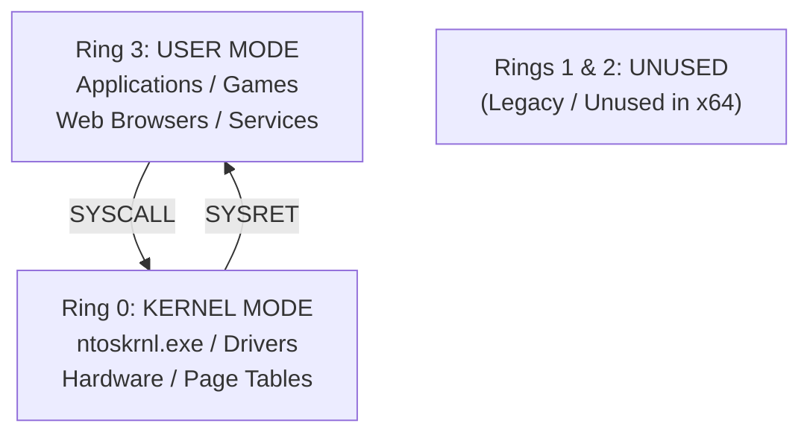
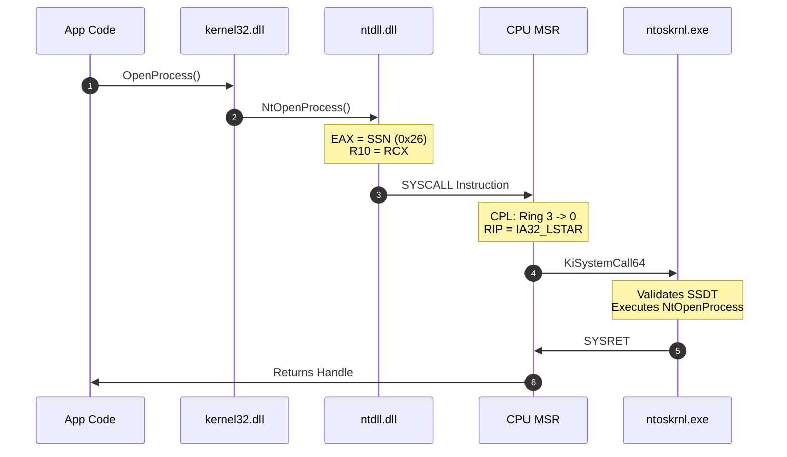

# 🏛️ Module 14: Operating System Architecture — Rings, Privileges & Syscalls

Before diving into memory manipulation, binary reverse engineering, or exploitation, you must understand how the operating system and CPU cooperate to enforce boundaries. The separation between what standard applications can do and what the operating system controls is governed by hardware-enforced CPU privilege rings.

---

## 📑 Table of Contents
- [1. CPU Privilege Rings & Hardware Enforcement](#1-cpu-privilege-rings--hardware-enforcement)
  - [1.1 Ring 0 (Kernel Mode) vs. Ring 3 (User Mode)](#11-ring-0-kernel-mode-vs-ring-3-user-mode)
  - [1.2 Why Rings 1 and 2 Are Unused in Modern OSes](#12-why-rings-1-and-2-are-unused-in-modern-oses)
- [2. Virtual Address Space Split (User vs. Kernel Memory)](#2-virtual-address-space-split-user-vs-kernel-memory)
  - [2.1 The 32-Bit 2GB/2GB Split vs. 64-Bit Canonical Memory](#21-the-32-bit-2gb2gb-split-vs-64-bit-canonical-memory)
  - [2.2 KUSER_SHARED_DATA (Fast Kernel-to-User State Sharing)](#22-kuser_shared_data-fast-kernel-to-user-state-sharing)
- [3. System Calls (Syscalls): Transitioning from Ring 3 to Ring 0](#3-system-calls-syscalls-transitioning-from-ring-3-to-ring-0)
  - [3.1 The Syscall Execution Pipeline](#31-the-syscall-execution-pipeline)
  - [3.2 The x64 `SYSCALL` / `SYSRET` Assembly Instructions](#32-the-x64-syscall--sysret-assembly-instructions)
  - [3.3 SSDT (System Service Descriptor Table) Dispatching](#33-ssdt-system-service-descriptor-table-dispatching)
  - [3.4 Direct Syscalls (Bypassing User-Mode EDR Hooks)](#34-direct-syscalls-bypassing-user-mode-edr-hooks)
- [4. Context Switching, Threads & Trap Frames](#4-context-switching-threads--trap-frames)
  - [4.1 What Happens During a Context Switch](#41-what-happens-during-a-context-switch)
  - [4.2 The Kernel Trap Frame (`_KTRAP_FRAME`)](#42-the-kernel-trap-frame-_ktrap_frame)

---

## 1. CPU Privilege Rings & Hardware Enforcement

Modern x86/x64 microprocessors feature four hardware privilege levels called **Rings** (0 through 3), enforced directly by the CPU's segment registers and Current Privilege Level (CPL) bits:



### 1.1 Ring 0 (Kernel Mode) vs. Ring 3 (User Mode)

| Attribute | Ring 3 (User Mode) | Ring 0 (Kernel Mode) |
| :--- | :--- | :--- |
| **Execution Scope** | Restricted sandbox. No direct hardware I/O. | Full direct execution. Complete control over CPU & hardware. |
| **Privileged Instructions** | `CR0`, `CR3`, `CR4`, `INVD`, `LGDT`, `CLI`, `STI` throw **General Protection Fault (`#GP`)**. | All assembly instructions permitted. |
| **Memory Access** | Can only read/write its own process user-space memory. | Can read/write all physical memory and all process virtual spaces. |
| **Crash Impact** | Process terminates (App crash). OS remains stable. | System halts immediately (**Blue Screen of Death / Kernel Panic**). |
| **Key Binaries** | `calc.exe`, `chrome.exe`, `explorer.exe` | `ntoskrnl.exe`, `win32k.sys`, `fltmgr.sys` |

### 1.2 Why Rings 1 and 2 Are Unused in Modern OSes
Historically, x86 architecture provided Ring 1 and Ring 2 for OS services and device drivers. However, modern operating systems (Windows, Linux, macOS) only use **Ring 0 and Ring 3**:
* **Portability**: Non-x86 architectures (like ARM, MIPS, and RISC-V) only implement two privilege levels (User Mode and Supervisor Mode). Limiting OS architecture to two rings made Windows and Linux portable across CPU architectures.
* **Performance**: Switching between multiple intermediate rings added unnecessary TLB cache flush and context switch latency.

---

## 2. Virtual Address Space Split (User vs. Kernel Memory)

Every process in Windows runs in its own private **Virtual Address Space (VAS)**. This space is divided into a User-Mode partition and a Kernel-Mode partition:

```
64-Bit Windows Canonical Virtual Memory Layout:
+-------------------------------------------------------------------+ 0xFFFFFFFFFFFFFFFF
|                                                                   |
|   KERNEL MODE SPACE (128 TB)                                      |
|   Shared across all processes. Accessible ONLY in Ring 0.          |
|   Contains: ntoskrnl.exe, HAL, Kernel Stacks, Paged/Nonpaged Pool  |
|                                                                   |
+-------------------------------------------------------------------+ 0xFFFF800000000000
|   CANONICAL ADDRESS GAP (Non-addressable void: 16.7 Million TB)   |
+-------------------------------------------------------------------+ 0x00007FFFFFFFFFFF
|                                                                   |
|   USER MODE SPACE (128 TB)                                        |
|   Private to THIS specific process.                               |
|   Contains: .exe code, loaded DLLs (ntdll, kernel32), Stack, Heap |
|                                                                   |
+-------------------------------------------------------------------+ 0x0000000000000000
```

### 2.1 The 32-Bit 2GB/2GB Split vs. 64-Bit Canonical Memory
* **32-Bit Windows (x86)**:
  * Total address space: $2^{32} = \text{4 GB}$.
  * Default split: Lower 2 GB (`0x00000000` to `0x7FFFFFFF`) is User Space; Upper 2 GB (`0x80000000` to `0xFFFFFFFF`) is Kernel Space.
* **64-Bit Windows (x64)**:
  * Uses a 48-bit canonical addressing scheme ($2^{48} = \text{256 TB}$).
  * Lower 128 TB is private User Space; Upper 128 TB is shared Kernel Space.
  * The top 16 bits of any valid address must match bit 47 (sign extension), creating the middle "Canonical Gap".

### 2.2 KUSER_SHARED_DATA
To optimize system performance, Windows maps a special memory structure called `KUSER_SHARED_DATA`:
* **User-Mode Address**: `0x7FFE0000` (Read-Only)
* **Kernel-Mode Address**: `0xFFFFF78000000000` (Read-Write)
* Contains system uptime, tick count, interrupt time, and OS version.
* Because the kernel continuously writes time data to its page and user mode maps it read-only, applications query the current time without making an expensive Ring 0 context switch.

---

## 3. System Calls (Syscalls): Transitioning from Ring 3 to Ring 0

When a User-Mode application needs to read a file (`ReadFile`), allocate memory (`VirtualAlloc`), or spawn a process (`CreateProcess`), it cannot execute hardware instructions directly. It must request the kernel via a **System Call**.

### 3.1 The Syscall Execution Pipeline



### 3.2 The x64 `SYSCALL` / `SYSRET` Assembly Instructions
In 64-bit architecture, `SYSCALL` replaced the older and slower software interrupt (`INT 0x2E` / `SYSENTER`).

Inside `ntdll.dll`, native API stubs look almost identical:
```nasm
; ntdll!NtAllocateVirtualMemory (Windows 11 Syscall Stub)
mov r10, rcx          ; Syscall expects first parameter in R10, not RCX
mov eax, 0x18         ; Syscall Service ID (SSN) loaded into EAX/RAX
syscall               ; Hardware transition: Switches CPU to Ring 0
ret                   ; Returns to caller after SYSRET
```

### 3.3 SSDT (System Service Descriptor Table) Dispatching
Inside `ntoskrnl.exe`:
1. `KiSystemCall64` receives control.
2. It uses the value in `EAX` as an index into the **SSDT (`KeServiceDescriptorTable`)**.
3. The SSDT points to the real kernel function (e.g., `nt!NtAllocateVirtualMemory`).
4. The kernel validates that the pointers passed from user mode do not point into kernel address space (`ProbeForRead` / `ProbeForWrite`).

### 3.4 Direct Syscalls (Bypassing User-Mode EDR Hooks)
Modern Endpoint Detection and Response (EDR) agents inject hooks (e.g., a 5-byte `JMP` instruction) into `ntdll.dll` functions inside User Mode to inspect parameters before the syscall occurs.
* **Direct Syscalls Technique**: Adversaries and advanced security researchers compile the 4-line assembly syscall stub directly inside their own executable code.
* **Why it works**: By executing `syscall` from their own `.text` section, execution jumps directly into Ring 0 without ever executing the hooked instructions in `ntdll.dll`.

---

## 4. Context Switching, Threads & Trap Frames

### 4.1 What Happens During a Context Switch
A CPU core can only execute one thread at a time. The Windows Kernel Scheduler (`nt!KiSwapContext`) performs rapid context switching (~every 10–15ms quantum):
1. Saves all current CPU registers (`RAX`, `RBX`, `RCX`, `RSP`, `RIP`, `RFLAGS`, XMM registers) to the thread's kernel stack.
2. If switching to a thread in a **different process**:
   * Changes the **CR3 Register** (Page Directory Base Register) to point to the new process's Page Table. This instantly replaces the active virtual memory mapping.
3. Restores the new thread's saved registers from its kernel stack.
4. Jumps to the new thread's saved `RIP`.

### 4.2 The Kernel Trap Frame (`_KTRAP_FRAME`)
Whenever an interrupt, exception, or syscall occurs, the kernel builds a `_KTRAP_FRAME` structure on the kernel stack:
* It captures the exact state of the processor at the precise microsecond user mode was interrupted.
* This allows the kernel to seamlessly resume user-mode execution at the exact instruction pointer (`Rip`) after servicing the request.

---

<div align="center">
  <sub>Published and maintained by <a href="https://github.com/DaddyZyn"><b>DaddyZyn (DRAXO.dev)</b></a></sub>
</div>
