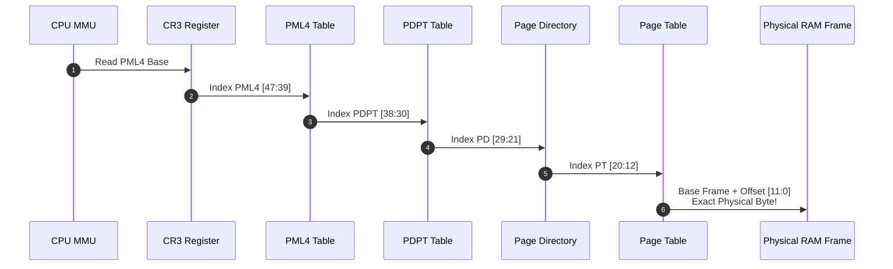
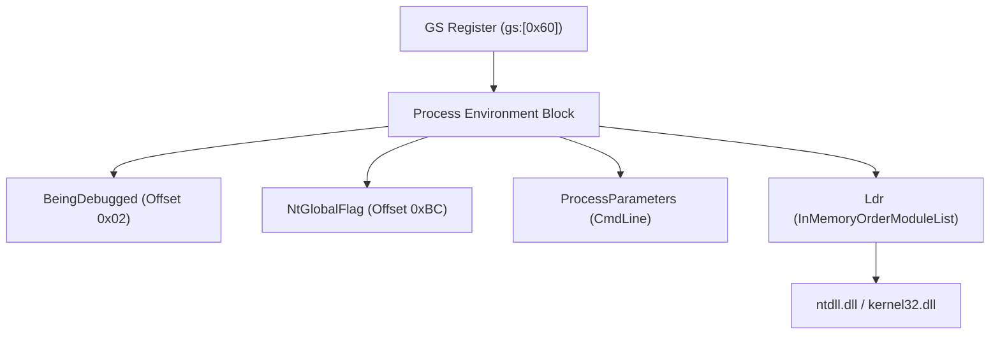

# 🧠 Module 15: Virtual Memory, 4-Level Paging & PEB/TEB Internals

To manipulate process memory, write trainers, build reverse engineering tools, or analyze shellcode, you must understand how virtual addresses translate to physical silicon and how the operating system tracks process metadata in memory structures like the **Process Environment Block (PEB)** and **Thread Environment Block (TEB)**.

---

## 📑 Table of Contents
- [1. Virtual Memory & 4-Level Paging Architecture (x64)](#1-virtual-memory--4-level-paging-architecture-x64)
  - [1.1 The Virtual-to-Physical Address Illusion](#11-the-virtual-to-physical-address-illusion)
  - [1.2 The 48-Bit Virtual Address Breakdown](#12-the-48-bit-virtual-address-breakdown)
  - [1.3 The Page Table Entry (PTE) Flags & The NX/DEP Bit](#13-the-page-table-entry-pte-flags--the-nxdep-bit)
- [2. Memory Allocation & Page Protections](#2-memory-allocation--page-protections)
  - [2.1 `VirtualAlloc` vs. Heap Allocations (`malloc`)](#21-virtualalloc-vs-heap-allocations-malloc)
  - [2.2 Memory Protection Constants](#22-memory-protection-constants)
  - [2.3 The RWX Code Injection Signature](#23-the-rwx-code-injection-signature)
- [3. The Thread Environment Block (TEB)](#3-the-thread-environment-block-teb)
  - [3.1 Accessing TEB via `GS` / `FS` Segment Registers](#31-accessing-teb-via-gs--fs-segment-registers)
  - [3.2 Key TEB Offsets (Stack Limits & TLS)](#32-key-teb-offsets-stack-limits--tls)
- [4. The Process Environment Block (PEB)](#4-the-process-environment-block-peb)
  - [4.1 Navigating from TEB to PEB (`gs:[0x60]`)](#41-navigating-from-teb-to-peb-gs0x60)
  - [4.2 Critical PEB Fields (Anti-Debugging & Metadata)](#42-critical-peb-fields-anti-debugging--metadata)
  - [4.3 Walking `InMemoryOrderModuleList` for API Hashing](#43-walking-inmemoryordermodulelist-for-api-hashing)

---

## 1. Virtual Memory & 4-Level Paging Architecture (x64)

### 1.1 The Virtual-to-Physical Address Illusion
Software instructions never interact directly with physical RAM chips. Every pointer in code (e.g. `0x00007FF712345000`) is a **Virtual Address**.
* The CPU's hardware **Memory Management Unit (MMU)** translates virtual addresses to physical RAM on the fly using a multi-tier tree structure called **Page Tables**.
* Physical RAM is divided into uniform 4096-byte ($4\text{ KB}$) chunks called **Page Frames**.

### 1.2 The 48-Bit Virtual Address Breakdown
On x86-64 architecture, a 64-bit virtual address uses its lower 48 bits for address translation, split into five components:

```
64-Bit Virtual Address Translation Bit Breakdown:
+----------------+--------+--------+--------+--------+---------------+
| Sign Extension |  PML4  |  PDPT  |   PD   |   PT   |  Page Offset  |
|    16 Bits     | 9 Bits | 9 Bits | 9 Bits | 9 Bits |    12 Bits    |
+----------------+--------+--------+--------+--------+---------------+
     [63:48]      [47:39]  [38:30]  [29:21]  [20:12]      [11:0]
```



### 1.3 The Page Table Entry (PTE) Flags & The NX/DEP Bit
Each 64-bit entry in a Page Table contains physical routing bits and hardware permission flags:
* **Bit 0 (P - Present)**: `1` if page resides in physical RAM; `0` if paged out to disk (causes Page Fault `#PF`).
* **Bit 1 (R/W - Read/Write)**: `0` = Read-Only; `1` = Read and Write.
* **Bit 2 (U/S - User/Supervisor)**: `0` = Ring 0 only; `1` = Ring 3 User Mode accessible.
* **Bit 63 (NX - No-Execute / XD - Execute-Disable)**: The hardware foundation for **DEP (Data Execution Prevention)**. If set to `1`, attempting to execute code from this memory page throws an Access Violation (`0xC0000005`).

---

## 2. Memory Allocation & Page Protections

### 2.1 `VirtualAlloc` vs. Heap Allocations (`malloc`)
* **`malloc` / `new` (Heap)**: High-level sub-allocator. Requests large chunks from the OS and divides them into small variable-sized buffers for strings, structs, and objects.
* **`VirtualAlloc` (OS Pages)**: Low-level WinAPI. Allocates raw memory directly aligned to $4\text{ KB}$ page boundaries. Requires explicit commit and protection flags.

```cpp
// Allocating 4KB of Read-Write-Execute memory
LPVOID pMemory = VirtualAlloc(
    NULL,                   // Let OS choose address
    4096,                   // Size (1 Page)
    MEM_COMMIT | MEM_RESERVE,// Reserve VAS and commit physical pages
    PAGE_EXECUTE_READWRITE  // Protection flags
);
```

### 2.2 Memory Protection Constants

| Constant | Value | Permissions | Typical Usage |
| :--- | :---: | :--- | :--- |
| `PAGE_NOACCESS` | `0x01` | None | Guard pages / Uncommitted space |
| `PAGE_READONLY` | `0x02` | Read | `.rdata` section (Constants, strings) |
| `PAGE_READWRITE` | `0x04` | Read + Write | `.data` section, Heap, Stack variables |
| `PAGE_EXECUTE_READ` | `0x20` | Read + Execute | `.text` section (Executable binary code) |
| `PAGE_EXECUTE_READWRITE` | `0x40` | Read + Write + Execute | Dynamic JIT compilers / Code Injection |

### 2.3 The RWX Code Injection Signature
Legitimate production software compiled by standard toolchains (MSVC, GCC, Clang) separates code and data:
* `.text` section is **`PAGE_EXECUTE_READ`** (Never writable).
* `.data` and heap are **`PAGE_READWRITE`** (Never executable).

> [!WARNING]
> **EDR / Antivirus Detection Heuristic**: When an application calls `VirtualAlloc` or `VirtualProtect` with **`PAGE_EXECUTE_READWRITE` (RWX)**, modern EDRs immediately flag the memory region as suspicious because RWX memory is the classic signature of shellcode staging.

---

## 3. The Thread Environment Block (TEB)

Every thread in a Windows process has a `TEB` structure maintained by the OS kernel in user space.

### 3.1 Accessing TEB via `GS` / `FS` Segment Registers
The CPU's segment registers point directly to thread-specific structures:
* **x86 (32-Bit)**: `FS:[0x0]` points to the TEB.
* **x64 (64-Bit)**: `GS:[0x0]` points to the TEB.

### 3.2 Key TEB Offsets (x64)
```
TEB Structure (GS Register Base):
GS:[0x00] -> Pointer to self (Current TEB)
GS:[0x08] -> StackBase (Top of user stack)
GS:[0x10] -> StackLimit (Bottom of committed user stack)
GS:[0x30] -> Process Environment Block (PEB) Pointer (on x86: FS:[0x30])
GS:[0x48] -> ThreadLocalStoragePointer (TLS)
GS:[0x60] -> Process Environment Block (PEB) Pointer (on x64)
```

---

## 4. The Process Environment Block (PEB)

The **PEB** is the most important user-mode data structure for process introspection, reverse engineering, and stealth API resolution.



### 4.1 Navigating to the PEB in C/C++
```cpp
#include <windows.h>
#include <winternl.h>

// Reading PEB directly from GS register (x64)
PPEB GetPEB() {
#if defined(_WIN64)
    return (PPEB)__readgsqword(0x60);
#else
    return (PPEB)__readfsdword(0x30);
#endif
}
```

### 4.2 Critical PEB Fields

| PEB Field | Offset (x64) | Type | Significance in Security & Reverse Engineering |
| :--- | :---: | :--- | :--- |
| `BeingDebugged` | `0x02` | `UCHAR` | `1` if a debugger is attached (`IsDebuggerPresent()` reads this byte). |
| `ImageBaseAddress` | `0x10` | `PVOID` | The base memory address where the main `.exe` was loaded in RAM. |
| `Ldr` | `0x18` | `PPEB_LDR_DATA` | Pointer to the loaded module database. |
| `ProcessParameters` | `0x20` | `PRTL_USER_PROCESS_PARAMETERS` | Contains original command line arguments, current directory, and image path. |
| `NtGlobalFlag` | `0xBC` | `ULONG` | Initialized to `0x70` (`FLG_HEAP_ENABLE_TAIL_CHECK | FLG_HEAP_ENABLE_FREE_CHECK | FLG_HEAP_VALIDATE_PARAMETERS`) under debuggers. |

### 4.3 Walking `InMemoryOrderModuleList` for API Hashing
To invoke Windows APIs without calling `GetModuleHandle` or `GetProcAddress` (which appear in the binary's Import Table and alert static scanners), code walks the PEB module list manually:

1. Read `PEB->Ldr`.
2. Follow the `InMemoryOrderModuleList` head (`LIST_ENTRY` circular doubly-linked list).
3. Cast each entry to `LDR_DATA_TABLE_ENTRY`.
4. Read `BaseDllName.Buffer` to locate `kernel32.dll` and its `DllBase` memory address.
5. Parse the Export Address Table in memory to resolve functions by cryptographic hash.

---

<div align="center">
  <sub>Published and maintained by <a href="https://github.com/DaddyZyn"><b>DaddyZyn (DRAXO.dev)</b></a></sub>
</div>
