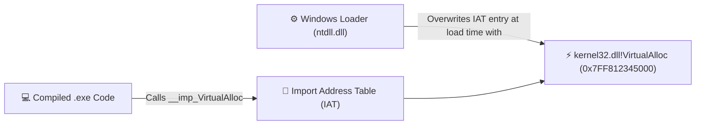
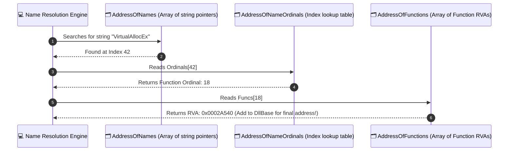

# 📦 Module 16: PE/COFF Binary Format, Dynamic Linking & API Hashing

The **Portable Executable (PE)** format is the standard binary file format for executables (`.exe`), dynamic link libraries (`.dll`), and kernel drivers (`.sys`) in Microsoft Windows. Understanding the internal header layout, section tables, Import/Export Address Tables, and base relocations is fundamental for binary reverse engineering, memory mapping, and static analysis evasion.

---

## 📑 Table of Contents
- [1. The PE File Structure Overview](#1-the-pe-file-structure-overview)
  - [1.1 The Header Hierarchy](#11-the-header-hierarchy)
  - [1.2 Relative Virtual Address (RVA) vs. File Offset (RAW)](#12-relative-virtual-address-rva-vs-file-offset-raw)
- [2. Detailed Header Dissection](#2-detailed-header-dissection)
  - [2.1 The DOS Header (`MZ`) & `e_lfanew`](#21-the-dos-header-mz--e_lfanew)
  - [2.2 The NT Headers (`IMAGE_NT_HEADERS64`)](#22-the-nt-headers-image_nt_headers64)
  - [2.3 The Optional Header & Data Directories](#23-the-optional-header--data-directories)
  - [2.4 Section Headers (`.text`, `.rdata`, `.data`, `.reloc`)](#24-section-headers)
- [3. Dynamic Linking: IAT & EAT Resolution](#3-dynamic-linking-iat--eat-resolution)
  - [3.1 The Import Address Table (IAT)](#31-the-import-address-table-iat)
  - [3.2 The Export Address Table (EAT) Architecture](#32-the-export-address-table-eat-architecture)
  - [3.3 Base Relocations (`.reloc`) & ASLR Re-basing](#33-base-relocations-reloc--aslr-re-basing)
- [4. Dynamic API Resolution via API Hashing (ROR13 / Murmur3)](#4-dynamic-api-resolution-via-api-hashing-ror13--murmur3)
  - [4.1 Why High-Tier Binaries Hide Imports](#41-why-high-tier-binaries-hide-imports)
  - [4.2 The ROR13 Export Table Resolution Loop](#42-the-ror13-export-table-resolution-loop)

---

## 1. The PE File Structure Overview

### 1.1 The Header Hierarchy
When stored on disk or loaded into RAM, a Windows PE binary follows a structured hierarchy of nested headers and sections:

```
PE BINARY MEMORY LAYOUT:
+-------------------------------------------------------------+
| IMAGE_DOS_HEADER (Magic: "MZ" / 0x5A4D)                     |
| -> e_lfanew (Offset 0x3C points to NT Headers)              |
+-------------------------------------------------------------+
| DOS Stub ("This program cannot be run in DOS mode")         |
+-------------------------------------------------------------+
| IMAGE_NT_HEADERS64                                          |
|  +-- Signature ("PE\0\0" / 0x00004550)                      |
|  +-- IMAGE_FILE_HEADER (Machine, NumberOfSections)          |
|  +-- IMAGE_OPTIONAL_HEADER64                                |
|       +-- AddressOfEntryPoint (RVA of execution start)      |
|       +-- ImageBase (Preferred virtual load address)        |
|       +-- DataDirectory[16] (Pointers to IAT, EAT, Relocs)  |
+-------------------------------------------------------------+
| SECTION HEADERS (Array of IMAGE_SECTION_HEADER)             |
|  +-- .text   (Executable Assembly Instructions - RX)        |
|  +-- .rdata  (Read-Only Data, String Literals, IAT - R)     |
|  +-- .data   (Global / Static Variables - RW)               |
|  +-- .pdata  (Exception Handling Function Tables - R)       |
|  +-- .reloc  (Base Relocation Fixup Table - R)              |
+-------------------------------------------------------------+
| RAW SECTION DATA (Actual code bytes and variables)          |
+-------------------------------------------------------------+
```

### 1.2 Relative Virtual Address (RVA) vs. File Offset (RAW)
* **File Offset (RAW Offset)**: The physical byte location on the hard drive.
* **Virtual Address (VA)**: The final memory address when the image is mapped into RAM ($VA = \text{ImageBase} + RVA$).
* **Relative Virtual Address (RVA)**: The byte offset from the module's base address in memory.
  * Because headers and sections have different alignments on disk (typically 512 bytes) vs in memory (typically 4096 bytes / 4KB page), converting RAW to RVA requires calculating section base deltas.

---

## 2. Detailed Header Dissection

### 2.1 The DOS Header (`MZ`) & `e_lfanew`
Every PE begins with the legacy MS-DOS header:
```cpp
typedef struct _IMAGE_DOS_HEADER {
    WORD  e_magic;      // Magic number: "MZ" (0x5A4D)
    // ... (Legacy 16-bit DOS registers) ...
    LONG  e_lfanew;     // File address of new exe header (NT Headers offset)
} IMAGE_DOS_HEADER, *PIMAGE_DOS_HEADER;
```
* **Critical Field**: `e_lfanew` (located at offset `0x3C`) contains the exact byte offset to `IMAGE_NT_HEADERS`.

### 2.2 The NT Headers (`IMAGE_NT_HEADERS64`)
```cpp
typedef struct _IMAGE_NT_HEADERS64 {
    DWORD Signature;                        // "PE\0\0" (0x00004550)
    IMAGE_FILE_HEADER FileHeader;           // COFF File Header
    IMAGE_OPTIONAL_HEADER64 OptionalHeader; // PE32+ Optional Header
} IMAGE_NT_HEADERS64, *PIMAGE_NT_HEADERS64;
```
* **`FileHeader.Machine`**: `0x8664` for x64 (AMD64) or `0x014C` for x86 (i386).
* **`FileHeader.NumberOfSections`**: The count of sections in the section table.

### 2.3 The Optional Header & Data Directories
Despite its name, the **Optional Header** is mandatory for executable binaries. It contains:
* **`AddressOfEntryPoint`**: The RVA where execution begins when the process launches.
* **`ImageBase`**: Preferred base address (default: `0x140000000` on x64).
* **`DataDirectory[16]`**: An array of 16 pointers (`VirtualAddress` and `Size`) to critical subsystems:
  * `DataDirectory[0]`: **Export Directory** (`IMAGE_DIRECTORY_ENTRY_EXPORT`)
  * `DataDirectory[1]`: **Import Directory** (`IMAGE_DIRECTORY_ENTRY_IMPORT`)
  * `DataDirectory[5]`: **Base Relocation Table** (`IMAGE_DIRECTORY_ENTRY_BASERELOC`)
  * `DataDirectory[12]`: **Import Address Table** (`IMAGE_DIRECTORY_ENTRY_IAT`)

---

## 3. Dynamic Linking: IAT & EAT Resolution

### 3.1 The Import Address Table (IAT)
When your program calls an external function like `MessageBoxA` from `user32.dll`:
1. On disk, the binary does not know what memory address `MessageBoxA` will occupy at runtime.
2. The compiler writes an **Import Lookup Table (INT)** and empty **Import Address Table (IAT)** entries.
3. When the Windows Loader (`ntdll!LdrpInitializeProcess`) starts the application:
   * It loads `user32.dll` into memory.
   * It reads the function names from the INT.
   * It finds their real addresses in memory and **overwrites the IAT pointers with the real function addresses**.
4. Your compiled code executes: `call QWORD PTR [__imp_MessageBoxA]` (an indirect call through the IAT).



### 3.2 The Export Address Table (EAT) Architecture
Dynamic Link Libraries (`.dll`) expose their public functions through the **Export Directory**:
* **`AddressOfFunctions`**: Array of RVAs pointing to the actual executable function code.
* **`AddressOfNames`**: Array of RVAs pointing to ASCII function name strings (e.g., `"CreateFileA"`).
* **`AddressOfNameOrdinals`**: Array of 16-bit indices mapping names to their index in `AddressOfFunctions`.



### 3.3 Base Relocations (`.reloc`) & ASLR Re-basing
When **Address Space Layout Randomization (ASLR)** loads a binary at a different memory address than its preferred `ImageBase`:
* All hardcoded absolute memory pointers in code would point to invalid memory.
* The loader calculates the **Delta**:
  $$\Delta = \text{ActualImageBase} - \text{PreferredImageBase}$$
* The loader iterates through the **Base Relocation Table (`.reloc`)** and adds $\Delta$ to every absolute pointer in the binary.

---

## 4. Dynamic API Resolution via API Hashing (ROR13 / Murmur3)

### 4.1 Why High-Tier Binaries Hide Imports
Static analysis tools (VirusTotal, PE-bear, IDA Pro) inspect the IAT to deduce program capabilities (e.g., seeing `VirtualAllocEx`, `WriteProcessMemory`, `CreateRemoteThread` immediately flags a process injector).
* **API Hashing**: Eliminates static imports by never calling `LoadLibrary` or `GetProcAddress` with plaintext strings. Instead, functions are resolved dynamically by matching pre-computed hashes against DLL export tables.

### 4.2 The ROR13 Export Table Resolution Loop

```cpp
#include <windows.h>

// ROR13 Hashing Algorithm (Rotates bits right by 13)
DWORD HashStringROR13(const char* str) {
    DWORD hash = 0;
    while (*str) {
        hash = (hash >> 13) | (hash << (32 - 13));
        hash += *str++;
    }
    return hash;
}

// Resolves a function address from an exported DLL by ROR13 hash
FARPROC GetProcAddressByHash(HMODULE hModule, DWORD targetHash) {
    PIMAGE_DOS_HEADER dos = (PIMAGE_DOS_HEADER)hModule;
    PIMAGE_NT_HEADERS nt = (PIMAGE_NT_HEADERS)((BYTE*)hModule + dos->e_lfanew);
    DWORD exportRVA = nt->OptionalHeader.DataDirectory[IMAGE_DIRECTORY_ENTRY_EXPORT].VirtualAddress;
    
    if (!exportRVA) return NULL;
    
    PIMAGE_EXPORT_DIRECTORY exports = (PIMAGE_EXPORT_DIRECTORY)((BYTE*)hModule + exportRVA);
    DWORD* pNames = (DWORD*)((BYTE*)hModule + exports->AddressOfNames);
    WORD* pOrdinals = (WORD*)((BYTE*)hModule + exports->AddressOfNameOrdinals);
    DWORD* pFunctions = (DWORD*)((BYTE*)hModule + exports->AddressOfFunctions);
    
    for (DWORD i = 0; i < exports->NumberOfNames; i++) {
        char* funcName = (char*)((BYTE*)hModule + pNames[i]);
        if (HashStringROR13(funcName) == targetHash) {
            WORD ordinal = pOrdinals[i];
            return (FARPROC)((BYTE*)hModule + pFunctions[ordinal]);
        }
    }
    return NULL;
}
```

---

<div align="center">
  <sub>Published and maintained by <a href="https://github.com/DaddyZyn"><b>DaddyZyn (DRAXO.dev)</b></a></sub>
</div>
