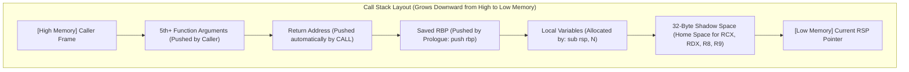

# ⚙️ Module 17: x86/x64 Assembly, CPU Registers & Calling Conventions

Reverse engineering disassemblers (x64dbg, IDA Pro, Ghidra) output raw machine assembly instructions. To follow program control flow, reconstruct functions, write shellcode, or build memory hooks, you must master the x64 register architecture, stack frame mechanics, and the Microsoft x64 Calling Convention.

---

## 📑 Table of Contents
- [1. CPU Register Architecture (x86 vs. x64)](#1-cpu-register-architecture-x86-vs-x64)
  - [1.1 64-Bit General Purpose Registers & Slicing](#11-64-bit-general-purpose-registers--slicing)
  - [1.2 Instruction Pointer (`RIP`) & RIP-Relative Addressing](#12-instruction-pointer-rip--rip-relative-addressing)
  - [1.3 Status Flags (`RFLAGS`: ZF, CF, SF, OF)](#13-status-flags-rflags-zf-cf-sf-of)
- [2. The Microsoft x64 Calling Convention (Fastcall)](#2-the-microsoft-x64-calling-convention-fastcall)
  - [2.1 Register Parameter Passing (`RCX`, `RDX`, `R8`, `R9`)](#21-register-parameter-passing-rcx-rdx-r8-r9)
  - [2.2 The 32-Byte Shadow Space (Home Space)](#22-the-32-byte-shadow-space-home-space)
  - [2.3 Mandatory 16-Byte Stack Alignment](#23-mandatory-16-byte-stack-alignment)
  - [2.4 Legacy 32-Bit Conventions (`cdecl`, `stdcall`, `fastcall`)](#24-legacy-32-bit-conventions-cdecl-stdcall-fastcall)
- [3. Stack Frame Anatomy & Function Lifecycle](#3-stack-frame-anatomy--function-lifecycle)
  - [3.1 Function Prologue](#31-function-prologue)
  - [3.2 Function Epilogue & `RET`](#32-function-epilogue--ret)
  - [3.3 Call Stack Visual Layout](#33-call-stack-visual-layout)
- [4. Control Flow, Comparisons & Branching](#4-control-flow-comparisons--branching)
  - [4.1 `CMP` vs. `TEST` Instructions](#41-cmp-vs-test-instructions)
  - [4.2 Conditional Branching Jump Table](#42-conditional-branching-jump-table)

---

## 1. CPU Register Architecture (x86 vs. x64)

### 1.1 64-Bit General Purpose Registers & Slicing
x86-64 provides sixteen 64-bit General Purpose Registers. Each 64-bit register can be accessed as smaller sub-registers for backward compatibility:

```
Register Slicing Hierarchy (RAX Example):
+---------------------------------------------------------------+
|                             RAX (64 Bits)                     |
+-------------------------------+-------------------------------+
                                |           EAX (32 Bits)       |
                                +---------------+---------------+
                                                |  AX (16 Bits) |
                                                +-------+-------+
                                                |AH(8b) |AL(8b) |
                                                +-------+-------+
```

| 64-bit | 32-bit | 16-bit | 8-bit Low | Primary Conventional Purpose |
| :--- | :--- | :--- | :--- | :--- |
| `RAX` | `EAX` | `AX` | `AL` (and `AH`) | Accumulator, Function return values |
| `RCX` | `ECX` | `CX` | `CL` | 1st function argument, Loop counter (`rep`) |
| `RDX` | `EDX` | `DX` | `DL` (and `DH`) | 2nd function argument, I/O operations |
| `RBX` | `EBX` | `BX` | `BL` (and `BH`) | Base register, Callee-saved general storage |
| `RSP` | `ESP` | `SP` | `SPL` | **Stack Pointer** (Points to current top of stack) |
| `RBP` | `EBP` | `BP` | `BPL` | **Base / Frame Pointer** (Base of current stack frame) |
| `RSI` | `ESI` | `SI` | `SIL` | Source Index for string operations |
| `RDI` | `EDI` | `DI` | `DIL` | Destination Index for string operations |
| `R8`–`R11` | `R8D`–`R11D` | `R8W`–`R11W` | `R8B`–`R11B` | 3rd/4th args (`R8`/`R9`), Volatile scratch registers |
| `R12`–`R15`| `R12D`–`R15D`| `R12W`–`R15W`| `R12B`–`R15B`| Non-volatile callee-saved registers |

### 1.2 Instruction Pointer (`RIP`) & RIP-Relative Addressing
* **`RIP`**: Holds the virtual memory address of the **next instruction** to be executed by the CPU.
* **RIP-Relative Addressing**: In 64-bit mode, instructions reference global variables and strings relative to the current instruction pointer: `mov rax, [rip + 0x1A20]`. This enables **Position-Independent Code (PIC)** required for ASLR.

### 1.3 Status Flags (`RFLAGS`: ZF, CF, SF, OF)
* **ZF (Zero Flag)**: Set to `1` if an arithmetic/logical operation results in `0`. Used after `CMP` to detect equality.
* **CF (Carry Flag)**: Set if an unsigned arithmetic operation overflows.
* **SF (Sign Flag)**: Set to the most significant bit (indicates negative result).
* **OF (Overflow Flag)**: Set if a signed integer overflow occurs.

---

## 2. The Microsoft x64 Calling Convention (Fastcall)

Unlike 32-bit Windows (which had multiple competing calling conventions), 64-bit Windows uses a single unified **Fastcall** standard.

### 2.1 Register Parameter Passing
The first four integer or pointer arguments are passed directly in registers:
1. **1st Argument**: `RCX`
2. **2nd Argument**: `RDX`
3. **3rd Argument**: `R8`
4. **4th Argument**: `R9`
* Any additional arguments (5th, 6th, etc.) are pushed onto the **Stack** from right to left.
* Floating-point arguments are passed in `XMM0`, `XMM1`, `XMM2`, and `XMM3`.

### 2.2 The 32-Byte Shadow Space (Home Space)
Every caller function is **strictly required to allocate 32 bytes (0x20) of scratch space on the stack** immediately before calling any function, even if the target function takes zero arguments.
* The called function can use these 4 quadword slots (`[rsp + 0x08]` through `[rsp + 0x20]`) to spill `RCX`, `RDX`, `R8`, and `R9` into memory during debugging or register pressure.

### 2.3 Mandatory 16-Byte Stack Alignment
Before executing a `CALL` instruction, the stack pointer (`RSP`) **must be aligned to a 16-byte boundary** ($RSP \pmod{16} == 0$).
* When `CALL` executes, it pushes the 8-byte return address, leaving $RSP \pmod{16} == 8$ upon function entry.
* The function prologue must adjust `RSP` by an odd multiple of 8 (e.g. `sub rsp, 0x28`) so that subsequent calls remain 16-byte aligned. Failing to align crashes the CPU on SSE instructions (`movaps`).

### 2.4 Legacy 32-Bit Conventions (x86)

| Convention | Argument Passing | Stack Cleanup | Used In |
| :--- | :--- | :--- | :--- |
| **`__cdecl`** | All on Stack (Right to Left) | **Caller** cleans stack (`add esp, N`) | Standard C runtime (`printf`) |
| **`__stdcall`** | All on Stack (Right to Left) | **Callee** cleans stack (`ret N`) | Standard Win32 APIs |
| **`__fastcall`** | 1st in `ECX`, 2nd in `EDX`, rest on stack | **Callee** cleans stack | Performance-critical functions |

---

## 3. Stack Frame Anatomy & Function Lifecycle



### 3.1 Function Prologue
Sets up the function's stack frame:
```nasm
push rbp              ; Save old base pointer
mov rbp, rsp          ; Establish new base pointer
sub rsp, 0x30         ; Allocate 48 bytes (Local vars + 32-byte shadow space)
```

### 3.2 Function Epilogue & `RET`
Tears down the stack frame and returns to caller:
```nasm
mov eax, [rbp-0x04]   ; Place return value in RAX/EAX
mov rsp, rbp          ; Restore stack pointer
pop rbp               ; Restore caller's base pointer
ret                   ; Pops Return Address into RIP and jumps back!
```

---

## 4. Control Flow, Comparisons & Branching

### 4.1 `CMP` vs. `TEST` Instructions
* **`CMP RAX, RBX`**: Performs $RAX - RBX$ and updates flags (`ZF`, `SF`, `OF`), discarding the numerical result.
* **`TEST RAX, RAX`**: Performs bitwise $RAX \ \& \ RAX$ and sets `ZF` if the value is zero. Commonly used to check for null pointers.

### 4.2 Conditional Branching Jump Table

| Instruction | Meaning | Trigger Condition | Common C/C++ Equivalent |
| :--- | :--- | :---: | :--- |
| **`JMP`** | Unconditional Jump | Always | `goto label;` |
| **`JE` / `JZ`** | Jump if Equal / Zero | `ZF == 1` | `if (x == y)` or `if (ptr == NULL)` |
| **`JNE` / `JNZ`**| Jump if Not Equal / Not Zero | `ZF == 0` | `if (x != y)` or `if (ptr != NULL)` |
| **`JG` / `JNLE`**| Jump if Greater (Signed) | `ZF == 0 and SF == OF` | `if (signed_a > signed_b)` |
| **`JL` / `JNGE`**| Jump if Less (Signed) | `SF != OF` | `if (signed_a < signed_b)` |
| **`JA` / `JNBE`**| Jump if Above (Unsigned) | `CF == 0 and ZF == 0` | `if (unsigned_a > unsigned_b)` |
| **`JB` / `JNAE`**| Jump if Below (Unsigned) | `CF == 1` | `if (unsigned_a < unsigned_b)` |

---

<div align="center">
  <sub>Published and maintained by <a href="https://github.com/DaddyZyn"><b>DaddyZyn (DRAXO.dev)</b></a></sub>
</div>
