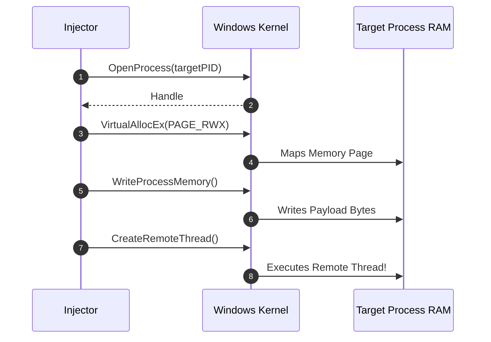
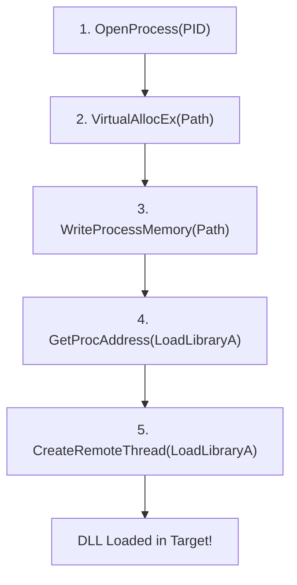
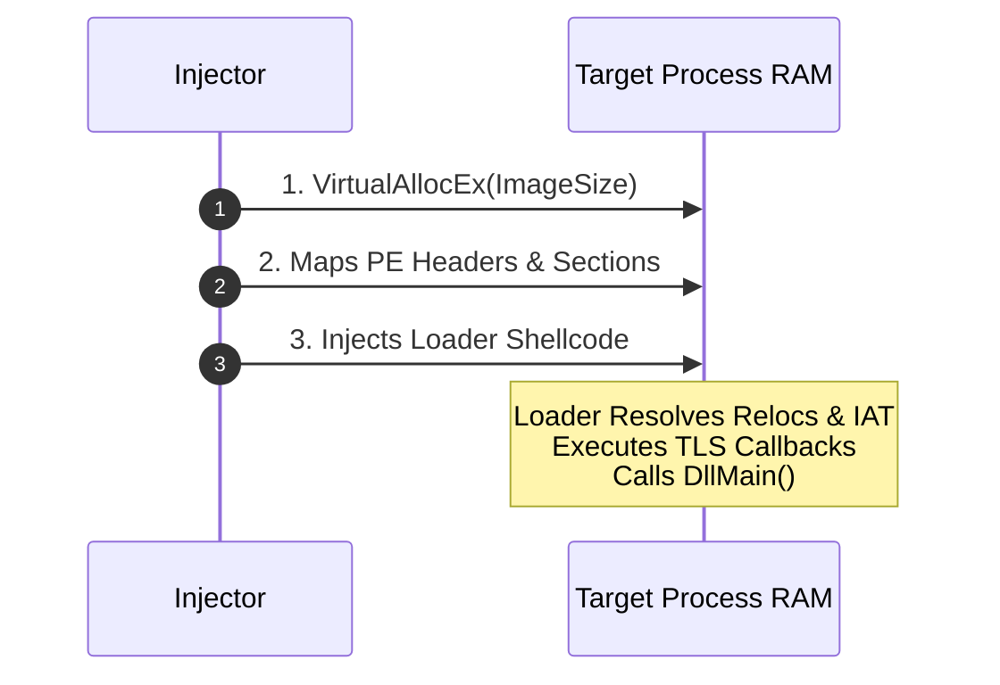
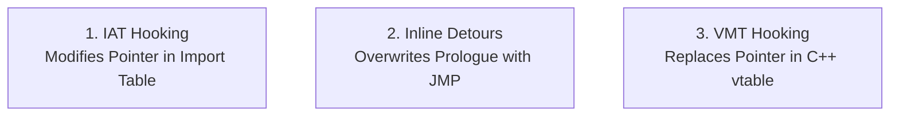
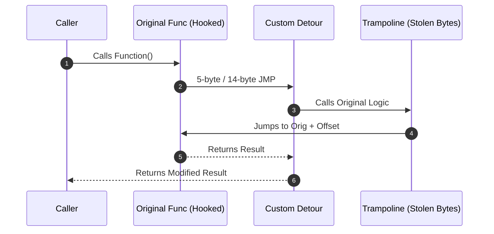
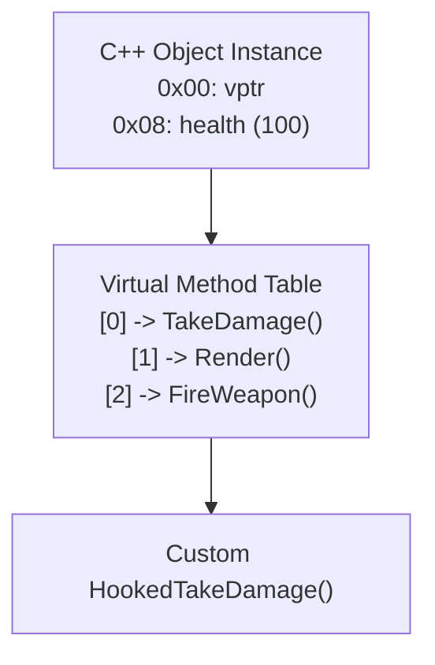

# 💉 Module 18: Process Manipulation, Injection & Hooking Techniques

In systems software, security instrumentation, game modding, and malware analysis, interacting with external processes requires reading, writing, and diverting memory execution. In this module, we dissect the mechanics of process memory manipulation, compare classic DLL injection with stealth Manual Mapping, and analyze the three core code hooking architectures: **IAT Hooking**, **Inline Detours (Trampolines)**, and **C++ VMT Hooking**.

---

## 📑 Table of Contents
- [1. Process Memory Primitives (WinAPI)](#1-process-memory-primitives-winapi)
  - [1.1 Process Handles & Access Rights](#11-process-handles--access-rights)
  - [1.2 Cross-Process Memory Manipulation](#12-cross-process-memory-manipulation)
- [2. Process Injection Mechanics](#2-process-injection-mechanics)
  - [2.1 Classic `CreateRemoteThread` Injection](#21-classic-createremotethread-injection)
  - [2.2 Manual Mapping (Stealth In-Memory PE Loading)](#22-manual-mapping-stealth-in-memory-pe-loading)
  - [2.3 Early Bird APC Injection](#23-early-bird-apc-injection)
- [3. Code Hooking Architectures](#3-code-hooking-architectures)
  - [3.1 Import Address Table (IAT) Hooking](#31-import-address-table-iat-hooking)
  - [3.2 Inline Detour Hooking & Trampoline Generation](#32-inline-detour-hooking--trampoline-generation)
  - [3.3 C++ Virtual Method Table (VMT) Hooking](#33-c-virtual-method-table-vmt-hooking)

---

## 1. Process Memory Primitives (WinAPI)

To interact with another process's virtual memory from user mode, the operating system requires obtaining a **Process Handle** from the kernel.

### 1.1 Process Handles & Access Rights
```cpp
HANDLE hProcess = OpenProcess(
    PROCESS_VM_READ | PROCESS_VM_WRITE | PROCESS_VM_OPERATION | PROCESS_CREATE_THREAD,
    FALSE,
    targetPID
);
```
* **`PROCESS_VM_READ`**: Allows calling `ReadProcessMemory`.
* **`PROCESS_VM_WRITE`**: Allows calling `WriteProcessMemory`.
* **`PROCESS_VM_OPERATION`**: Allows calling `VirtualAllocEx` and `VirtualProtectEx` to alter memory protections.

### 1.2 Cross-Process Memory Manipulation


---

## 2. Process Injection Mechanics

### 2.1 Classic `CreateRemoteThread` Injection
The most traditional DLL injection technique leverages the fact that `kernel32.dll!LoadLibraryA` shares the exact same function signature as a thread start routine (`LPTHREAD_START_ROUTINE`):

$$\text{DWORD WINAPI ThreadProc(LPVOID lpParameter);}$$
$$\text{HMODULE WINAPI LoadLibraryA(LPCSTR lpLibFileName);}$$



> **Limitations & Detection Vectors**:
> * Creates a file artifact on disk.
> * Registers the DLL in the target's PEB `InMemoryOrderModuleList`.
> * Triggers `DLL_PROCESS_ATTACH` in all existing threads.
> * Hooked by modern EDRs on `NtCreateThreadEx`.

### 2.2 Manual Mapping (Stealth In-Memory PE Loading)
**Manual Mapping** bypasses the Windows Loader entirely. The injector acts as a custom operating system loader directly inside the target's memory space:



* **Advantage**: The DLL is never registered in the PEB module lists, leaves zero disk records, and runs entirely in unbacked memory pages.

### 2.3 Early Bird APC Injection
To bypass behavioral EDR monitoring before security hooks are initialized:
1. Spawns target process in a suspended state: `CreateProcessA("target.exe", ..., CREATE_SUSPENDED, ...)`.
2. Allocates and writes shellcode to target memory space.
3. Queues an **Asynchronous Procedure Call (APC)** to the main suspended thread: `QueueUserAPC((PAPCFUNC)pShellcode, hThread, NULL)`.
4. Resumes the thread: `ResumeThread(hThread)`.
* **Result**: The operating system kernel executes the APC shellcode **before** the main application entry point and before any third-party EDR DLLs can hook `ntdll.dll`.

---

## 3. Code Hooking Architectures

Hooking is the practice of intercepting function calls to monitor parameters, alter return values, or redirect program control flow.



---

### 3.1 Import Address Table (IAT) Hooking
IAT hooking replaces the imported function address inside the module's `.rdata` Import Table:

```cpp
// Pseudocode for IAT Hooking
void HookIAT(HMODULE hModule, const char* targetDLL, const char* targetFunc, void* newFunc) {
    // 1. Locate Import Directory in PE Headers
    PIMAGE_IMPORT_DESCRIPTOR importDesc = GetImportDescriptor(hModule, targetDLL);
    
    // 2. Find target function in FirstThunk (IAT)
    PIMAGE_THUNK_DATA thunk = (PIMAGE_THUNK_DATA)((BYTE*)hModule + importDesc->FirstThunk);
    while (thunk->u1.Function) {
        if (IsTargetFunction(thunk, targetFunc)) {
            // 3. Change memory protection to writable
            DWORD oldProtect;
            VirtualProtect(&thunk->u1.Function, sizeof(void*), PAGE_READWRITE, &oldProtect);
            
            // 4. Overwrite pointer with our hook function!
            thunk->u1.Function = (ULONG_PTR)newFunc;
            
            VirtualProtect(&thunk->u1.Function, sizeof(void*), oldProtect, &oldProtect);
            break;
        }
        thunk++;
    }
}
```

---

### 3.2 Inline Detour Hooking & Trampoline Generation

Inline hooking overwrites the very first instructions (prologue) of a target function with an unconditional jump (`JMP`) to a detour function.



#### The 64-Bit Absolute Jump Challenge:
* A standard 32-bit relative jump `E9 <32-bit offset>` only reaches within $\pm 2\text{ GB}$.
* In 64-bit address space, the detour function may be located gigabytes away.
* **14-Byte Absolute Jump Pattern**:
  ```nasm
  FF 25 00 00 00 00    ; JMP QWORD PTR [rip + 0]
  40 50 34 12 77 7F 00 00 ; 8-byte 64-bit absolute memory address
  ```

---

### 3.3 C++ Virtual Method Table (VMT) Hooking

In C++, classes containing `virtual` functions store a hidden pointer (`vptr`) as the very first 8 bytes of the object instance in memory. This `vptr` points to an array of function pointers called the **VMT (`vtable`)**.



#### Execution:
1. Dereference `vptr` to locate the `vtable` pointer array in `.rdata`.
2. Change page protection via `VirtualProtect`.
3. Overwrite `vtable[index]` with the pointer to the detour function.
* **Advantage**: Zero instructions are modified inside the `.text` code section, evading simple byte integrity scanners.

---

<div align="center">
  <sub>Published and maintained by <a href="https://github.com/DaddyZyn"><b>DaddyZyn (DRAXO.dev)</b></a></sub>
</div>
