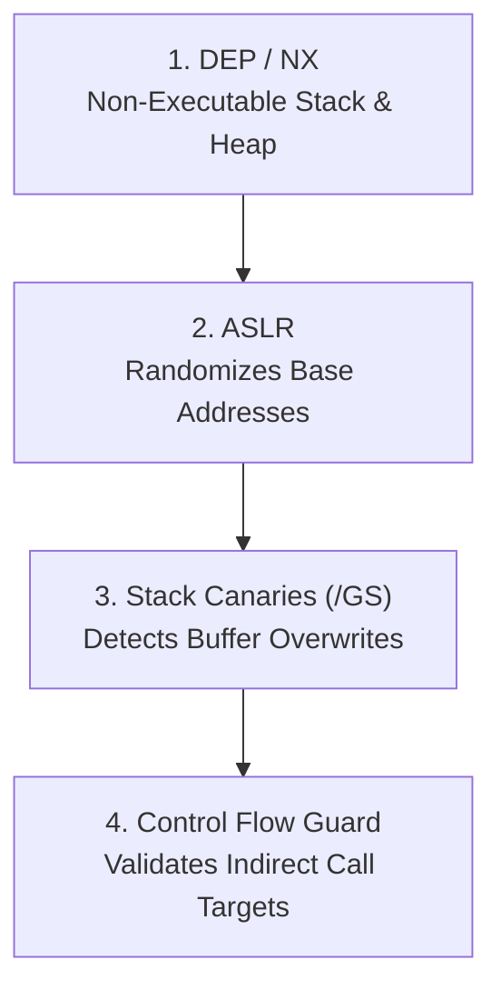
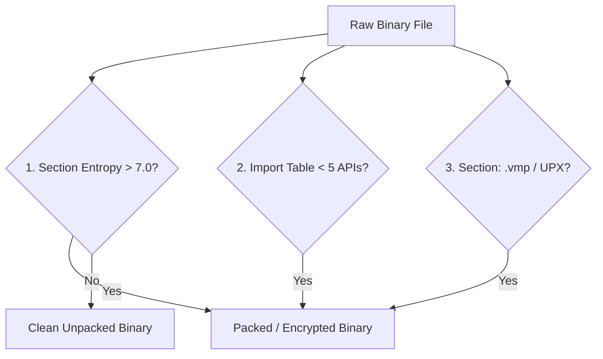
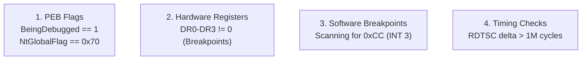
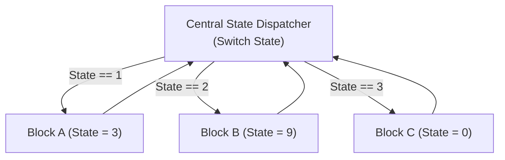

# 🛡️ Module 19: Reverse Engineering Protections, Anti-Debugging & Mitigations

When analyzing unfamiliar software, malware, or commercial binaries in a disassembler (x64dbg, IDA Pro, Ghidra), you will encounter binary defenses designed to prevent inspection, tampering, and exploitation. In this module, we break down operating system exploit mitigations (**DEP/NX**, **ASLR**, **Stack Canaries**, **CFG**) and examine how to identify packed, obfuscated, and anti-debugged binaries.

---

## 📑 Table of Contents
- [1. Operating System Exploit Mitigations](#1-operating-system-exploit-mitigations)
  - [1.1 DEP / NX (Data Execution Prevention) & ROP Chains](#11-dep--nx-data-execution-prevention--rop-chains)
  - [1.2 ASLR (Address Space Layout Randomization)](#12-aslr-address-space-layout-randomization)
  - [1.3 Stack Canaries (`/GS` Security Cookies)](#13-stack-canaries-gs-security-cookies)
  - [1.4 Control Flow Guard (CFG)](#14-control-flow-guard-cfg)
- [2. How to Identify Protected & Packed Binaries](#2-how-to-identify-protected--packed-binaries)
  - [2.1 High Section Entropy Analysis](#21-high-section-entropy-analysis)
  - [2.2 Stripped / Minimal Import Address Tables](#22-stripped--minimal-import-address-tables)
  - [2.3 Characteristic Section Names (VMProtect, Themida, UPX)](#23-characteristic-section-names)
- [3. Anti-Debugging Detection Mechanics](#3-anti-debugging-detection-mechanics)
  - [3.1 PEB Checks (`BeingDebugged`, `NtGlobalFlag`)](#31-peb-checks-beingdebugged-ntglobalflag)
  - [3.2 Hardware Breakpoint Probing (`DR0`–`DR7`)](#32-hardware-breakpoint-probing-dr0dr7)
  - [3.3 Software Breakpoint Scanning (`0xCC` / `INT 3`)](#33-software-breakpoint-scanning-0xcc--int-3)
  - [3.4 Timing Checks (`RDTSC`)](#34-timing-checks-rdtsc)
- [4. Code Obfuscation & Virtualization Architectures](#4-code-obfuscation--virtualization-architectures)
  - [4.1 Control Flow Flattening](#41-control-flow-flattening)
  - [4.2 Virtual Machine Protection (Bytecode Virtualization)](#42-virtual-machine-protection-bytecode-virtualization)

---

## 1. Operating System Exploit Mitigations

Modern compilers and operating systems implement defense-in-depth layers to prevent memory corruption vulnerabilities from achieving code execution.



### 1.1 DEP / NX (Data Execution Prevention) & ROP Chains
* **The Defense**: Enforces the hardware **NX (No-Execute) bit** in Page Table Entries. Stack and heap memory pages are marked as `PAGE_READWRITE` (non-executable). If an attacker overflows a buffer and jumps directly into shellcode on the stack, the CPU immediately raises an Access Violation (`0xC0000005`).
* **The Bypass Concept (ROP - Return-Oriented Programming)**:
  * Instead of injecting new executable code, the attacker strings together short snippets of existing executable instructions in loaded DLLs that end in a `RET` instruction (called **ROP Gadgets**).
  * The ROP chain calls `VirtualProtect` to flip the shellcode page from `PAGE_READWRITE` to `PAGE_EXECUTE_READWRITE`, disabling DEP on that memory region.

### 1.2 ASLR (Address Space Layout Randomization)
* **The Defense**: Every time the system reboots or a process launches, the kernel randomizes the `ImageBase` addresses of `.exe` files and system DLLs (`ntdll.dll`, `kernel32.dll`), as well as the base addresses of the Stack and Heap.
* **The Bypass Concept**: Requires an **Information Disclosure (Memory Leak)** vulnerability to read a single pointer from memory, calculate the module's dynamic base delta, and resolve all gadget addresses relative to the leak.

### 1.3 Stack Canaries (`/GS` Security Cookies)
* **The Defense**: The compiler places a random 64-bit integer (`__security_cookie`) onto the stack frame between local variables and the saved return pointer (`RIP`).
* **Validation**: Before the function executes `RET`, it compares the canary value against the master cookie in `.data`. If an overflow corrupted the canary, the process calls `__report_gsfailure` and terminates immediately.

---

## 2. How to Identify Protected & Packed Binaries

When loading an unknown binary into a PE viewer (PE-bear, CFF Explorer) or disassembler, several key indicators immediately reveal that the binary is packed, encrypted, or protected:



### 2.1 High Section Entropy Analysis
* Normal compiled x86/x64 machine code and ASCII strings have a Shannon entropy of **$4.5 - 6.2$ bits/byte**.
* Encrypted, compressed, or packed payloads have maximum randomness with entropy **$> 7.2$ bits/byte**.

### 2.2 Stripped / Minimal Import Address Tables
* A standard complex application imports hundreds of functions across multiple DLLs (`user32`, `gdi32`, `advapi32`, `ws2_32`).
* A packed binary typically has an IAT with **only 2 to 5 functions** (e.g., only `LoadLibraryA` and `GetProcAddress` in `kernel32.dll`), used by the small unpacker stub to dynamically unpack the real binary at runtime.

### 2.3 Characteristic Section Names

| Section Name | Identified Protection / Packer |
| :--- | :--- |
| `UPX0`, `UPX1`, `UPX2` | **UPX (Ultimate Packer for eXecutables)** |
| `.vmp0`, `.vmp1` | **VMProtect (Virtual Machine Protection)** |
| `.themida`, `Themida` | **Themida / WinLicense (Oreans Technologies)** |
| `.enigma1`, `.enigma2` | **Enigma Protector** |
| `.bindat`, `.aspack` | **ASPack Protector** |

---

## 3. Anti-Debugging Detection Mechanics

Protected software employs several distinct detection checks to spot active debuggers:



### 3.1 PEB Checks
When a debugger attaches to a process, the Windows kernel sets specific flags inside the process's `PEB`:
* `PEB->BeingDebugged == 1` (`IsDebuggerPresent()` simply checks this byte).
* `PEB->NtGlobalFlag == 0x70` (`FLG_HEAP_ENABLE_TAIL_CHECK | FLG_HEAP_ENABLE_FREE_CHECK | FLG_HEAP_VALIDATE_PARAMETERS`).

### 3.2 Hardware Breakpoint Probing (`DR0`–`DR7`)
Hardware breakpoints rely on the CPU's Debug Registers (`DR0`, `DR1`, `DR2`, `DR3`). Protected binaries call `GetThreadContext`:
```cpp
CONTEXT ctx = { 0 };
ctx.ContextFlags = CONTEXT_DEBUG_REGISTERS;
GetThreadContext(GetCurrentThread(), &ctx);

if (ctx.Dr0 || ctx.Dr1 || ctx.Dr2 || ctx.Dr3) {
    // 🚨 Hardware Breakpoint Detected!
    ExitProcess(0);
}
```

### 3.3 Software Breakpoint Scanning (`0xCC` / `INT 3`)
When you set a standard software breakpoint in x64dbg or IDA Pro, the debugger temporarily replaces the first byte of the instruction with **`0xCC` (`INT 3`)**.
* Anti-tamper routines scan critical function bytes in memory. If a byte equals `0xCC`, the binary knows a breakpoint is present.

### 3.4 Timing Checks (`RDTSC`)
The `RDTSC` (Read Time-Stamp Counter) instruction returns the number of CPU clock cycles elapsed since reset:
```nasm
rdtsc                 ; Read initial timestamp into EDX:EAX
mov r8d, eax          ; Save start time
; ... (Critical execution block) ...
rdtsc                 ; Read ending timestamp
sub eax, r8d          ; Calculate elapsed cycles
cmp eax, 0x100000     ; If delta is huge, a human is stepping through in a debugger!
jg debugger_detected
```

---

## 4. Code Obfuscation & Virtualization Architectures

### 4.1 Control Flow Flattening
Transforms clean, readable nested `if-else` and `while` loops into a single monolithic **infinite `switch-case` loop controlled by a state variable**:



### 4.2 Virtual Machine Protection (Bytecode Virtualization)
The most advanced commercial protection technology (VMProtect, Themida):
1. The protector compiles native x86/x64 instructions into **custom, randomized, proprietary bytecode**.
2. It strips the original x64 machine code from the binary completely.
3. It embeds a small custom **Virtual Machine Interpreter Loop** into the `.text` section.
4. When executed, the embedded VM reads the custom bytecode one byte at a time, emulating CPU registers and arithmetic internally.
* **Reverse Engineering Impact**: Standard disassemblers cannot decompile the code back to C/C++ because x64 instructions no longer exist. Analysts must reverse engineer the custom virtual machine interpreter and write custom bytecode disassemblers.

---

<div align="center">
  <sub>Published and maintained by <a href="https://github.com/DaddyZyn"><b>DaddyZyn (DRAXO.dev)</b></a></sub>
</div>
