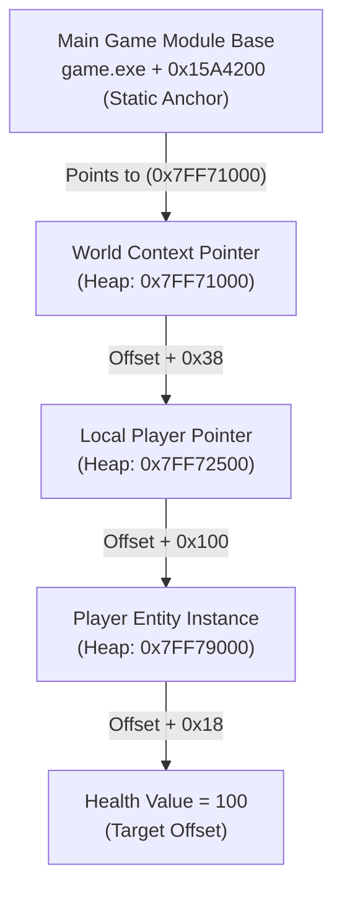
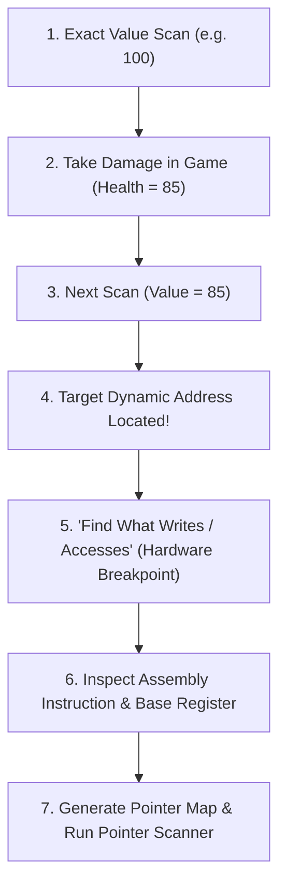

# 🧠 Module 20: Memory Operations, Pointer Chains & Structure Reconstruction

In low-level software engineering, reverse engineering, and game analysis, interacting with a process requires navigating dynamic memory. Because modern software allocates memory dynamically on the heap during runtime, variables and objects do not stay at static addresses. In this module, we dissect dynamic heap memory, multi-level pointer chains, Cheat Engine workflows, and data structure reconstruction with ReClass.NET.

---

## 📑 Table of Contents
- [1. Static Base Addresses vs. Dynamic Heap Allocations](#1-static-base-addresses-vs-dynamic-heap-allocations)
  - [1.1 Why Memory Addresses Change Every Restart](#11-why-memory-addresses-change-every-restart)
  - [1.2 The Module Base Anchor](#12-the-module-base-anchor)
- [2. Multi-Level Pointer Chains](#2-multi-level-pointer-chains)
  - [2.1 The Pointer Dereference Architecture](#21-the-pointer-dereference-architecture)
  - [2.2 Mathematical Pointer Notation](#22-mathematical-pointer-notation)
  - [2.3 Resolving Pointer Chains in C++](#23-resolving-pointer-chains-in-c)
- [3. Cheat Engine Dynamic Analysis Workflows](#3-cheat-engine-dynamic-analysis-workflows)
  - [3.1 Value Scanning (Exact, Changed, Decreased)](#31-value-scanning-exact-changed-decreased)
  - [3.2 "Find Out What Accesses This Address" (Hardware Breakpoints)](#32-find-out-what-accesses-this-address-hardware-breakpoints)
  - [3.3 The Pointer Scanner Engine](#33-the-pointer-scanner-engine)
- [4. Data Structure Reconstruction (ReClass.NET)](#4-data-structure-reconstruction-reclassnet)
  - [4.1 Identifying Structure Padding & Member Alignments](#41-identifying-structure-padding--member-alignments)
  - [4.2 Dissecting Classes in Memory](#42-dissecting-classes-in-memory)

---

## 1. Static Base Addresses vs. Dynamic Heap Allocations

### 1.1 Why Memory Addresses Change Every Restart
When you search for a value (such as player health = 100) in memory and restart the game, the value is located at a completely different address:
1. **ASLR (Address Space Layout Randomization)**: Randomizes the base address of the main executable and loaded DLLs.
2. **Dynamic Heap Memory (`malloc` / `new`)**: When the game engine spawns an entity, the operating system assigns whatever free page frame is available on the heap.



### 1.2 The Module Base Anchor
While heap addresses are dynamic, the game's internal code pointers inside the `.data` or `.rdata` section are stored at fixed offsets from the **Module Base Address**:
$$\text{ModuleBase} = \text{GetModuleHandleA("game.exe")}$$
$$\text{StaticAnchor} = \text{ModuleBase} + \text{StaticOffset}$$

---

## 2. Multi-Level Pointer Chains

### 2.1 The Pointer Dereference Architecture
Complex object-oriented game engines (Unreal Engine, Unity, proprietary engines) organize data into nested hierarchical classes:
* `EngineContext` $\rightarrow$ `World` $\rightarrow$ `PersistentLevel` $\rightarrow$ `ActorArray` $\rightarrow$ `LocalPlayer` $\rightarrow$ `HealthComponent` $\rightarrow$ `HealthValue`.

### 2.2 Mathematical Pointer Notation
In Cheat Engine and reverse engineering tooling, pointer chains are represented as a static base followed by an ordered array of hexadecimal offsets:

$$\text{FinalAddress} = \left[ \left[ \left[ \text{game.exe} + \text{0x1A40} \right] + \text{0x38} \right] + \text{0x10} \right] + \text{0x18}$$

1. Read 8 bytes from `game.exe + 0x1A40` $\rightarrow$ yields Address $A$.
2. Add `0x38` to Address $A$ and read 8 bytes $\rightarrow$ yields Address $B$.
3. Add `0x10` to Address $B$ and read 8 bytes $\rightarrow$ yields Address $C$.
4. Target health value is located at $C + \text{0x18}$.

### 2.3 Resolving Pointer Chains in C++

```cpp
#include <windows.h>
#include <vector>

// Resolves a multi-level 64-bit pointer chain in target process memory
uintptr_t ResolvePointerChain(HANDLE hProcess, uintptr_t baseAddr, const std::vector<unsigned int>& offsets) {
    uintptr_t currentAddr = baseAddr;
    
    for (size_t i = 0; i < offsets.size(); i++) {
        // Read 8-byte pointer from current address
        if (!ReadProcessMemory(hProcess, (LPCVOID)currentAddr, &currentAddr, sizeof(currentAddr), NULL)) {
            return 0; // Invalid / broken pointer chain
        }
        // Add offset to dereferenced pointer
        currentAddr += offsets[i];
    }
    
    return currentAddr;
}
```

---

## 3. Cheat Engine Dynamic Analysis Workflows

Cheat Engine (CE) is the primary dynamic memory introspection tool used to locate variables, trace pointer chains, and inspect runtime assembly.



### 3.1 Value Scanning Workflows
1. **Initial Scan**: Value Type = `4 Bytes` (or `Float`), Scan Type = `Exact Value` (e.g. `100`).
2. **Value Mutation**: Change the value in-game (take damage, shoot ammo, collect coins).
3. **Next Scan**: Filter for the new exact value (or `Decreased value` / `Increased value` if exact numbers are hidden by UI).
4. Repeat until only 1–3 dynamic memory addresses remain.

### 3.2 "Find Out What Accesses This Address" (Hardware Breakpoints)
Once you find the dynamic memory address of a variable:
1. Right-click address $\rightarrow$ select **"Find out what writes to this address"** (or accesses).
2. Cheat Engine attaches a debugger and sets a **CPU Hardware Breakpoint** (`DR0`-`DR3`) on that memory address.
3. Trigger the action in-game.
4. An instruction window pops up showing the exact instruction modifying the value:
   ```nasm
   mov [rbx+0x00000128], eax    ; RBX contains Base Entity Pointer, 0x128 is Health Offset
   ```
5. Note the register (`RBX`) and offset (`0x128`).
6. Search for the address in `RBX` as a hexadecimal pointer to find the upstream pointer!

### 3.3 The Pointer Scanner Engine
Manually tracing 5-level pointer chains can be slow. Cheat Engine's **Pointer Scanner**:
1. Generates a **Pointer Map** of memory snapshot 1.
2. Restarts the game and generates **Pointer Map** of snapshot 2.
3. Compares the maps to find paths from static module bases (`game.exe+0x...`) that reliably resolve to the target variable across all game restarts.

---

## 4. Data Structure Reconstruction (ReClass.NET)

When reverse engineering complex classes, you must reconstruct the memory layout of the entire C++ class structure. **ReClass.NET** allows real-time interactive dissection of process memory.

```
Example Reconstructed C++ Entity Class Layout in ReClass.NET:
0x0000: vptr                    (Pointer to Virtual Method Table)
0x0008: int32_t entity_id       (4 Bytes)
0x000C: uint8_t team_id         (1 Byte)
0x000D: uint8_t pad_000D[3]     (3 Bytes Structure Padding)
0x0010: Vector3 position        (12 Bytes: float x, y, z)
0x001C: float yaw               (4 Bytes)
0x0020: float pitch             (4 Bytes)
0x0024: int32_t health          (4 Bytes)
0x0028: int32_t max_health      (4 Bytes)
0x002C: uint8_t is_alive        (1 Byte)
0x002D: uint8_t pad_002D[3]     (3 Bytes Structure Padding)
0x0030: WeaponComponent* weapon (8-byte pointer to nested Weapon class)
```

### 4.1 Structure Padding & Member Alignment
* In C/C++, compilers align 4-byte integers to 4-byte boundaries and 8-byte pointers to 8-byte boundaries for CPU memory bus efficiency.
* If a 1-byte `team_id` is placed before an 8-byte pointer, the compiler inserts **7 bytes of invisible padding** between them.
* ReClass.NET visualizes these padding bytes, preventing offset misalignments when reconstructing header files.

---

<div align="center">
  <sub>Published and maintained by <a href="https://github.com/DaddyZyn"><b>DaddyZyn (DRAXO.dev)</b></a></sub>
</div>
