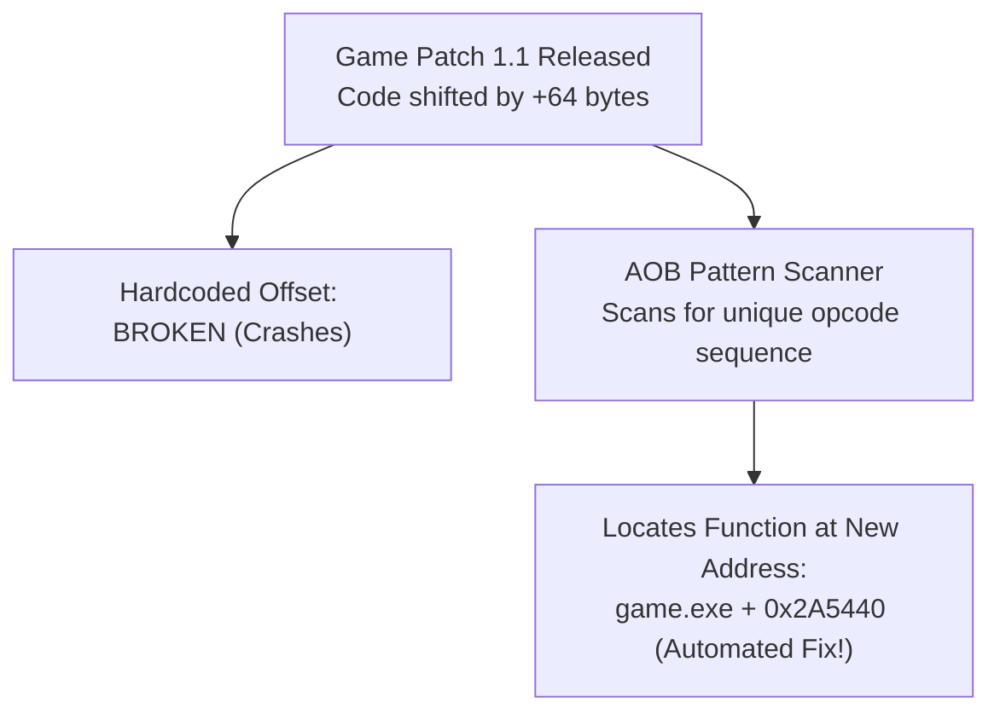
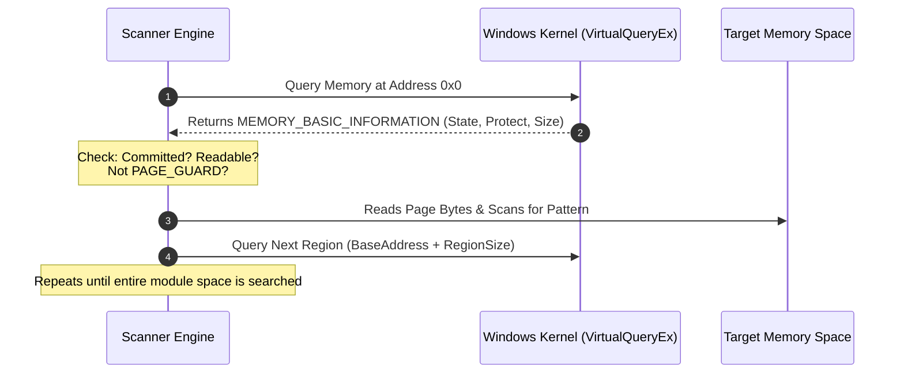

# 🔍 Module 21: AOB Pattern Scanning, SigMaking & Memory Iteration

When games or applications receive an update (patch), the compiler generates new machine code. This changes function addresses, shifts struct offsets, and breaks hardcoded pointers. To build resilient mods, trainers, and security tools, developers use **Array of Bytes (AOB) Pattern Scanning** (Signature Scanning) to dynamically locate functions and data at runtime.

---

## 📑 Table of Contents
- [1. Why Hardcoded Offsets Break On Every Patch](#1-why-hardcoded-offsets-break-on-every-patch)
  - [1.1 The Recompilation Shift Problem](#11-the-recompilation-shift-problem)
  - [1.2 The Signature Solution](#12-the-signature-solution)
- [2. Anatomy of an AOB Pattern & Mask](#2-anatomy-of-an-aob-pattern--mask)
  - [2.1 Static Opcodes vs. Dynamic Operands (Wildcards)](#21-static-opcodes-vs-dynamic-operands-wildcards)
  - [2.2 IDA-Style vs. Code-Style (Byte + Mask)](#22-ida-style-vs-code-style-byte--mask)
- [3. Memory Region Traversal via `VirtualQueryEx`](#3-memory-region-traversal-via-virtualqueryex)
  - [3.1 The `MEMORY_BASIC_INFORMATION` Structure](#31-the-memory_basic_information-structure)
  - [3.2 Filtering Safe Memory Pages (Avoiding `PAGE_GUARD` Crashes)](#32-filtering-safe-memory-pages-avoiding-page_guard-crashes)
- [4. Fast C++ Pattern Scanner Implementation](#4-fast-c-pattern-scanner-implementation)
- [5. SigMaking in IDA Pro & Ghidra](#5-sigmaking-in-ida-pro--ghidra)
  - [5.1 Creating Unique Signatures](#51-creating-unique-signatures)
  - [5.2 Verifying Signature Uniqueness](#52-verifying-signature-uniqueness)

---

## 1. Why Hardcoded Offsets Break On Every Patch

### 1.1 The Recompilation Shift Problem
Suppose a game version 1.0 has a function at `game.exe + 0x2A5400`.
* In version 1.1, the developer fixes a bug and adds 15 lines of code to an unrelated function earlier in the source.
* When compiled, all subsequent functions are shifted forward by 64 bytes.
* If your software uses hardcoded offset `0x2A5400`, it reads invalid instructions or crashes immediately.

### 1.2 The Signature Solution
While virtual memory addresses shift, the **underlying machine code opcodes** generated by the compiler for a specific function remain virtually identical across updates. By scanning memory for this specific byte sequence with wildcards, we find the new address automatically.



---

## 2. Anatomy of an AOB Pattern & Mask

### 2.1 Static Opcodes vs. Dynamic Operands (Wildcards)
Consider this x64 assembly instruction:
```nasm
mov rax, [rip + 0x1A2540]   ; 48 8B 05 40 25 1A 00
cmp eax, 0x64               ; 83 F8 64
```
* `48 8B 05`: Static machine opcode for `mov rax, [rip + offset]`.
* `40 25 1A 00`: **Dynamic RIP-relative displacement** (changes on every compile).
* `83 F8 64`: Static opcode for `cmp eax, 100`.

To create an AOB pattern, we replace dynamic operands with **Wildcards (`?`)**:
* **Pattern**: `\x48\x8B\x05\x00\x00\x00\x00\x83\xF8\x64`
* **Mask**: `xxx????xxx` (`x` = match exact byte, `?` = ignore byte)

### 2.2 IDA-Style vs. Code-Style Patterns

| Style Format | Representation | Usage |
| :--- | :--- | :--- |
| **IDA-Style (Spaces)** | `48 8B 05 ? ? ? ? 83 F8 64` | IDA Pro / Ghidra / Cheat Engine |
| **Byte + Mask** | `"\x48\x8B\x05\x00\x00\x00\x00\x83\xF8\x64", "xxx????xxx"` | C / C++ Source Code |

---

## 3. Memory Region Traversal via `VirtualQueryEx`

To scan the target process without reading invalid memory pages (which triggers Access Violations), we use `VirtualQueryEx` to walk the memory page map.



### 3.1 Filtering Safe Memory Pages
* **`State == MEM_COMMIT`**: Only scan pages that are physically committed in RAM.
* **`Protect & (PAGE_READONLY | PAGE_READWRITE | PAGE_EXECUTE_READ | PAGE_EXECUTE_READWRITE)`**: Only scan readable pages.
* **Skip `PAGE_GUARD` and `PAGE_NOACCESS`**: Reading a guard page triggers an exception in the target process.

---

## 4. Fast C++ Pattern Scanner Implementation

```cpp
#include <windows.h>
#include <vector>
#include <iostream>

// Compares memory buffer against pattern and mask
bool DataCompare(const BYTE* pData, const BYTE* bMask, const char* szMask) {
    for (; *szMask; ++szMask, ++pData, ++bMask) {
        if (*szMask == 'x' && *pData != *bMask) {
            return false;
        }
    }
    return (*szMask == 0);
}

// Scans a specific memory buffer for an AOB signature
uintptr_t FindPattern(uintptr_t startAddress, DWORD size, const BYTE* bMask, const char* szMask) {
    for (DWORD i = 0; i < size; i++) {
        if (DataCompare((const BYTE*)(startAddress + i), bMask, szMask)) {
            return (startAddress + i);
        }
    }
    return 0; // Not found
}

// External Pattern Scanner across target process memory pages
uintptr_t ScanProcessMemory(HANDLE hProcess, uintptr_t moduleBase, size_t moduleSize, const BYTE* pattern, const char* mask) {
    std::vector<BYTE> buffer(moduleSize);
    SIZE_T bytesRead = 0;
    
    if (ReadProcessMemory(hProcess, (LPCVOID)moduleBase, buffer.data(), moduleSize, &bytesRead)) {
        uintptr_t offset = FindPattern((uintptr_t)buffer.data(), (DWORD)bytesRead, pattern, mask);
        if (offset != 0) {
            return moduleBase + (offset - (uintptr_t)buffer.data());
        }
    }
    return 0;
}
```

---

## 5. SigMaking in IDA Pro & Ghidra

### 5.1 Creating Unique Signatures in IDA Pro
1. Navigate to the target function in IDA Pro.
2. Select 15–30 bytes at the function prologue (or unique mid-function branch).
3. Use a SigMaker plugin (or script) to convert instructions to IDA-style strings:
   * Instructions that reference global pointers (`[rip + offset]`) or call targets (`call offset`) are automatically masked with `?`.
4. Ensure the signature contains at least 3–4 static opcode anchors to prevent false positives.

### 5.2 Verifying Signature Uniqueness
* In IDA Pro: Press `Alt + B` (Search Sequence of Bytes) $\rightarrow$ paste `48 8B 05 ? ? ? ? 83 F8 64`.
* **Rule**: A valid production signature **MUST match exactly 1 occurrence** in the entire module binary. If it matches 2 or more locations, extend the pattern by several bytes until uniqueness equals 1.

---

<div align="center">
  <sub>Published and maintained by <a href="https://github.com/DaddyZyn"><b>DaddyZyn (DRAXO.dev)</b></a></sub>
</div>
