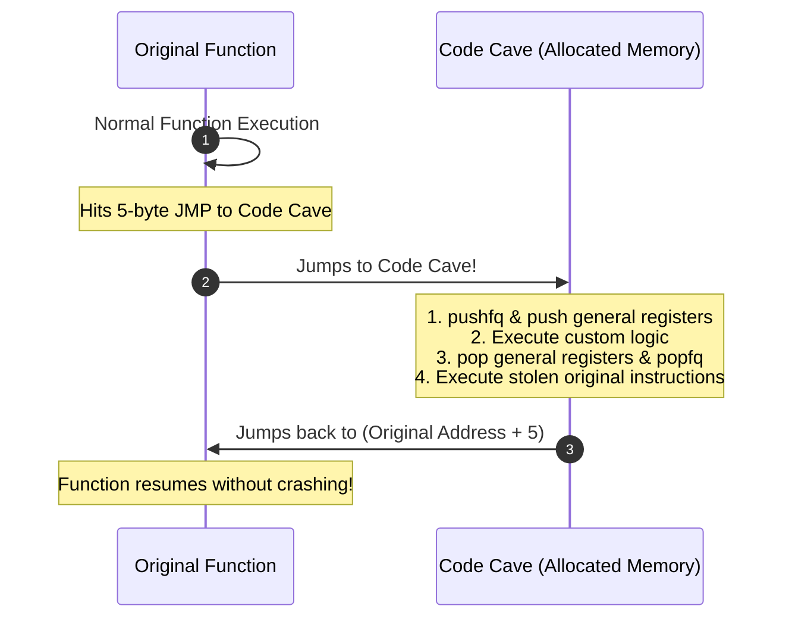

# ⚡ Module 22: Byte Patching, Code Caves & Inline Assembly

When modifying compiled software in memory, you often need to alter program flow, disable security checks, or inject custom logic without recompiling the source code. In this module, we break down NOP byte patching, conditional branch inverting, allocating executable **Code Caves**, and preserving 64-bit CPU register states.

---

## 📑 Table of Contents
- [1. Byte Patching Fundamentals](#1-byte-patching-fundamentals)
  - [1.1 The `VirtualProtect` Memory Swap](#11-the-virtualprotect-memory-swap)
  - [1.2 NOP Sleds & Conditional Branch Inverting](#12-nop-sleds--conditional-branch-inverting)
- [2. Code Cave Architecture](#2-code-cave-architecture)
  - [2.1 Why Code Caves Are Required](#21-why-code-caves-are-required)
  - [2.2 Static Padding Caves vs. Dynamic `VirtualAlloc` Caves](#22-static-padding-caves-vs-dynamic-virtualalloc-caves)
  - [2.3 The $\pm 2\text{ GB}$ Relative Jump Constraint](#23-the-pm-2text-gb-relative-jump-constraint)
- [3. Register State Preservation & Execution Flow](#3-register-state-preservation--execution-flow)
  - [3.1 Saving `RFLAGS` (`pushfq` / `popfq`)](#31-saving-rflags-pushfq--popfq)
  - [3.2 The Register Push/Pop Sled](#32-the-register-pushpop-sled)
  - [3.3 Restoring Displaced (Stolen) Instructions](#33-restoring-displaced-stolen-instructions)
- [4. Complete Code Cave Assembly Stub Example](#4-complete-code-cave-assembly-stub-example)

---

## 1. Byte Patching Fundamentals

### 1.1 The `VirtualProtect` Memory Swap
By default, the `.text` code section of a binary is mapped as **`PAGE_EXECUTE_READ`** (Read-Only + Executable). Attempting to overwrite bytes directly throws an Access Violation (`0xC0000005`).

To patch code bytes:
1. Call `VirtualProtect` to change the page to **`PAGE_EXECUTE_READWRITE`**.
2. Overwrite the target machine opcodes.
3. Call `VirtualProtect` to restore original permissions.
4. Call `FlushInstructionCache` so CPU instruction pipelines recognize the modified bytes.

```cpp
void PatchBytes(void* dst, void* src, size_t size) {
    DWORD oldProtect;
    VirtualProtect(dst, size, PAGE_EXECUTE_READWRITE, &oldProtect);
    memcpy(dst, src, size);
    VirtualProtect(dst, size, oldProtect, &oldProtect);
    FlushInstructionCache(GetCurrentProcess(), dst, size);
}
```

### 1.2 NOP Sleds & Conditional Branch Inverting

| Desired Modification | Original Opcode | Patched Opcode | Effect |
| :--- | :--- | :--- | :--- |
| **Bypass Check (NOP)** | `74 08` (`JE +08`) | `90 90` (`NOP NOP`) | Ignores jump; falls through unconditionally |
| **Force Jump (Always)** | `74 08` (`JE +08`) | `EB 08` (`JMP +08`) | Always jumps regardless of flags |
| **Invert Condition** | `74 08` (`JE +08`) | `75 08` (`JNE +08`) | Inverts logic from Equal to Not Equal |

---

## 2. Code Cave Architecture

### 2.1 Why Code Caves Are Required
If you want to inject 30 lines of custom C++ / assembly logic into a function, you cannot write it directly in place because overwriting instructions destroys subsequent game code.
* **Solution (The Code Cave)**: Overwrite 5 bytes in the original function with an unconditional jump (`JMP`) to an empty executable memory region (the **Code Cave**). In the cave, execute your custom logic, execute the original overwritten instructions, and jump back.



### 2.2 Static Padding Caves vs. Dynamic `VirtualAlloc` Caves
1. **Static Alignment Caves**: Compilers align functions to 16-byte boundaries, leaving runs of unused padding (`0xCC` or `0x90`) at the end of functions in `.text`.
2. **Dynamic Allocated Caves**: Call `VirtualAlloc` to allocate a dedicated $4\text{ KB}$ executable page.

### 2.3 The $\pm 2\text{ GB}$ Relative Jump Constraint
A standard 5-byte `E9` jump takes a 32-bit signed relative offset, meaning it can only jump within $\pm 2\text{ GB}$ of the current instruction pointer (`RIP`).
* When allocating dynamic caves with `VirtualAlloc`, you must scan memory addresses near the game's module base (`ModuleBase + 0x100000`) so the cave falls within the 32-bit relative range.

---

## 3. Register State Preservation & Execution Flow

When your injected assembly executes, it uses CPU registers (`RAX`, `RCX`, `RDX`, flags). If you change `RAX` without restoring it, the original game function will crash when it resumes.

### 3.1 Saving `RFLAGS` (`pushfq` / `popfq`)
The `pushfq` instruction pushes the entire 64-bit `RFLAGS` register (Zero Flag, Carry Flag, Sign Flag) onto the stack, preserving comparison states.

### 3.2 The Register Push/Pop Sled
```nasm
; --- SAVING STATE ---
pushfq                  ; Save CPU status flags
push rax                ; Save volatile registers
push rbx
push rcx
push rdx
push rsi
push rdi
push r8
push r9
push r10
push r11

; --- [ YOUR CUSTOM ASSEMBLY LOGIC HERE ] ---

; --- RESTORING STATE (Exact Reverse Order) ---
pop r11
pop r10
pop r9
pop r8
pop rdi
pop rsi
pop rdx
pop rcx
pop rbx
pop rax
popfq                   ; Restore CPU status flags
```

### 3.3 Restoring Displaced (Stolen) Instructions
A 5-byte `JMP` overwrites original instructions. Because x86/x64 instructions have variable lengths (1 to 15 bytes), you must use a length disassembler (e.g. Zydis) to calculate how many whole instructions were displaced (e.g. 7 bytes).
* The displaced 7 bytes must be placed at the end of the code cave immediately before the `JMP back` instruction.

---

## 4. Complete Code Cave Assembly Stub Example

```nasm
; Hook Location in Original Function:
; game.exe + 0x1A250:  mov [rbx + 0x120], eax   ; 6 Bytes (Displaced)
; game.exe + 0x1A256:  test eax, eax           ; Next instruction

; Code Cave Memory Layout:
code_cave_start:
    pushfq                      ; Save RFLAGS
    push rax                    ; Save RAX
    
    ; Custom Logic: Check if entity is our player
    cmp rbx, [rel local_player_ptr]
    jne skip_mod
    mov eax, 0x000003E7         ; Set value to 999
    
skip_mod:
    mov [rbx + 0x120], eax      ; Execute original stolen instruction
    pop rax                     ; Restore RAX
    popfq                       ; Restore RFLAGS
    
    ; Jump back to next instruction in original function
    jmp qword [rel return_jump_address]
```

---

<div align="center">
  <sub>Published and maintained by <a href="https://github.com/DaddyZyn"><b>DaddyZyn (DRAXO.dev)</b></a></sub>
</div>
