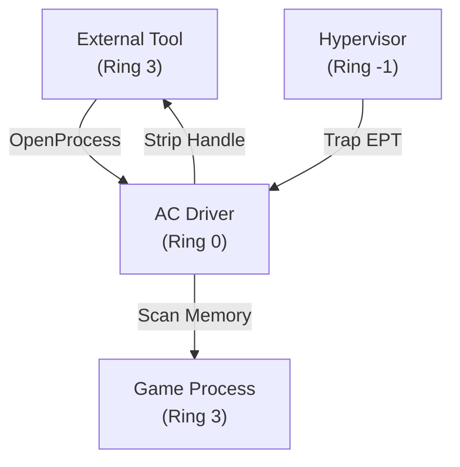
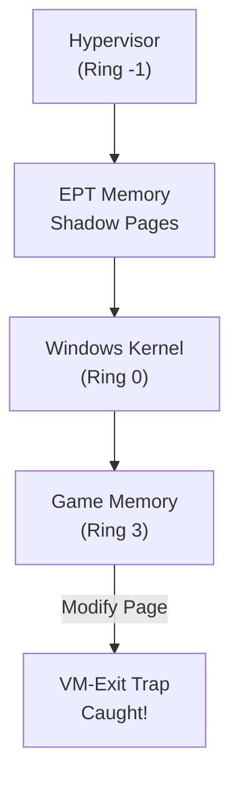

# 🛡️ Module 23: Anti-Cheat Architecture & Kernel Defense Mechanics

Modern competitive video games enforce security using **Kernel-Mode (Ring 0) Anti-Cheat Drivers** (BattlEye, Easy Anti-Cheat, Riot Vanguard, Ricochet). Because user-mode applications operate at Ring 3, standard memory reading and process injection techniques are completely visible to and blocked by kernel-level monitoring. In this module, we dissect the internal architecture of kernel anti-cheats, handle stripping callbacks, memory scanning routines, and hypervisor protections.

---

## 📑 Table of Contents
- [1. User-Mode (Ring 3) vs. Kernel-Mode (Ring 0) Anti-Cheats](#1-user-mode-ring-3-vs-kernel-mode-ring-0-anti-cheats)
  - [1.1 The Privilege Asymmetry Problem](#11-the-privilege-asymmetry-problem)
  - [1.2 Modern Kernel AC Threat Matrix](#12-modern-kernel-ac-threat-matrix)
- [2. Kernel-Level Detection Primitives](#2-kernel-level-detection-primitives)
  - [2.1 Process Handle Stripping (`ObRegisterCallbacks`)](#21-process-handle-stripping-obregistercallbacks)
  - [2.2 Unbacked Executable Memory Scanning](#22-unbacked-executable-memory-scanning)
  - [2.3 Code Section (`.text`) Integrity Checksums](#23-code-section-text-integrity-checksums)
  - [2.4 Kernel Thread & Driver Stack Walking](#24-kernel-thread--driver-stack-walking)
- [3. Hypervisor-Level Anti-Cheats (VT-x / EPT)](#3-hypervisor-level-anti-cheats-vt-x--ept)
  - [3.1 Type-1 / Type-2 Hypervisors (Ring -1)](#31-type-1--type-2-hypervisors-ring--1)
  - [3.2 Extended Page Tables (EPT) Memory Shadowing](#32-extended-page-tables-ept-memory-shadowing)
- [4. Heartbeat Telemetry & Behavioral Heuristics](#4-heartbeat-telemetry--behavioral-heuristics)

---

## 1. User-Mode (Ring 3) vs. Kernel-Mode (Ring 0) Anti-Cheats

### 1.1 The Privilege Asymmetry Problem
In early PC gaming (e.g. legacy Valve Anti-Cheat - VAC), the anti-cheat ran as a standard user-mode DLL inside the game process:
* **The Flaw**: Any external software running with administrative rights had equal or higher privilege than the anti-cheat. An external tool could suspend the AC thread, hook its functions, or block its memory reads.

### 1.2 Modern Kernel AC Threat Matrix



| Anti-Cheat System | Execution Level | Startup Model | Primary Target Games |
| :--- | :---: | :--- | :--- |
| **Valve Anti-Cheat (VAC)** | Ring 3 (User) | Game Launch | CS2, Dota 2, TF2 |
| **BattlEye (BE)** | Ring 0 (Kernel) | Game Launch | Rainbow Six Siege, Tarkov, DayZ |
| **Easy Anti-Cheat (EAC)** | Ring 0 (Kernel) | Game Launch | Apex Legends, Fortnite, Rust |
| **Riot Vanguard** | Ring 0 + Ring -1 | **System Boot (ELAM)** | Valorant, League of Legends |

---

## 2. Kernel-Level Detection Primitives

### 2.1 Process Handle Stripping (`ObRegisterCallbacks`)
When an external tool calls `OpenProcess(PROCESS_ALL_ACCESS, ...)`:
1. The request enters the Windows Kernel Object Manager.
2. The anti-cheat kernel driver registers pre-operation callbacks using `ObRegisterCallbacks`.
3. The driver checks if the target process is the protected game.
4. If yes, it **masks out all read, write, and thread creation permissions**, reducing the handle to `PROCESS_QUERY_LIMITED_INFORMATION`.
5. The external tool receives an empty, powerless handle that fails on `ReadProcessMemory` or `VirtualAllocEx`.

```cpp
// Kernel Driver Callback Skeleton
OB_PREOP_CALLBACK_STATUS PreOpenProcessCallback(PVOID RegistrationContext, POB_PRE_OPERATION_INFORMATION PreInfo) {
    if (IsGameProcess(PreInfo->Object)) {
        // Strip VM_READ, VM_WRITE, and VM_OPERATION from requested handle
        PreInfo->Parameters->CreateHandleInformation.DesiredAccess &= ~PROCESS_VM_READ;
        PreInfo->Parameters->CreateHandleInformation.DesiredAccess &= ~PROCESS_VM_WRITE;
        PreInfo->Parameters->CreateHandleInformation.DesiredAccess &= ~PROCESS_VM_OPERATION;
    }
    return OB_PREOP_SUCCESS;
}
```

### 2.2 Unbacked Executable Memory Scanning
When software uses **Manual Mapping** to inject code:
* Standard DLLs are backed by a physical file on the hard drive (`VAD - Virtual Address Descriptor` points to `C:\Program Files\...`).
* Injected manual mapped DLLs reside in memory allocated via `VirtualAlloc`.
* **The Detection**: Anti-cheat system threads continuously walk the game's page tables. If they find an executable page (`PAGE_EXECUTE_READ` or `PAGE_EXECUTE_READWRITE`) that has **no backing file on disk** (unbacked memory), the account is flagged immediately.

### 2.3 Code Section (`.text`) Integrity Checksums
Anti-cheat drivers calculate cryptographic hashes of the game's `.text` section in memory:
* If an inline hook, byte patch, or NOP instruction modifies even 1 byte in the `.text` section, the runtime hash differs from the disk hash, triggering an integrity violation ban.

### 2.4 Kernel Thread & Driver Stack Walking
Anti-cheats monitor thread creation via `PsSetCreateThreadNotifyRoutine` and image loading via `PsSetLoadImageNotifyRoutine`. They walk the kernel call stack to verify that calling drivers are signed with legitimate WHQL Microsoft certificates.

---

## 3. Hypervisor-Level Anti-Cheats (VT-x / EPT)

Advanced solutions (like Riot Vanguard) utilize hardware virtualization features built into Intel (VT-x) and AMD (AMD-V) CPUs.



### 3.1 Extended Page Tables (EPT) Memory Shadowing
* **EPT (Second-Level Address Translation)** allows a hypervisor to create hidden shadow page tables.
* If a rootkit or external driver attempts to alter kernel page tables (`CR3` manipulation), the CPU triggers a hardware **VM-Exit trap**, handing execution to the hypervisor before the write occurs.

---

## 4. Heartbeat Telemetry & Behavioral Heuristics

Beyond memory scanning, kernel anti-cheats maintain a cryptographically authenticated communication channel with game servers:
1. **Encrypted Heartbeats**: Every few seconds, the game client and kernel driver exchange signed challenge-response nonces containing system integrity reports.
2. **Behavioral Analytics**: Mouse movement vector analysis, click timing distributions, and view-angle velocity smoothing algorithms detect non-human aim curves and impossible reaction times.

---

<div align="center">
  <sub>Published and maintained by <a href="https://github.com/DaddyZyn"><b>DaddyZyn (DRAXO.dev)</b></a></sub>
</div>
