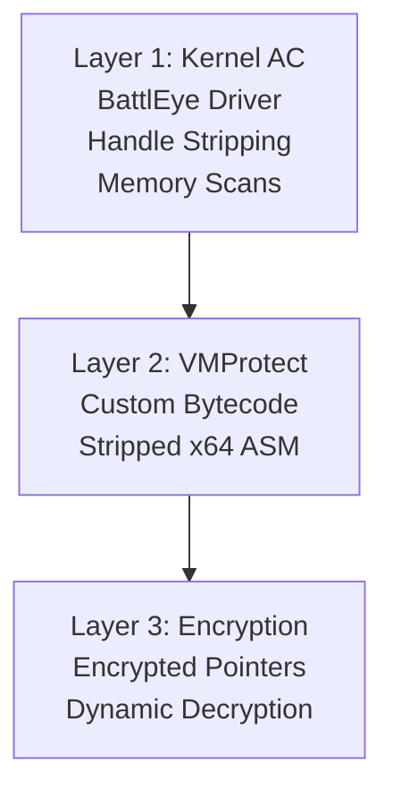
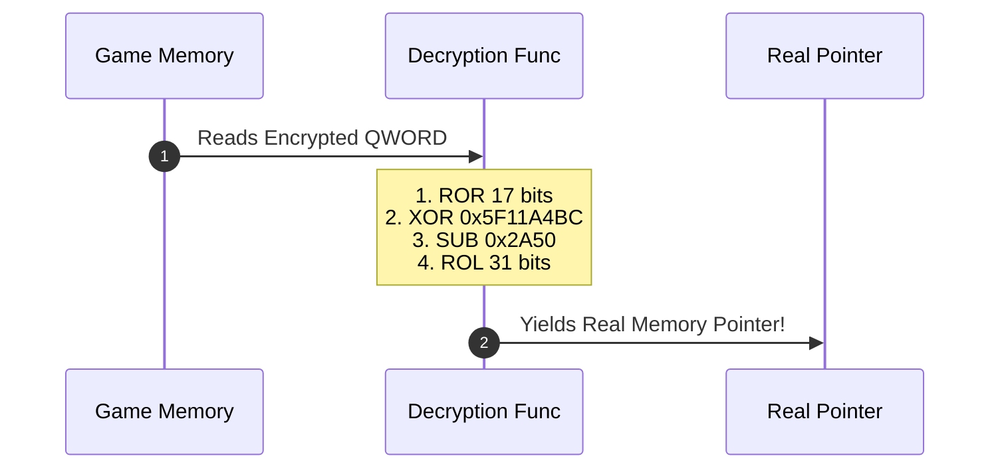
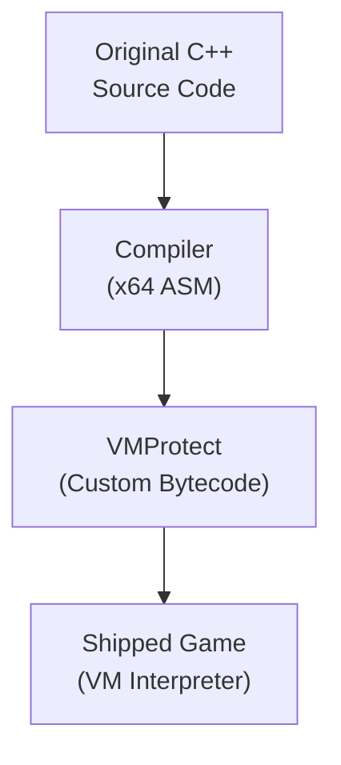

# 🛡️ Module 24: AAA Binary Obfuscation & Why Games Like R6 Are Hard to Reverse

Beginners often assume all games work like open-source software where player coordinates and entity arrays sit in plain memory at fixed offsets. However, modern competitive AAA titles—most notoriously **Tom Clancy's Rainbow Six Siege (R6)**—implement multi-tiered defense architectures designed to defeat static disassembly, dynamic debugging, and memory reconstruction. In this module, we dissect the anti-reverse engineering techniques used in R6 and modern AAA titles.

---

## 📑 Table of Contents
- [1. The Multi-Layered Defense Stack in Rainbow Six Siege](#1-the-multi-layered-defense-stack-in-rainbow-six-siege)
  - [1.1 The Triple-Threat Matrix](#11-the-triple-threat-matrix)
  - [1.2 Why Standard Cheat Engine Workflows Fail](#12-why-standard-cheat-engine-workflows-fail)
- [2. Encrypted Pointers & Dynamic Decryption Routines](#2-encrypted-pointers--dynamic-decryption-routines)
  - [2.1 The Concept of Memory Pointer Encryption](#21-the-concept-of-memory-pointer-encryption)
  - [2.2 Mathematical Bitwise Permutation Operations](#22-mathematical-bitwise-permutation-operations)
  - [2.3 Seasonal Polymorphism (Patch Rotation)](#23-seasonal-polymorphism-patch-rotation)
- [3. Code Virtualization (VMProtect) in Game Loops](#3-code-virtualization-vmprotect-in-game-loops)
  - [3.1 Stripping x64 Machine Code into Custom Bytecode](#31-stripping-x64-machine-code-into-custom-bytecode)
  - [3.2 The VM Dispatcher Loop](#32-the-vm-dispatcher-loop)
- [4. Advanced Anti-Reversing Defenses](#4-advanced-anti-reversing-defenses)
  - [4.1 Opaque Predicates & Control Flow Flattening](#41-opaque-predicates--control-flow-flattening)
  - [4.2 Call Stack Spoofing & Synthetic Frames](#42-call-stack-spoofing--synthetic-frames)
- [5. How Analysts Reverse Encrypted Structures in IDA Pro](#5-how-analysts-reverse-encrypted-structures-in-ida-pro)

---

## 1. The Multi-Layered Defense Stack in Rainbow Six Siege

### 1.1 The Triple-Threat Matrix
Rainbow Six Siege does not rely on a single defensive tool; it combines three mutually reinforcing layers of security:



### 1.2 Why Standard Cheat Engine Workflows Fail
If you attach Cheat Engine to R6:
1. **BattlEye** blocks process handles and strips access.
2. If bypassed, searching for player coordinates ($X, Y, Z$) yields **0 results** because coordinates are stored as encrypted bitwise structures.
3. If an entity address is found, tracing its pointer chain reveals that pointers are not direct memory addresses, but **obfuscated mathematical tokens** that crash the application if dereferenced directly.

---

## 2. Encrypted Pointers & Dynamic Decryption Routines

### 2.1 The Concept of Memory Pointer Encryption
In a standard game, the entity array is accessed directly:
```cpp
// Standard Game (Direct Pointer)
uintptr_t pEntityList = *(uintptr_t*)(GameManager + 0x18);
```
In Rainbow Six Siege, pointers stored in memory are encrypted using algebraic bitwise formulas:
```cpp
// R6 Architecture (Encrypted Pointer)
uintptr_t encryptedVal = *(uintptr_t*)(GameManager + 0x18);
uintptr_t pEntityList = DecryptEntityList(encryptedVal);
```

### 2.2 Mathematical Bitwise Permutation Operations
The game engine applies a combination of bitwise operations to obfuscate 64-bit pointers:
* **Bitwise Rotation**: `_rotl64(val, shift)` and `_rotr64(val, shift)`
* **Bitwise XOR**: `val ^ 0x5A4D112233445566ULL`
* **Arithmetic Inversion / Addition**: `val + Key` or `val - Key`
* **Byte Swapping**: `_byteswap_uint64(val)`



### 2.3 Seasonal Polymorphism (Patch Rotation)
Every time Ubisoft releases a new season or mid-season patch:
* The build pipeline randomly regenerates the algebraic encryption formulas and cryptographic keys for **every single pointer in the game**.
* What was `(val ^ Key1) + Key2` in Season 1 becomes `_rotl64(val - Key3, 23) ^ Key4` in Season 2.
* **Impact**: Every reversed offset, SDK, and memory analysis tool is broken on patch day.

---

## 3. Code Virtualization (VMProtect) in Game Loops

### 3.1 Stripping x64 Machine Code into Custom Bytecode
Critical game subsystems in R6 (such as camera matrices, network synchronization, and bone transforms) are protected using **VMProtect**:



### 3.2 The VM Dispatcher Loop
When the game executes a virtualized function:
1. Native execution stops.
2. Execution jumps into a centralized **VM Interpreter Loop**.
3. The interpreter reads the custom bytecode stream byte-by-byte.
4. It executes internal handlers for arithmetic, memory reads, and stack management.
* **Disassembly Result**: In IDA Pro or Ghidra, the function does not decompile into readable C code (`F5`). Analysts only see hundreds of obfuscated jumps inside the VM interpreter.

---

## 4. Advanced Anti-Reversing Defenses

### 4.1 Opaque Predicates & Control Flow Flattening
Compilers insert **Opaque Predicates** (conditional branches whose outcome is known at compile time but difficult for static disassemblers to deduce, e.g. $x^2 \ge 0$ for all real $x$).
* Combined with **Control Flow Flattening**, functions are restructured into massive, complex state machines with hundreds of dead code paths.

### 4.2 Call Stack Spoofing & Synthetic Frames
When a function executes, the return address on the stack reveals which function called it.
* R6 and anti-cheat modules use **Stack Spoofing**: Overwriting return pointers on the stack with synthetic addresses pointing to legitimate modules (like `ntdll.dll` or `kernel32.dll`) before making calls.
* If a security scanner inspects the call stack, the stack trace appears entirely legitimate.

---

## 5. How Analysts Reverse Encrypted Structures in IDA Pro

To extract decryption algorithms from modern AAA games:

1. **Find Function Cross-References (XREFs)**: Locate un-virtualized functions that call the decrypted data (such as weapon firing or HUD rendering routines).
2. **Decompile with IDA Pro (`F5`)**: Trace where the encrypted QWORD is loaded from the base structure.
3. **Isolate Decryption Math**: Identify the sequence of `__ROL8__`, `__ROR8__`, and XOR operations in the decompiled pseudocode.
4. **Reconstruct Decryption in C++**: Port the decompiled mathematical formula directly into a custom analysis tool.

---

<div align="center">
  <sub>Published and maintained by <a href="https://github.com/DaddyZyn"><b>DaddyZyn (DRAXO.dev)</b></a></sub>
</div>
