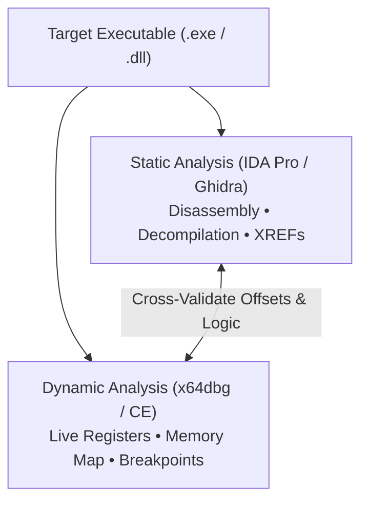
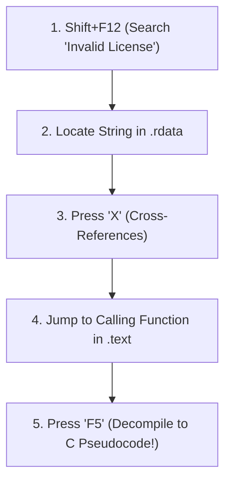
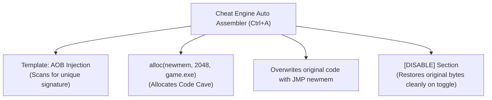

# 🔬 Module 25: Static & Dynamic Reverse Engineering Workflows (IDA Pro, Ghidra, x64dbg & CE)

Reverse engineering is the art of deducing the design, architecture, and behavior of compiled software without access to original source code. To analyze complex systems effectively, security researchers combine **Static Analysis** (IDA Pro, Ghidra) with **Dynamic Analysis** (x64dbg, Cheat Engine). In this module, we break down professional reverse engineering workflows, hotkeys, decompilation strategies, and debugging techniques.

---

## 📑 Table of Contents
- [1. The Reverse Engineering Tool Matrix](#1-the-reverse-engineering-tool-matrix)
  - [1.1 Static vs. Dynamic Analysis](#11-static-vs-dynamic-analysis)
  - [1.2 Core Tool Ecosystem](#12-core-tool-ecosystem)
- [2. Static Analysis in IDA Pro & Ghidra](#2-static-analysis-in-ida-pro--ghidra)
  - [2.1 The Essential Hotkey Reference](#21-the-essential-hotkey-reference)
  - [2.2 String Searching & Cross-References (XREFs)](#22-string-searching--cross-references-xrefs)
  - [2.3 Decompilation & Type Reconstruction (`F5` & `Y`)](#23-decompilation--type-reconstruction-f5--y)
  - [2.4 Struct Definition in IDA (`Shift + F9`)](#24-struct-definition-in-ida-shift--f9)
- [3. Dynamic Debugging in x64dbg](#3-dynamic-debugging-in-x64dbg)
  - [3.1 Breakpoint Architectures (Software `0xCC` vs. Hardware `DR0-DR3`)](#31-breakpoint-architectures-software-0xcc-vs-hardware-dr0-dr3)
  - [3.2 Execution Stepping (`F7`, `F8`, `Ctrl+F9`)](#32-execution-stepping-f7-f8-ctrlf9)
  - [3.3 Memory Map & Call Stack Inspection](#33-memory-map--call-stack-inspection)
- [4. Cheat Engine Integration & Auto Assembler](#4-cheat-engine-integration--auto-assembler)
  - [4.1 Dissecting Data Structures](#41-dissecting-data-structures)
  - [4.2 Generating Auto Assembler Code Cave Scripts](#42-generating-auto-assembler-code-cave-scripts)

---

## 1. The Reverse Engineering Tool Matrix

### 1.1 Static vs. Dynamic Analysis
* **Static Analysis (IDA Pro / Ghidra)**: Reading, decompiling, and dissecting the binary on disk without running it. Safe for analyzing malware and understanding broad architectural flow.
* **Dynamic Analysis (x64dbg / Cheat Engine)**: Running the software under an attached debugger to inspect live CPU registers, heap allocations, and dynamic function arguments in real time.

### 1.2 Core Tool Ecosystem

| Tool | Primary Purpose | Best For |
| :--- | :--- | :--- |
| **IDA Pro (Hex-Rays)** | Industry-standard disassembler / decompiler | Fast x64 pseudocode decompilation (`F5`) |
| **Ghidra (NSA)** | Free, open-source decompiler & analyzer | Multi-architecture decompilation & script automation |
| **x64dbg** | Open-source 64-bit user-mode debugger | Step-by-step assembly debugging & memory patching |
| **Cheat Engine** | Memory scanner & dynamic runtime debugger | Fast memory searching, pointer scanning, structure dissection |
| **ReClass.NET** | Interactive live memory structure mapper | Reconstructing C++ classes and struct padding in real time |

---

## 2. Static Analysis in IDA Pro & Ghidra

### 2.1 The Essential Hotkey Reference (IDA Pro)

| Hotkey | Action | Description |
| :--- | :--- | :--- |
| **`Shift + F12`** | Strings Window | Scans binary for all embedded ASCII and UTF-16 string literals |
| **`X`** | Cross-References (XREFs) | Shows all functions that call or reference the selected function/variable |
| **`F5`** / **`Tab`** | Decompile / Toggle View | Generates high-level C pseudocode from assembly instructions |
| **`N`** | Rename | Renames variables, subroutines, or labels for readability |
| **`Y`** | Set Type | Changes variable types or function prototypes (e.g. `int*`, `DWORD`) |
| **`G`** | Jump to Address | Jumps directly to a specific RVA or virtual memory address |
| **`Spacebar`** | Toggle Graph / Text | Toggles between IDA Graph View and linear Disassembly View |
| **`Shift + F9`** | Structures Window | Opens the C++ Structure Editor to define custom structs |

### 2.2 String Searching & Cross-References (XREFs) Workflow
The fastest way to locate critical logic in an unknown binary:
1. Press **`Shift + F12`** to open the Strings window.
2. Filter for keywords: `"Player"`, `"Health"`, `"Auth"`, `"Error"`, `"License"`, `"Key"`.
3. Double-click the string to jump to its location in `.rdata`.
4. Press **`X`** on the string name to view **Cross-References (XREFs)**.
5. Click the calling function to jump directly into the function using that string!

### 2.3 Decompilation & Type Reconstruction
When IDA decompiles code, it defaults to raw generic types (`__int64 a1`, `unsigned __int8 *a2`).
* Select variable `a1` $\rightarrow$ press **`Y`** $\rightarrow$ type `Entity* a1`.
* IDA instantly rewrites the pseudocode from ugly pointer arithmetic (`*(a1 + 0x18)`) into clean struct member access (`a1->health`).

---

## 3. Dynamic Debugging in x64dbg

### 3.1 Breakpoint Architectures

| Breakpoint Type | Underlying Mechanism | Detectable by Software? |
| :--- | :--- | :--- |
| **Software Breakpoint (`F2`)** | Replaces instruction byte with **`0xCC` (`INT 3`)** | ⚠️ Yes (Detected by memory checksum scans) |
| **Hardware Breakpoint (`DR0-DR3`)** | Configures CPU Debug Registers (**Execute, Read, Write**) | ⚠️ Yes (Detected via `GetThreadContext`) |
| **Memory Page Breakpoint** | Marks page as **`PAGE_GUARD`** (Catches any access) | ⚠️ Yes (Detected via Exception Handlers) |

### 3.2 Execution Stepping
* **`F7` (Step Into)**: Executes single instruction. Follows `CALL` instructions into the subroutine.
* **`F8` (Step Over)**: Executes single instruction. Treats `CALL` subroutines as a single step (does not step inside).
* **`Ctrl + F9` (Execute Till Return)**: Runs until the current function executes `RET`.

### 3.3 Memory Map (`Alt + M`) & Call Stack (`Alt + K`)
* **Memory Map**: Lists all allocated virtual memory pages, their sizes, base addresses, and protection flags (`PAGE_EXECUTE_READ`, `PAGE_READWRITE`).
* **Call Stack**: Displays the nested chain of callers leading to the current execution point, allowing you to trace program control flow backwards.

---

## 4. Cheat Engine Integration & Auto Assembler

Cheat Engine includes a built-in disassembler and **Auto Assembler (AA)** script engine (`Ctrl + A` in Memory View).

### 4.1 Generating Auto Assembler Code Cave Scripts
In Cheat Engine Memory Viewer:
1. Navigate to target instruction $\rightarrow$ press **`Ctrl + A`** (Auto Assembler).
2. Click **Template** $\rightarrow$ select **AOB Injection**.
3. Cheat Engine generates a production-ready script that:
   * Defines an AOB signature for update resilience.
   * Allocates a dynamic code cave (`alloc(newmem, 2048, "game.exe"+0x...)`).
   * Handles memory protection changes automatically.
   * Restores original bytes when the user disables the script toggle.

---

  Published and maintained by <a href="https://github.com/DaddyZyn"><b>DaddyZyn (DRAXO.dev)</b></a>

