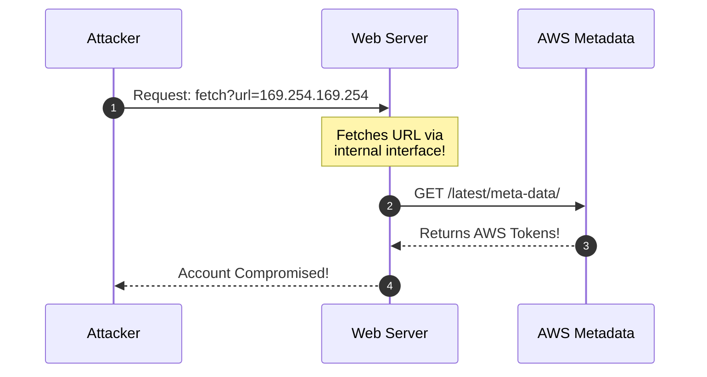

# 🌐 Module 26: Web Application Security — SQL Injection & Server-Side Request Forgery (SSRF)

Web applications are the primary external attack surface for modern enterprises and cloud infrastructure. When backend services fail to sanitize user input or validate outgoing server requests, attackers can compromise database servers or pivot into private cloud metadata endpoints. In this module, we dissect the mechanics of **SQL Injection (SQLi)**, **Server-Side Request Forgery (SSRF)**, and **Cross-Site Scripting (XSS)**.

---

## 📑 Table of Contents
- [1. SQL Injection (SQLi) Mechanics](#1-sql-injection-sqli-mechanics)
  - [1.1 The Vulnerability: Raw String Concatenation](#11-the-vulnerability-raw-string-concatenation)
  - [1.2 Union-Based SQL Injection](#12-union-based-sql-injection)
  - [1.3 Blind Boolean & Time-Based Extraction](#13-blind-boolean--time-based-extraction)
  - [1.4 Defensive Countermeasure: Parameterized Queries (Prepared Statements)](#14-defensive-countermeasure-parameterized-queries-prepared-statements)
- [2. Server-Side Request Forgery (SSRF)](#2-server-side-request-forgery-ssrf)
  - [2.1 How SSRF Pivots Past Firewalls](#21-how-ssrf-pivots-past-firewalls)
  - [2.2 Cloud Metadata Endpoint Exploitation (AWS / Azure / GCP)](#22-cloud-metadata-endpoint-exploitation-aws--azure--gcp)
  - [2.3 SSRF Mitigation: Allowlisting & IMDSv2](#23-ssrf-mitigation-allowlisting--imdsv2)
- [3. Cross-Site Scripting (XSS) & Content Security Policy (CSP)](#3-cross-site-scripting-xss--content-security-policy-csp)
  - [3.1 Reflected vs. Stored vs. DOM-Based XSS](#31-reflected-vs-stored-vs-dom-based-xss)
  - [3.2 Content Security Policy (CSP) Headers](#32-content-security-policy-csp-headers)

---

## 1. SQL Injection (SQLi) Mechanics

### 1.1 The Vulnerability: Raw String Concatenation
When a backend server constructs database queries by directly concatenating unsanitized user input into SQL query strings:

```python
# ❌ VULNERABLE CODE
query = f"SELECT * FROM users WHERE username = '{user_input}' AND password = '{password_input}'"
```
If an attacker inputs `admin' --`, the query becomes:
```sql
SELECT * FROM users WHERE username = 'admin' --' AND password = '...'
```
The `--` comment operator instructs the database engine to ignore the remainder of the query (including password validation), logging the attacker in as administrator.

### 1.2 Union-Based SQL Injection
When query results are reflected on the web page:
1. Determine column count: `' ORDER BY 1--`, `' ORDER BY 2--`, until an error occurs.
2. Determine data types: `' UNION SELECT NULL, 'a', 1--`.
3. Extract schema and tables:
   ```sql
   ' UNION SELECT table_name, column_name FROM information_schema.columns--
   ```

### 1.3 Blind Boolean & Time-Based Extraction
When database errors and results are hidden from the UI:
* **Boolean-Based**: Infer data bit-by-bit by checking if the page loads normally or fails:
  ```sql
  ' AND (SELECT SUBSTRING(password, 1, 1) FROM users WHERE username='admin') = 'a'--
  ```
* **Time-Based (Sleep Probing)**: Force the database engine to delay its response:
  ```sql
  ' AND (SELECT IF(1=1, SLEEP(5), 0))--
  ```

### 1.4 Defensive Countermeasure: Parameterized Queries (Prepared Statements)
```python
# 🛡️ SECURE CODE (Parameterized Query)
cursor.execute("SELECT * FROM users WHERE username = %s AND password = %s", (user_input, password_input))
```
* **Why Parameterization Works**: The database engine compiles the SQL query structure **before** inserting user parameters. Input is treated strictly as literal data, never as executable code.

---

## 2. Server-Side Request Forgery (SSRF)

### 2.1 How SSRF Pivots Past Firewalls
SSRF occurs when a web server accepts a URL from a user (e.g. "Fetch profile picture from URL") and downloads the asset without verifying the destination:



### 2.2 Cloud Metadata Endpoint Exploitation
Cloud instances (AWS EC2, Azure VMs, Google Cloud Compute) host an internal link-local metadata service at `http://169.254.169.254`:
* In AWS (IMDSv1): Querying `http://169.254.169.254/latest/meta-data/iam/security-credentials/<RoleName>` returns temporary AWS Access Key IDs, Secret Access Keys, and Session Tokens with full cloud infrastructure privileges.

### 2.3 SSRF Mitigation: Allowlisting & IMDSv2
1. **Network Allowlisting**: Enforce strict domain allowlists; block internal IP ranges (`127.0.0.1`, `10.0.0.0/8`, `192.168.0.0/16`, `169.254.169.254`).
2. **Enforce AWS IMDSv2**: Requires a session token via `PUT` with custom headers (`X-aws-ec2-metadata-token`), which standard SSRF payloads cannot forge.

---

## 3. Cross-Site Scripting (XSS) & Content Security Policy (CSP)

### 3.1 Reflected vs. Stored vs. DOM-Based XSS
* **Stored XSS (Persistent)**: Malicious JavaScript payload is stored in a database (e.g. comment field) and executed in the browser of every user who views the page.
* **Reflected XSS**: Payload is reflected off the web server in an immediate response (e.g. search query parameter `?q=<script>alert(1)</script>`).
* **DOM-Based XSS**: Vulnerability exists purely in client-side JavaScript (e.g. writing `location.hash` directly into `document.body.innerHTML`).

### 3.2 Content Security Policy (CSP) Headers
Web servers enforce strict browser execution rules via the `Content-Security-Policy` HTTP header:
```http
Content-Security-Policy: default-src 'self'; script-src 'self' https://trustedscripts.com; object-src 'none';
```
* Blocks inline scripts (`<script>alert(1)</script>`).
* Restricts script execution strictly to trusted domains.

---

<div align="center">
  <sub>Published and maintained by <a href="https://github.com/DaddyZyn"><b>DaddyZyn (DRAXO.dev)</b></a></sub>
</div>
