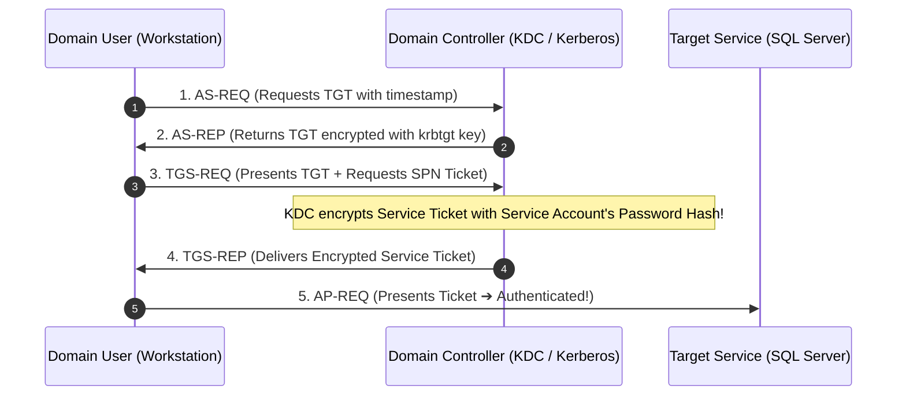
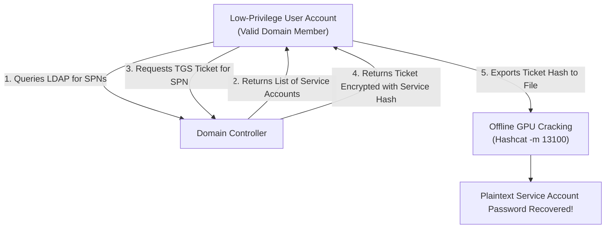

# 🏢 Module 27: Active Directory Security — Kerberos, Kerberoasting & Credential Access

In enterprise environments, Microsoft **Active Directory (AD)** serves as the central identity and access management system for users, computers, and servers. Once an adversary gains an initial foothold on a domain-joined workstation, they leverage Active Directory protocol features to escalate privileges and move laterally. In this module, we break down the Kerberos authentication architecture, the mechanics of **Kerberoasting**, **LSASS memory dumping**, and enterprise mitigations.

---

## 📑 Table of Contents
- [1. Active Directory & The Kerberos Authentication Architecture](#1-active-directory--the-kerberos-authentication-architecture)
  - [1.1 Domain Controllers & Service Principal Names (SPNs)](#11-domain-controllers--service-principal-names-spns)
  - [1.2 The Kerberos 4-Step Ticket Exchange](#12-the-kerberos-4-step-ticket-exchange)
- [2. The Kerberoasting Attack](#2-the-kerberoasting-attack)
  - [2.1 Why Any Domain User Can Request Service Tickets](#21-why-any-domain-user-can-request-service-tickets)
  - [2.2 Offline GPU Cracking with Hashcat (`-m 13100`)](#22-offline-gpu-cracking-with-hashcat--m-13100)
  - [2.3 Kerberoasting Defensive Hardening](#23-kerberoasting-defensive-hardening)
- [3. LSASS Credential Access & Pass-the-Hash (PtH)](#3-lsass-credential-access--pass-the-hash-pth)
  - [3.1 What Resides in `lsass.exe` Process Memory](#31-what-resides-in-lsassexe-process-memory)
  - [3.2 Pass-the-Hash (PtH) Mechanics](#32-pass-the-hash-pth-mechanics)
  - [3.3 Defenses: LSA Protection (PPL) & Credential Guard](#33-defenses-lsa-protection-ppl--credential-guard)

---

## 1. Active Directory & The Kerberos Authentication Architecture

### 1.1 Domain Controllers & Service Principal Names (SPNs)
In an Active Directory domain, services (e.g. Microsoft SQL, IIS Web Servers, File Shares) run under specific service user accounts. To identify these services, Active Directory assigns them a **Service Principal Name (SPN)** (e.g., `MSSQLSvc/sqlserver.corp.local:1433`).

### 1.2 The Kerberos 4-Step Ticket Exchange



* **TGT (Ticket Granting Ticket)**: Proves the user has authenticated to the domain.
* **TGS (Ticket Granting Service Ticket)**: Specific ticket allowing access to a requested service account.

---

## 2. The Kerberoasting Attack

### 2.1 Why Any Domain User Can Request Service Tickets
By design in Kerberos:
* **ANY valid domain user account** (even the lowest-privileged contractor) has permission to query LDAP for registered SPNs and request a `TGS` ticket for any service in the domain.
* When the Domain Controller returns the `TGS-REP` ticket, the ticket payload is **encrypted with the target service account's password hash (NTLM/AES)**.
* The attacker does not need to send the ticket to the actual service. They extract the encrypted ticket directly from memory.



### 2.2 Offline GPU Cracking with Hashcat (`-m 13100`)
The extracted ticket hash format (`$krb5tgs$23$...`) is cracked completely offline without generating any network noise:
```bash
hashcat -m 13100 -a 0 kerberoast_hashes.txt /usr/share/wordlists/rockyou.txt
```
* If the service account uses a weak password, the plaintext password is recovered within minutes, granting the attacker domain service privileges.

### 2.3 Kerberoasting Defensive Hardening
1. **Group Managed Service Accounts (gMSA)**: Migrate services to gMSAs, where Windows automatically generates 128-character complex passwords and rotates them automatically.
2. **Enforce AES Encryption**: Disable legacy RC4 encryption (`etype 23`) for Kerberos tickets; enforce AES-256 (`etype 18`).

---

## 3. LSASS Credential Access & Pass-the-Hash (PtH)

### 3.1 What Resides in `lsass.exe` Process Memory
The **Local Security Authority Subsystem Service (`lsass.exe`)** enforces security policies and authenticates users in Windows:
* When a user logs in (locally or via RDP), `lsass.exe` caches their credentials in memory:
  * NTLM Password Hashes
  * Kerberos TGT and TGS Tickets
  * Cleartext credentials (in legacy WDigest configurations)

### 3.2 Pass-the-Hash (PtH) Mechanics
When an attacker dumps `lsass.exe` and extracts an NTLM hash (e.g. `aad3b435b51404eeaad3b435b51404ee:31d6cfe0d16ae931b73c59d7e0c089c0`):
* In NTLM authentication, the client proves its identity by performing an MD4-based HMAC calculation using the **hash itself**, not the plaintext password.
* **Result**: An attacker can authenticate to remote servers across the network by supplying the NTLM hash directly without ever needing to crack the plaintext password.

### 3.3 Defenses: LSA Protection & Credential Guard
1. **LSA Protection (Protected Process Light - PPL)**: Restricts access to `lsass.exe` so non-PPL processes (even with Local Administrator rights) cannot call `OpenProcess(PROCESS_VM_READ)` on LSASS.
2. **Credential Guard (VBS)**: Isolates LSASS secrets in a secure, hardware-virtualized enclave (**Virtual Secure Mode - VSM**). Even if the Windows kernel is compromised, the hypervisor prevents reading credential keys.

---

<div align="center">
  <sub>Published and maintained by <a href="https://github.com/DaddyZyn"><b>DaddyZyn (DRAXO.dev)</b></a></sub>
</div>
